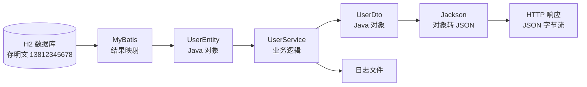
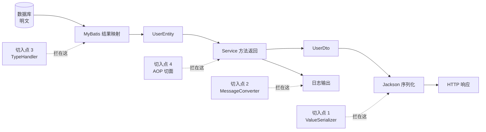
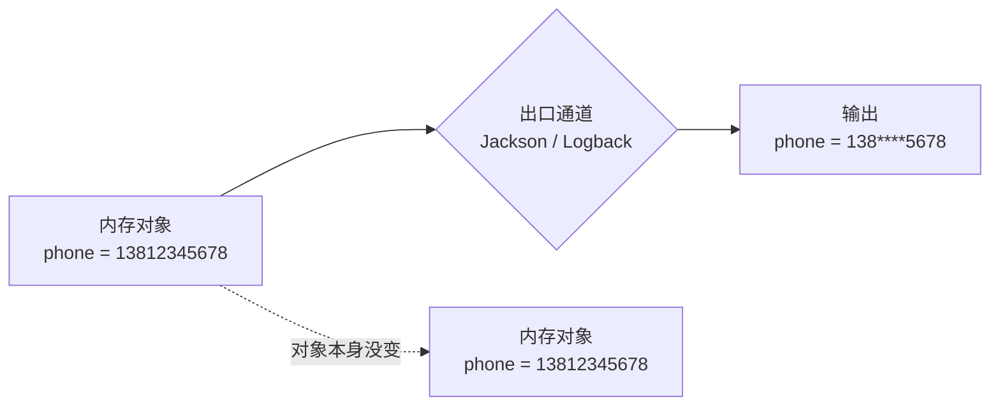
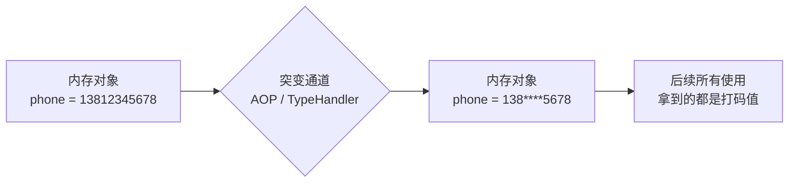
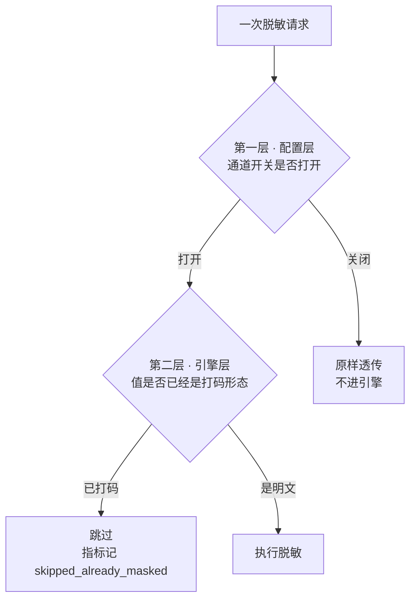
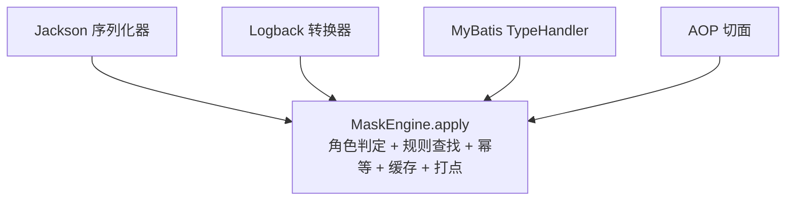

# 第 2 章 在 Spring Boot 里，脱敏该在哪一刀切下去

> **本章目标**：把 Spring Boot 的数据流画清楚，找到四个可以下手的位置，并建立整份教程最重要的心智模型——**出口通道 vs 突变通道**。
>
> **前置知识**：知道 Controller / Service / Mapper 分层，知道接口返回的对象会被转成 JSON。
>
> **预计时长**：35 分钟。
>
> **本章不写代码**，但它决定了后面九章你能不能看懂。如果只能读一章，读这一章。

---

## 2.1 先把数据流画出来

一个最普通的「查用户详情」请求，数据要走这么一趟：



请你特别注意这条线的两个终点：

- **主干终点是** `HTTP 响应`。数据变成 JSON 字节流给前端。
- **支线终点是** `日志文件`。`Service` 里一句 `log.info` 就把数据写进了另一个完全独立的出口。

新手最容易犯的错，就是只盯着主干做脱敏，完全忘了还有日志这条支线。接口返回得再干净，日志文件里躺着一行明文手机号，一样是泄露。

再看一遍这条流水线，问自己一个问题：**明文在哪些环节是「活着」的？**

答案是：从数据库一直到 Jackson 之前，明文都在。`UserEntity.phone` 是明文，`UserDto.phone` 是明文，`log.info` 拿到的也是明文。所以理论上，这一路上的**任何一个环节**都可以是脱敏的下手点。

---

## 2.2 四个切入点

本项目在这条流水线上选了四个位置下手。先看它们分别拦在哪：



逐个说明。

### 切入点 1 · 传输层：Jackson 自定义序列化器（主路径）

**位置**：Java 对象转成 JSON 的那一刻。

Spring Boot 把 Controller 返回的对象交给 Jackson 序列化。Jackson 在写每个字段时，会去看这个字段有没有指定自定义序列化器。我们就在这里插一脚：遇到带 `@Sensitive` 的 String 字段，不写原值，写打码后的值。

```java
// 业务代码只有这一个注解
@Sensitive(type = SensitiveType.PHONE)
private String phone;
```

**关键特征：内存里的** `UserDto.phone` **从头到尾都是** `13812345678`**，只有写出去的那串字节变成了** `138****5678`**。**

这是本项目的**主路径**，也是绝大多数 Web 项目唯一需要的通道。第 9 章详解。

### 切入点 2 · 日志层：Logback MessageConverter

**位置**：日志消息格式化输出的那一刻。

日志的问题很特殊：`log.info("phone={}", user.getPhone())` 拿到的是一个已经拼好的字符串，我们不知道哪一段是手机号——没有注解，没有类型信息，什么都没有。

所以这个通道只能用**正则扫描**：在最终的日志正文里找长得像手机号、身份证、银行卡、邮箱的片段，找到就打码。

```xml
<!-- 把 %msg 换成 %sensitiveMsg，日志正文就会过一遍脱敏 -->
<pattern>%d [%thread] %-5level %logger{36} - %sensitiveMsg%n</pattern>
```

**关键特征：这是一个和接口完全独立的出口。** 接口脱敏（切入点 1）对日志毫无作用，反之亦然。两者互补，生产环境通常同时开启。第 10 章详解。

### 切入点 3 · 持久层：MyBatis TypeHandler

**位置**：MyBatis 把 `ResultSet` 的列值塞进 Java 对象字段的那一刻。

MyBatis 用 `TypeHandler` 做 JDBC 类型和 Java 类型之间的转换。我们写一个自定义的 `TypeHandler<String>`，在它从 `ResultSet` 读出字符串后先打码，再返回给 MyBatis 去 set 到字段上。

```java
@Result(column = "phone", property = "phone",
        typeHandler = PhoneSensitiveTypeHandler.class)
```

**关键特征：**`UserEntity.phone` **从数据库出来就已经是** `138****5678` **了。** 应用层拿到的对象里根本没有明文。第 11 章详解。

### 切入点 4 · 应用层：`@Sensitive` + AOP

**位置**：Service 方法返回值交给调用方之前。

用 AOP 环绕通知拦住方法返回值，然后**反射遍历**这个对象（包括嵌套对象、List、Map），把所有带 `@Sensitive` 的 String 字段就地改写。

```java
@SensitiveMethod
public UserDto loadForAop(Long id) {
    return loadPlain(id);   // 返回的对象在切面里被改写
}
```

**关键特征：和切入点 3 一样，改的是内存里的 Java 对象本身。** 不依赖 HTTP，所以 RPC 调用、消息投递、内部服务之间的调用也能覆盖。第 12 章详解。

---

## 2.3 最重要的心智模型：出口通道 vs 突变通道

现在把上面四个「关键特征」并排放在一起看，一个清晰的分界线就出现了。

| 切入点      | 脱敏后，内存里的 Java 对象       |
| ----------- | -------------------------------- |
| 1 · Jackson | **明文**（只有输出的字节被改了） |
| 2 · Logback | **明文**（只有日志文本被改了）   |
| 3 · MyBatis | **打码值**（对象被改了）         |
| 4 · AOP     | **打码值**（对象被改了）         |

这就是本项目最核心的分类：

### 出口通道（Jackson、Logback）

**不动业务对象，只在数据「离开进程」的边界上改写输出。**



Jackson 管 HTTP 响应这个出口，Logback 管日志文件那个出口。两者作用在不同出口、互不干扰，所以**生产环境推荐同时开启**。

### 突变通道（AOP、MyBatis TypeHandler）

**把 Java 对象里的明文真的替换掉了。**



注意最后那个箭头：**「后续所有使用」**。这是四个字，但它意味着一长串后果。

### 突变通道会带来什么后果

假设一个订单服务用了 AOP 通道，Service 返回的 `UserDto.phone` 已经变成 `138****5678`。接下来：

| 后续动作            | 会发生什么                                                                |
| ------------------- | ------------------------------------------------------------------------- |
| 交给 Jackson 序列化 | 打码值再走一次脱敏，可能变成 `138*******`（第二次打码把星号也算进长度了） |
| 存进 Redis 缓存     | 缓存里存的是打码值，以后所有从缓存读的地方都拿不到明文了                  |
| `update` 回数据库   | **数据库里的明文被打码值覆盖，明文永久丢失**                              |
| 用来发短信          | 发给 `138****5678`，直接失败                                              |
| 走可逆还原接口      | 对象里已经没有明文，还原无从下手                                          |

第三条是真正的生产事故级别。这就是为什么 `plan.md` 里 AOP 和 MyBatis 两个通道的**默认值都是** `false`：

```yaml
masking:
  channels:
    jackson: true # 出口通道，推荐开
    logback: true # 出口通道，推荐开
    aop: false # 突变通道，默认关
    mybatis: false # 突变通道，默认关
```

### 那突变通道有什么用

它们不是废弃设计，也有不可替代的场景：

- **AOP**：项目没有 HTTP 出口（比如纯 RPC 服务、消息消费者、定时任务），Jackson 根本不会被调用，这时只能靠 AOP。
- **MyBatis TypeHandler**：某张表的某些字段**全系统都不需要明文**（比如一张纯展示用的历史归档表），在查询层一次性打掉，比在每个出口都加注解更彻底、性能也最好。

关键在于：**用突变通道时，必须清楚地知道你放弃了明文。**

### 一句话记住这一章

> **出口通道改的是「写出去的东西」，突变通道改的是「东西本身」。**

后面九章里几乎每一个坑，都能追溯到这句话。

---

## 2.4 四方案横向对比

|                        | 切入点 1 · Jackson                | 切入点 2 · Logback                   | 切入点 3 · MyBatis                   | 切入点 4 · AOP                   |
| ---------------------- | --------------------------------- | ------------------------------------ | ------------------------------------ | -------------------------------- |
| **通道类型**           | 出口                              | 出口                                 | 突变                                 | 突变                             |
| **作用位置**           | 对象转 JSON                       | 日志格式化                           | 数据库结果映射                       | 方法返回值                       |
| **识别敏感字段的依据** | `@Sensitive` 注解，或字段名映射   | **正则匹配**（没有类型信息）         | Mapper 里显式指定 TypeHandler        | `@Sensitive` 注解                |
| **改内存对象**         | 否                                | 否                                   | 是                                   | 是                               |
| **优点**               | 集中管理、业务零侵入、明文保留    | 无侵入、覆盖所有日志、堵住最大泄漏口 | 性能最好、对应用完全透明             | 不依赖 HTTP，RPC / MQ 场景可用   |
| **缺点**               | 管不到内部服务调用和日志          | 正则会误伤和漏判、有性能开销         | 灵活性差、明文彻底丢失、可逆还原失效 | 反射有成本、改内存对象、影响面大 |
| **适用场景**           | **对外 REST API（绝大多数项目）** | **所有项目都该开**                   | 全系统统一规则的纯展示字段           | 无 HTTP 出口的服务               |
| **项目默认**           | 开                                | 开                                   | 关                                   | 关                               |
| **详解章节**           | 第 9 章                           | 第 10 章                             | 第 11 章                             | 第 12 章                         |

看这张表的时候注意第三行**「识别敏感字段的依据」**，它解释了一个常见困惑：

为什么日志脱敏只能用正则，不能像接口那样用注解？因为 `log.info("phone={}", phone)` 传到 Logback 手里的时候，已经是 `"phone=13812345678"` 这样一个普通字符串了。它不知道这来自哪个类的哪个字段，注解信息在字符串拼接的那一刻就丢光了。正则是唯一的选择，代价就是会误伤（一个 16 位的订单号会被当成银行卡）和漏判（用户输入的 `138 1234 5678` 带空格，正则匹配不到）。

---

## 2.5 为什么要把四个都实现

一个合理的疑问：既然 Jackson 通道能覆盖绝大多数 Web 项目，为什么要写四套？

三个原因。

### 原因一：出口不止一个

Jackson 只管 HTTP 响应。日志是另一个出口，而且是**更容易泄露的那个**——响应报文一般不落盘，日志文件会被长期保存、被同步到日志平台、被全公司检索。

> `log.info("phone={}", user.getPhone())` 里仍是明文时，接口 Jackson 打码挡不住日志泄漏。

所以至少 Jackson + Logback 这两个通道是必须的组合，不是二选一。

### 原因二：不是所有服务都有 HTTP 出口

微服务架构里有大量没有 REST 接口的服务：消息消费者、定时任务、gRPC / Dubbo 服务。这些服务里 Jackson 可能压根不参与序列化，或者用的是别的序列化协议。这时候脱敏只能在应用层（AOP）做。

### 原因三：这是一个教学项目

`requirement.txt` 的原始需求就是把四种实现方式全部讲透。四个通道分别对应四种完全不同的 Spring 生态扩展点：

| 通道    | 你会学到的 Spring / 生态知识                              |
| ------- | --------------------------------------------------------- |
| Jackson | 自定义序列化器、`createContextual` 上下文化、组合注解     |
| Logback | `ClassicConverter`、`conversionRule` 注册、日志格式化流程 |
| MyBatis | `BaseTypeHandler`、结果映射流程、`@Result` 注解           |
| AOP     | `@Around` 环绕通知、反射遍历对象图、循环引用处理          |

即使你的项目只用得上第一个，另外三个也是很好的框架扩展点学习材料。

### 但四个同时开会出问题

这就引出了第 13 章的主题。回顾 2.3 节的后果表：如果 AOP 已经把对象改成了 `138****5678`，Jackson 再脱敏一次会怎样？

本项目用三层防线解决这个问题：



外加**第三层 · 启动层**：应用启动时检测到 `jackson` 和 `aop` / `mybatis` 同时开启，会打一条 WARN；如果配了 `strict: true`，直接启动失败，防止误配上线。

（顺带说一句：本项目 `mask-demo` 的默认配置把四个通道全开了，所以你启动 Demo 时**一定会看到那条 WARN**，这是故意的，为了让你在第 3 章就见到它。）

---

## 2.6 设计三原则

整个方案的设计取向：

> 低侵入、高内聚、可扩展。业务代码只声明「这是敏感数据」，不手写打码逻辑。

拆开看。

### 低侵入：业务代码只写「是什么」，不写「怎么做」

对比一下侵入式和非侵入式的写法。

**侵入式**（不推荐）：

```java
public UserDto loadUser(Long id) {
    UserDto dto = convert(userMapper.findById(id));
    // 业务方法里混进了脱敏逻辑
    if (!currentUserIsAdmin()) {
        dto.setPhone(MaskUtil.maskPhone(dto.getPhone()));
        dto.setIdCard(MaskUtil.maskIdCard(dto.getIdCard()));
        dto.setEmail(MaskUtil.maskEmail(dto.getEmail()));
    }
    return dto;
}
```

问题不只是丑。每加一个字段要改这里，每加一个返回该 DTO 的方法都要复制这段，漏一处就是一次泄露。而且业务方法从此和「当前用户角色」耦合了，单元测试要 mock 一堆东西。

**非侵入式**（本项目）：

```java
public class UserDto {
    @Sensitive(type = SensitiveType.PHONE)
    private String phone;
}

public UserDto loadUser(Long id) {
    return convert(userMapper.findById(id));   // 业务方法干干净净
}
```

声明式的好处是**声明的位置只有一处**（字段定义），无论多少个接口返回这个 DTO，都自动生效。

### 高内聚：所有决策收拢到一个地方

四个通道各自的代码只做「怎么拦」，不做「拦到之后怎么办」。所有判断——当前是什么角色、要不要旁路、用哪条规则、有没有缓存、要不要打点——全部收拢在一个 `MaskEngine.apply()` 方法里。



这带来一个很实际的好处：**新增一个「凌晨 2 点后所有角色都不许看明文」这种奇怪需求，只需要改引擎一处**，四个通道自动生效。第 6 章会逐行读这个方法。

### 可扩展：加类型不改框架

新增一种脱敏类型的正确姿势应该是「加代码」而不是「改代码」（开闭原则）。

本项目的扩展成本是：写一个实现 `MaskStrategy` 接口的类，标上 `@Component`，完事。**不用改枚举、不用改 starter、不用注册到任何地方**——Spring 会自动把容器里所有 `MaskStrategy` 收集起来交给注册表。

`mask-demo` 里的快递单号脱敏就是这么加的（`mask-demo/src/main/java/com/learn/mask/demo/mask/ExpressNoMaskStrategy.java`）。第 4 章会带你从零写一遍。

---

## 本章小结

- Spring Boot 的数据流有**两个终点**：HTTP 响应和日志文件。只顾前者是最常见的疏漏
- 四个切入点分别拦在：MyBatis 结果映射、Service 方法返回、Jackson 序列化、日志格式化
- **核心心智模型**：出口通道（Jackson / Logback）改的是「写出去的东西」；突变通道（AOP / MyBatis）改的是「东西本身」
- 突变通道会让应用层永久失去明文，可能导致缓存污染、明文被回写覆盖、可逆还原失效，所以项目里默认关闭
- 生产推荐组合是 `jackson + logback`；四通道同时开靠三层防线兜底（配置层透传、引擎层幂等、启动层校验）
- 设计三原则：低侵入（声明式注解）、高内聚（统一引擎入口）、可扩展（加类不改类）

下一章我们把 Demo 跑起来，用六个实验把这一章讲的每个结论都亲眼看一遍。

---

## 课后练习

**练习 2.1** 某项目为了「双重保险」，同时开启了 MyBatis TypeHandler 和 Jackson 两个通道，脱敏规则是手机号保留前 3 后 4。现在有一个接口：查出用户后，把手机号存进 Redis 缓存，然后返回给前端。

请回答：

1. 前端最终看到的手机号是什么样？
2. Redis 里存的是什么？
3. 一小时后缓存命中，接口返回给前端的是什么？
4. 这个方案有什么隐患？

**练习 2.2** 团队里有人提议：「既然 Logback 通道用正则就能脱敏，那我们干脆写一个 Servlet Filter，用正则扫描整个 HTTP 响应体，一把梭全解决，四个通道都不用写了。」

请说出这个方案的三个问题。

**练习 2.3** 下面三个场景，各应该开启哪些通道？给出 `masking.channels.`\* 的配置并说明理由。

1. 一个标准的对外 REST API 服务，用 Spring MVC + MyBatis
2. 一个 Kafka 消息消费者，没有任何 HTTP 接口，处理完把结果写入另一个 topic
3. 一个内部报表查询服务，所有查询结果只用于页面展示，从不回写数据库，也不需要明文

---

## 练习答案

### 练习 2.1

**1. 前端看到的手机号：**`138****5678`（大概率）。

TypeHandler 先把 `UserEntity.phone` 改成了 `138****5678`。到 Jackson 这一层，引擎的**幂等检测**会发现这个值已经是当前规则的打码形态（前 3 位保留、后 4 位保留、中间全是 `*`），于是跳过，指标记 `skipped_already_masked`。所以结果是对的。

但这个「对」是靠幂等兜底兜出来的，不是设计如此。如果幂等检测有边界情况没覆盖到（比如换了 `maskChar`、规则热更新导致前后缀位数变了），就会二次打码变成 `138*******` 之类。

**2. Redis 里存的是** `138****5678`**。** 这是真正的问题。TypeHandler 是突变通道，`UserEntity` 出库时就已经被改了，代码里 `redis.set(key, user.getPhone())` 存进去的必然是打码值。

**3. 一小时后缓存命中，返回** `138****5678`**。** 表面上看还是对的——用户没察觉。

**4. 隐患：**

- **明文已经永久不可得。** 缓存里是打码值，如果原始查询逻辑改成「先查缓存，没有才查库」，那这个用户的手机号在整个应用生命周期里都拿不到明文了。要发短信、要实名核验、要客服核对，全部失败。
- **可逆还原失效。** 第 14 章的还原接口需要从对象里取明文再加密，这里取到的是打码值。
- **一旦有任何** `update` **路径把这个对象写回数据库，明文就被覆盖了。** 这是不可恢复的数据损坏。
- **正确性依赖幂等兜底。** 幂等是安全网，不该当成主设计。

**正确做法**：这个场景应该关掉 MyBatis 通道，只留 Jackson。缓存里存明文（并做好缓存的访问控制），出口打码。

### 练习 2.2

**问题 1：正则在完整 JSON 上误伤率极高。** 响应体里的订单号、流水号、时间戳、UUID、雪花 ID 都是长数字串，一个 16~19 位的订单号会被银行卡正则命中。而 Base64 编码的图片、token、签名里更是一定会出现能匹配上邮箱或数字模式的片段。接口一坏，前端解析直接崩。

**问题 2：无法按角色和字段做差异化。** 正则只看字符串长什么样，不知道这个值来自哪个字段。做不到「`UserDto.phone` 要打码但 `SmsTask.targetPhone` 不打码」，也做不到「同一个字段 ADMIN 看明文 USER 看星号」——后者虽然可以在 Filter 里读角色，但粒度只能是「整个响应体全打码或全不打码」。

**问题 3：破坏非字符串类型和响应完整性。** 响应里的数字类型字段（比如 `"amount": 6222021234567890123`）被替换成 `6222***********0123` 后，JSON 里这个位置变成了非法的数字字面量，前端 `JSON.parse` 直接报错。同理，如果响应是二进制流、文件下载、SSE 流，Filter 包装响应体本身就会出问题。

**附加问题**：性能。要缓冲整个响应体才能做正则替换，大响应体会占用大量内存，还失去了流式输出的能力。

**结论**：正则只适合用在**已经丢失了结构信息**的场景（日志正文就是这样，别无选择）。JSON 响应是有完整结构信息的，用 Jackson 在字段级别精确处理才是对的。

### 练习 2.3

**场景 1 · 标准对外 REST API**

```yaml
masking:
  channels:
    jackson: true
    logback: true
    aop: false
    mybatis: false
```

理由：Jackson 覆盖 HTTP 出口且不改内存对象，明文保留给业务用；Logback 堵住日志泄漏。两个突变通道关闭，避免污染内存对象和缓存。这是 `plan.md` 里的推荐组合，也是绝大多数项目的答案。

**场景 2 · Kafka 消费者，无 HTTP**

```yaml
masking:
  channels:
    jackson: false
    logback: true
    aop: true
    mybatis: false
```

理由：没有 HTTP 出口，Jackson 通道不会被触发，开着也没用（而且如果内部有 JSON 序列化会造成叠加）。要对方法返回值打码只能用 AOP。Logback 依然要开——消费者的日志同样会泄露。

注意这里要额外小心：AOP 是突变通道，如果处理结果要写回 Kafka 或数据库，得确认写出去的应该是打码值还是明文。如果应该是明文，那连 AOP 也不该开，改为只在打日志时依赖 Logback 通道。

**场景 3 · 内部报表查询服务，只展示、不回写、不需要明文**

```yaml
masking:
  channels:
    jackson: false
    logback: true
    aop: false
    mybatis: true
```

理由：这是 MyBatis 通道**唯一真正合适**的场景，三个前提条件全部满足——只用于展示、从不回写、不需要明文。在查询层一次性打掉最彻底（任何遗漏加注解的字段也跑不掉）、性能最好、对应用完全透明。

Jackson 关掉是因为已经没有明文可脱了，开着只是白跑一遍幂等检测。
