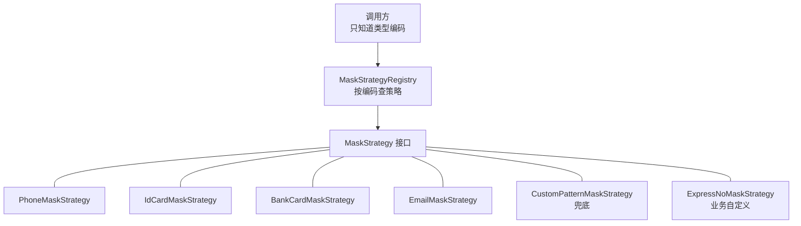
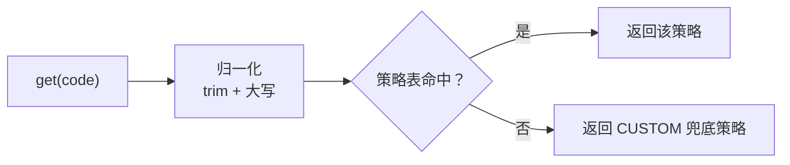

# 第 4 章 从一个 if-else 到策略模式

> **本章目标**：把第 1 章那段会腐烂的 `if-else` 重构成策略模式，写出四个内置策略，最后给方案加一个「快递单号」类型——**不改任何已有代码**。
> **前置知识**：Java 接口、抽象类、`enum`、`record`。不需要预先懂策略模式，本章从零讲。
> **预计时长**：60 分钟（含动手）。
> **本章代码**：`mask-tutorial/src/main/java/com/learn/mask/tutorial/ch04/`
> **跑测试**：`mvn -f mask-tutorial/pom.xml test`

---

## 4.1 问题场景：先把腐烂过程演一遍

第 1 章我们停在了这样一段代码：

```java
public static String maskByType(String type, String raw) {
    if (raw == null || raw.isBlank()) {
        return raw;
    }
    if ("phone".equals(type)) {
        return keep(raw, 3, 4);
    } else if ("idCard".equals(type)) {
        return keep(raw, 6, 4);
    } else if ("bankCard".equals(type)) {
        return keep(raw, 4, 4);
    } else if ("email".equals(type)) {
        int at = raw.indexOf('@');
        if (at <= 0) {
            return keep(raw, 1, 0);
        }
        return raw.charAt(0) + "*".repeat(at - 1) + raw.substring(at);
    }
    return keep(raw, 1, 1);
}
```

完整代码在 `ch04/NaiveMasker.java`，你可以先跑一下 `NaiveMaskerTest` 看它的行为。

这段代码**功能上是对的**。测试能过：

```java
assertThat(NaiveMasker.maskByType("phone", "13812345678")).isEqualTo("138****5678");
assertThat(NaiveMasker.maskByType("email", "zhangsan@example.com")).isEqualTo("z*******@example.com");
```

所以它的问题不是 bug，是**结构**。想象接下来半年会发生什么：

| 时间     | 需求               | 这个方法的变化               |
| ------ | ---------------- | --------------------- |
| 第 1 周  | 加银行卡             | 多一个分支                 |
| 第 3 周  | 加地址              | 多一个分支，而且地址逻辑和别的都不一样   |
| 第 6 周  | 加快递单号            | 多一个分支，要写正则            |
| 第 8 周  | 手机号规则改成前 3 后 0   | 改魔法数字，但改的时候得小心别碰到别的分支 |
| 第 10 周 | 掩码字符从 `*` 改成 `●` | 满方法搜索替换 `"*"`，漏一处就不一致 |
| 第 12 周 | 某个业务线要用自己的手机号规则  | **卡住了**               |

最后一行是关键。到这一步，你要么在方法里再套一层 `if (businessLine == ...)`，要么把整个方法复制一份。两条路都是死路。

还有几个更隐蔽的问题：

- **`type` 是 `String`。** 调用方写 `"idcard"`（少个大写 C）不会有任何编译错误，运行时静默落到最后的兜底分支，脱敏结果不对但没人发现。
- **规则写死在代码里。** 第 7 章要做配置化，这段代码里的 `3, 4` / `6, 4` 全得挪走。
- **没法单独测。** 想测邮箱逻辑，必须通过 `maskByType("email", ...)` 这个入口，而这个方法的签名和别的类型是耦合的。
- **`keep` 方法在每次调用时重算星号。** 后面要加缓存（第 8 章）时，缓存该挂在哪一层？没有合适的位置。

### 我们真正需要的东西

跳出代码想一想：上面这些需求的共同点是「**同一件事（打码）有多种做法（按类型），而且做法会不断增加**」。

这句话就是策略模式的定义。

---

## 4.2 原理：策略模式在这里长什么样

策略模式的三个角色：

| 角色   | 职责           | 本项目里是谁                                       |
| ---- | ------------ | -------------------------------------------- |
| 策略接口 | 定义「打码」这件事的契约 | `MaskStrategy`                               |
| 具体策略 | 各自实现一种做法     | `PhoneMaskStrategy` 等                        |
| 上下文  | 选一个策略并调用它    | `MaskStrategyRegistry` + 第 6 章的 `MaskEngine` |



关键收益：**`if-else` 的每个分支变成了一个独立的类，新增分支变成了新增类。** 这就是开闭原则在这个场景下的具体含义。

但策略模式不是免费的。它把「一个方法里的 8 个分支」换成了「8 个文件」，多了间接层。所以下面几节的重点不只是「拆成接口」，还包括**怎么让拆分后的代码总量反而变少**。

---

## 4.3 策略接口：只需要四个方法

```java
public interface MaskStrategy {

    SensitiveType type();

    default String code() {
        return type() == null ? SensitiveType.CUSTOM.name() : type().name();
    }

    String mask(String raw, MaskRule rule);

    boolean alreadyMasked(String raw, MaskRule rule);
}
```

逐个说。

### `type()` —— 内置类型枚举

```java
public enum SensitiveType {
    PHONE, ID_CARD, BANK_CARD, EMAIL, CUSTOM
}
```

用枚举替代 `String type`，直接解决了 4.1 节的「拼错不报错」问题。

注意 `CUSTOM` 不是可有可无的：它是**兜底类型**，也是策略表未命中时的回落目标。有了它，查策略永远不会返回 `null`。

### `mask(raw, rule)` —— 规则从参数进来，不写死在策略里

这是一个容易做错的设计决策。你可能会想把保留位数写在策略里：

```java
// 不好的设计
public class PhoneMaskStrategy implements MaskStrategy {
    public String mask(String raw) {
        return keep(raw, 3, 4);   // 3 和 4 写死在这
    }
}
```

这样第 7 章的配置化就没法做了——规则来自 `application.yml`，得在运行时传进来。所以规则必须是**参数**：

```java
public record MaskRule(boolean enabled, int keepPrefix, int keepSuffix, char maskChar) {
    public static MaskRule of(int keepPrefix, int keepSuffix) {
        return new MaskRule(true, keepPrefix, keepSuffix, '*');
    }
}
```

> **这里用 `record` 是有意的，而且会一直保持到最后。** 规则会被四个通道并发读取，一旦可变，热更新改字段的瞬间就可能有请求读到「前一半旧值、后一半新值」的规则。第 7 章的做法是让**配置容器**可变、让它每次返回一个不可变的规则快照。
> 
> 顺带说一句：`mask-starter` 的 `MaskRule` 是可变 JavaBean，和这里的取舍不同。第 7 章 7.7 节会对比两者的代价。

### `code()` —— 「不改枚举也能扩展」的关键

这是整个接口设计里最重要的一个方法，但它的价值要到 4.9 节才看得出来。

先记住一句话：**`type()` 返回枚举，受枚举取值限制；`code()` 返回字符串，不受限制。** 策略表用 `code()` 做主键，所以业务可以注册一个枚举里根本不存在的类型。

默认实现让内置策略不用管这件事：`code()` 默认就等于枚举名。

---

## 4.4 为什么要有第四个方法 `alreadyMasked`

现在看这个方法会觉得莫名其妙——脱敏就脱敏，为什么还要反向判断「这个值是不是已经被脱敏过了」？

回顾第 2 章 2.3 节：四个通道里有两个是**突变通道**，会把内存对象里的明文替换成打码值。如果同时开了 AOP 和 Jackson，同一个值会走两次脱敏：

```
第一次（AOP）：13812345678  →  138****5678
第二次（Jackson）：138****5678  →  ？
```

第二次会发生什么？`keepMask("138****5678", rule(3,4))` 的结果是：长度 11，保留前 3 后 4，中间 4 位打星——中间那 4 位本来就是 `****`，所以结果还是 `138****5678`。

**这次碰巧没坏。** 但换个规则就坏了：

```
规则改成保留前 3 后 0
第一次：13812345678  →  138********
第二次：138********  →  138********   还行

规则改成保留前 6 后 4
第一次：13812345678  →  138***5678      咦？
```

真正会坏的是掩码字符和位数不对齐的组合，以及邮箱这类有结构的类型。第 13 章会给出一个能真实复现二次打码的组合。

所以引擎需要一个能力：**在脱敏之前先问一句「这个值是不是已经是打码形态了？」，是就跳过。** 这个判断只有策略自己知道怎么做——`keepMask` 产出的形态是「中间全是掩码字符」，邮箱产出的形态是「local 段 keep 之后全是掩码字符」，各不相同。

所以它必须是策略接口的一部分。第 6 章 6.5 节会看到引擎怎么用它。

---

## 4.5 动手写：把通用能力下沉

四个内置类型里，手机号、身份证、银行卡、通用规则的逻辑**完全一样**，只有保留位数不同。所以第一步是把这段逻辑抽出来：

```java
public final class MaskUtils {

    public static String keepMask(String raw, MaskRule rule) {
        if (raw == null) {
            return null;
        }
        int prefix = Math.max(rule.keepPrefix(), 0);
        int suffix = Math.max(rule.keepSuffix(), 0);
        int len = raw.length();
        if (len == 0) {
            return raw;
        }
        if (len <= prefix + suffix) {
            return String.valueOf(rule.maskChar()).repeat(len);
        }
        return raw.substring(0, prefix)
                + String.valueOf(rule.maskChar()).repeat(len - prefix - suffix)
                + raw.substring(len - suffix);
    }
}
```

三个细节值得停下来看。

**`Math.max(..., 0)`。** 配置文件里如果写了 `keep-prefix: -1`（手误或者故意想表达「不保留」），不做钳制会导致 `substring(0, -1)` 抛异常。钳制到 0 之后行为是「不保留前缀」，符合直觉。

**`len <= prefix + suffix` 时全部打星。** 这是全项目最重要的一行兜底。它同时解决了三个问题：

- `"138"` 这种超短输入不会抛 `StringIndexOutOfBoundsException`（第 1 章的第二个 bug）
- 不会因为长度不够而**原样返回明文**（那就等于没脱敏，是更严重的问题）
- 行为可预测：遮不了一部分就全遮

请记住这个取值取向：**面对脏数据，「遮得更多」永远优于「报错」，也优于「放过」。**

**判断是 `<=` 而不是 `<`。** 长度正好等于 `prefix + suffix` 时也全星。因为此时中间没有任何字符可遮，如果按位置拼接，结果就是原文——一个没有被脱敏的手机号。测试里专门覆盖了这个边界：

```java
assertThat(strategy.mask("1381234", phoneRule)).isEqualTo("*******");   // 7 == 3 + 4
```

反向判断也放在这里：

```java
public static boolean alreadyKeepMasked(String raw, MaskRule rule) {
    if (isBlank(raw)) {
        return false;
    }
    int prefix = Math.max(rule.keepPrefix(), 0);
    int suffix = Math.max(rule.keepSuffix(), 0);
    char maskChar = rule.maskChar();
    int len = raw.length();
    if (len <= prefix + suffix) {
        return raw.chars().allMatch(c -> c == maskChar);
    }
    for (int i = prefix; i < len - suffix; i++) {
        if (raw.charAt(i) != maskChar) {
            return false;
        }
    }
    return true;
}
```

注意 `isBlank(raw)` 返回 `false`——**空值永远不算「已脱敏」**。这一点很重要：如果空串被判为已脱敏，引擎会跳过它；虽然结果一样（空串脱敏后还是空串），但指标会被记成 `skip_already_masked` 而不是 `bypass`，把监控数据搅乱。

---

## 4.6 动手写：基类 + 四个内置策略

有了 `MaskUtils`，基类只有十几行：

```java
public abstract class AbstractKeepMaskStrategy implements MaskStrategy {

    @Override
    public String mask(String raw, MaskRule rule) {
        if (MaskUtils.isBlank(raw) || rule == null || !rule.enabled()) {
            return raw;
        }
        return MaskUtils.keepMask(raw, rule);
    }

    @Override
    public boolean alreadyMasked(String raw, MaskRule rule) {
        if (rule == null) {
            return false;
        }
        return MaskUtils.alreadyKeepMasked(raw, rule);
    }
}
```

`rule == null || !rule.enabled()` 这个守卫让「关闭某个类型的脱敏」成为可能，第 7 章的 `masking.rules.phone.enabled: false` 就靠它。

然后，四个具体策略各自**只有一个方法**：

```java
public class PhoneMaskStrategy extends AbstractKeepMaskStrategy {
    @Override
    public SensitiveType type() {
        return SensitiveType.PHONE;
    }
}
```

`IdCardMaskStrategy`、`BankCardMaskStrategy`、`CustomPatternMaskStrategy` 一模一样，只是返回的枚举不同。

### 停下来算一下代码量

|                 | `if-else` 版  | 策略模式版                        |
| --------------- | ------------ | ---------------------------- |
| 文件数             | 1            | 8                            |
| 有效代码行数          | 约 25 行       | 约 70 行                       |
| 加一个「保留前后缀」类型的成本 | 改 1 个方法，+4 行 | 加 1 个文件，+6 行（其中 5 行是模板）      |
| 改掩码字符的成本        | 全方法搜索替换      | 改配置                          |
| 单独测某个类型         | 只能通过总入口      | 直接 `new PhoneMaskStrategy()` |
| 业务替换内置规则        | 做不到          | 注册一个同 code 的策略即可（4.8 节）      |

**策略模式确实让总代码量变多了。** 这是它的成本，不该粉饰。它换来的是「新增和修改的成本变低、变可预测」——从「改一个所有人都在用的方法」变成「加一个只有自己碰的文件」。

如果你的项目只有一种敏感类型且永远不会变，`if-else` 是更好的选择。判断标准是**变化的频率和方向**：类型会持续增加 → 策略模式；类型固定但每个类型内部逻辑会变 → 策略模式收益不大。

---

## 4.7 暴露的问题：邮箱套不进这个模式

现在给邮箱也来一个：

```java
public class EmailMaskStrategy extends AbstractKeepMaskStrategy {
    @Override
    public SensitiveType type() {
        return SensitiveType.EMAIL;
    }
}
```

用 `zhangsan@example.com`、规则「保留前 1 后 0」跑一下：

```
输入：zhangsan@example.com    （20 个字符）
输出：z*******************
```

域名被吃掉了。

再试试「保留前 1 后 12」，想着把 `@example.com` 这 12 个字符留出来：

```
输入：zhangsan@example.com
输出：z*******@example.com    ← 这次对了
输入：li@example.com          ← 换一个短邮箱
输出：**************          ← 长度 14 <= 1 + 12，全星了
```

问题的根源是：**通用逻辑按「整串长度」算，而邮箱的语义单位是「`@` 分隔的两段」。** 只要邮箱地址长度不同，固定的 `keepSuffix` 就对不上域名长度。

顺便说，为什么域名不该遮？两个原因：域名不是个人标识（`@example.com` 可能有几万人），遮它没有隐私收益；而保留域名有明确的业务价值（客服能一眼看出是企业邮箱还是个人邮箱，风控能识别一次性邮箱域名）。这正是第 1 章 1.6 节说的「业务一致性」。

### 解法：邮箱不继承基类

```java
public class EmailMaskStrategy implements MaskStrategy {

    @Override
    public String mask(String raw, MaskRule rule) {
        if (MaskUtils.isBlank(raw) || rule == null || !rule.enabled()) {
            return raw;
        }
        int at = raw.indexOf('@');
        if (at <= 0) {
            return MaskUtils.keepMask(raw, rule);
        }
        String local = raw.substring(0, at);
        String domain = raw.substring(at);
        int keep = Math.max(rule.keepPrefix(), 1);
        if (local.length() <= keep) {
            return String.valueOf(rule.maskChar()).repeat(local.length()) + domain;
        }
        return local.substring(0, keep)
                + String.valueOf(rule.maskChar()).repeat(local.length() - keep)
                + domain;
    }
}
```

四个设计点：

**`at <= 0` 一次挡掉两种异常输入。** `at == -1` 是「没有 `@`」，`at == 0` 是「`@` 在开头，没有 local 段」。两种情况都**回落到通用打星**，而不是抛异常，也不是原样返回。

第 3 章练习 3.1 的最后一行就是这个分支：`@example.com` 走 `keepMask` 后得到 `@***********`——保留的第 1 个字符是 `@` 本身。这个结果看起来有点怪，但它是安全的（原文被遮住了），这就够了。

**`Math.max(rule.keepPrefix(), 1)`。** 邮箱至少保留 1 个字符。如果配置成 0，local 段会被全星，结果 `*******@example.com` 反而暴露了「local 段有 8 个字符」这个信息量更大的特征，而且失去了「同一个人的邮箱看起来一致」的可辨识度。

**`local.length() <= keep` 时整段打星，不原样返回。** `a@b.com` 的 local 段只有 1 个字符，等于保留位数。如果按「保留前 1 位」处理，结果就是 `a@b.com`——**完全没有脱敏**。所以这里必须走全星分支，得到 `*@b.com`。

这是一个很容易漏掉的安全边界。测试里专门覆盖：

```java
assertThat(strategy.mask("a@b.com", emailRule)).isEqualTo("*@b.com");
```

**`alreadyMasked` 也必须跟着重写。** 判定逻辑要和 `mask` 对称——只检查 local 段。如果直接用基类的实现，它会拿整串去比对，把 `z*******@example.com` 中间的 `@example` 当成「不是掩码字符」，判定为未脱敏，然后二次打码。

**规律：策略的 `mask` 和 `alreadyMasked` 必须成对设计。** 改了一个忘了另一个，幂等就失效了。

---

## 4.8 策略注册表

现在有五个策略，需要一个地方管理它们。

```java
public class MaskStrategyRegistry {

    private final Map<String, MaskStrategy> strategies = new LinkedHashMap<>();

    public MaskStrategyRegistry(List<MaskStrategy> maskStrategies) {
        for (MaskStrategy strategy : maskStrategies) {
            register(strategy);
        }
    }

    public MaskStrategy get(String code) {
        MaskStrategy strategy = strategies.get(normalize(code));
        if (strategy != null) {
            return strategy;
        }
        return strategies.get(SensitiveType.CUSTOM.name());
    }

    public void register(MaskStrategy strategy) {
        if (strategy == null) {
            return;
        }
        strategies.put(normalize(strategy.code()), strategy);
    }

    public static String normalize(String code) {
        if (code == null || code.isBlank()) {
            return SensitiveType.CUSTOM.name();
        }
        return code.trim().toUpperCase(Locale.ROOT);
    }
}
```

四个设计点，每一个都对应一个具体的坑。

### 构造函数收 `List<MaskStrategy>`

这是**为接入 Spring 提前铺路**。到第 8 章我们把这个类注册成 Bean 时，只需要：

```java
@Bean
public MaskStrategyRegistry maskStrategyRegistry(List<MaskStrategy> strategies) {
    return new MaskStrategyRegistry(strategies);
}
```

Spring 看到 `List<MaskStrategy>` 参数，会自动把容器里**所有** `MaskStrategy` 类型的 Bean 收集进来。这意味着业务方加策略的成本是：写一个类，标 `@Component`，结束。不需要注册、不需要改配置、不需要碰 starter 任何代码。

如果构造函数写成 `MaskStrategyRegistry()` 然后手动 `register(new PhoneMaskStrategy())`，这个自动收集的能力就没有了。

### 编码归一化

```java
code.trim().toUpperCase(Locale.ROOT)
```

配置文件里写 `phone`、注解里写 `PHONE`、有人手抖打了 `" Phone "`——都要能查到同一个策略。

`Locale.ROOT` 不是可省略的。默认 `toUpperCase()` 会用系统 locale，在土耳其语环境下小写 `i` 会变成 `İ`（带点的大写 I）而不是 `I`。这是 Java 里的经典陷阱，叫 Turkish-I 问题。类型编码里恰好有 `ID_CARD` 这种含 `i` 的名字，所以这里必须显式指定 `Locale.ROOT`。

### 查不到时回落 `CUSTOM`，不返回 `null`



这个决策的意义在于**调用方永远不需要写 null 检查**，也不会因为「某个类型忘了注册策略」而导致敏感字段被原样输出。

行为上的含义是：**未知类型按通用规则脱敏**（默认保留前 1 后 1）。这仍然是「遮得更多优于放过」的取向。

### 同编码后注册者覆盖前者

`LinkedHashMap.put` 的自然行为，但它带来一个有用的能力：**业务可以替换内置策略**。

比如某个项目的手机号规则很特殊（要保留运营商号段的前 3 位 + 归属地的 2 位），只要写一个 `type()` 返回 `PHONE` 的策略并注册，就会覆盖 starter 的内置实现。测试里验证了这个行为：

```java
MaskStrategyRegistry registry = new MaskStrategyRegistry(
        List.of(new PhoneMaskStrategy(), stricterPhone));
assertThat(registry.get(SensitiveType.PHONE)).isSameAs(stricterPhone);
```

不过要注意：在 Spring 环境下，`List<MaskStrategy>` 的注入顺序取决于 Bean 的定义顺序和 `@Order`，不完全可控。所以真要覆盖内置策略，更可靠的做法是用 `@ConditionalOnMissingBean` 或干脆自己定义 `MaskStrategyRegistry` Bean（第 18 章 18.2 节会讲）。

---

## 4.9 扩展实战：加一个 starter 里没有的类型

来一个真实需求：

> 订单详情要展示快递单号。`SF1234567890123` 要保留承运商前缀 `SF` 和末尾 4 位；国际单号 `EA123456789CN` 末尾的国家代码 `CN` 也要保留。

先问一个问题：**这个需求要改哪些已有文件？**

答案是**零个**。

```java
public class ExpressNoMaskStrategy implements MaskStrategy {

    public static final String EXPRESS= "EXPRESS";

    private static final Pattern EXPRESS_PATTERN= Pattern.compile("^([A-Za-z]*)(\\d+)([A-Za-z]*)$");

    @Override
    public SensitiveType type() {
        return SensitiveType.CUSTOM;
    }

    @Override
    public String code() {
        return EXPRESS;
    }

    @Override
    public String mask(String raw, MaskRule rule) {
        if (MaskUtils.isBlank(raw) || rule == null || !rule.enabled()) {
            return raw;
        }
        String trimmed = raw.strip();
        Matcher matcher = EXPRESS.matcher(trimmed);
        if (matcher.matches()) {
            return matcher.group(1) + MaskUtils.keepMask(matcher.group(2), rule) + matcher.group(3);
        }
        return MaskUtils.keepMask(trimmed, rule);
    }

    @Override
    public boolean alreadyMasked(String raw, MaskRule rule) {
        if (MaskUtils.isBlank(raw) || rule == null) {
            return false;
        }
        String trimmed = raw.strip();
        // 快递单号只由字母和数字组成，正常明文里不可能出现掩码字符。
        // 所以「含掩码字符」就足以判定已打码，比逐位比对更简单也更稳。
        // 代价是：如果某种单号格式合法地包含 '*'，就会被误判为已打码而跳过脱敏。
        // 用这个捷径的前提是你确认自己的数据格式里不会出现掩码字符。
        if (trimmed.indexOf(rule.maskChar()) >= 0) {
            return true;
        }
        Matcher matcher = EXPRESS_PATTERN.matcher(trimmed);
        if (matcher.matches()) {
            return MaskUtils.alreadyKeepMasked(matcher.group(2), rule);
        }
        return MaskUtils.alreadyKeepMasked(trimmed, rule);
    }
}
```

**这就是 `code()` 那个方法存在的意义。** 它返回 `"EXPRESS"`——一个 `SensitiveType` 枚举里根本不存在的编码。策略表按字符串索引，所以完全接受。

对照一下如果没有 `code()` 会怎样：你必须往 `SensitiveType` 枚举里加一个 `EXPRESS`。而 `SensitiveType` 在 starter 里，改它意味着**业务需求驱动了框架发版**。有 100 个业务方就要加 100 个枚举值，而且互相能看到彼此的业务类型。

三个实现细节：

**正则只匹配「字母 + 数字 + 字母」结构，数字段交给 `keepMask`。** 这样保留位数依然是配置驱动的，没有回到硬编码。

**匹配失败时回落 `keepMask`，不原样返回。** 快递公司格式千奇百怪（带横线的、纯字母的），认不出来的情况一定会有。这时按通用规则打星，虽然结果不好看，但绝不会泄露。**这是 4.5 节那个取向的又一次应用。**

**`alreadyMasked` 用了一个捷径：**

```java
if (trimmed.indexOf(rule.maskChar()) >= 0) {
    return true;
}
```

「字符串里含掩码字符 → 判定为已打码」。快递单号只由字母数字组成，正常明文里不可能出现 `*`，所以这个判断足够可靠，而且比逐位比对简单得多。

代价是它很宽松：如果哪天出现一种合法包含 `*` 的单号格式，就会被误判为已打码而**跳过脱敏**。用这个捷径的前提是你确认自己的数据格式里不会出现掩码字符。这类「简单但有前提」的实现在真实项目里很常见，重要的是把前提写在注释里，而不是让下一个人自己猜。

### 接入 Spring 之后

在 `mask-demo` 里，这个策略只多了一个注解：

```java
@Component
public class ExpressNoMaskStrategy implements MaskStrategy {
```

然后配置里给它一条规则：

```yaml
masking:
  rules:
    extras:
      EXPRESS:
        keep-prefix: 2
        keep-suffix: 4
  extra-map-keys:
    expressNo: EXPRESS
```

字段上用：

```java
@Sensitive(code = ExpressNoMaskStrategy.EXPRESS)
private String expressNo;
```

这就是第 3 章实验一里 `expressNo` 变成 `SF12*******0123` 的全部机制。

---

## 4.10 验证

```bash
mvn -f mask-tutorial/pom.xml test
```

本章的 27 个测试分三个文件：

| 测试类                        | 数量  | 测什么                                      |
| -------------------------- | --- | ---------------------------------------- |
| `NaiveMaskerTest`          | 4   | **断言 bug 存在**：`replace` 替换全部匹配、脏数据抛异常    |
| `MaskStrategyTest`         | 18  | 各策略正确性、边界（超短/空值/规则关闭）、掩码字符可配置、幂等判定、自定义策略 |
| `MaskStrategyRegistryTest` | 5   | 按类型/编码查找、归一化、回落 CUSTOM、后注册覆盖             |

`NaiveMaskerTest` 是一种值得学的写法——**故意断言错误行为**：

```java
@Test
@DisplayName("replace 版 bug：中间四位重复出现时替换了全部匹配")
void replaceMasksEveryOccurrence() {
    assertThat(NaiveMasker.maskPhoneByReplace("13812341234"))
            .isEqualTo("138********")
            .isNotEqualTo("138****1234");
}
```

这个测试绿了不代表代码对，而是证明「bug 确实存在且我理解了它」。真实项目里排查线上问题时，先写一个断言当前错误行为的测试，是确认「我复现了这个 bug」最可靠的方式；修完再把断言改成正确期望，就能确保修复真的生效。

几个值得注意的断言：

```java
// 不定长字段不需要为每种长度写分支
assertThat(bankCard.mask("6222021234567890123", rule)).isEqualTo("6222***********0123");  // 19 位
assertThat(bankCard.mask("6222021234567890", rule)).isEqualTo("6222********7890");        // 16 位

// 换了掩码字符，幂等判定就认不出来了
assertThat(phone.alreadyMasked("138####5678", MaskRule.of(3, 4))).isFalse();
```

最后那条断言暴露了幂等机制的**固有边界**：它只能识别「用当前规则的掩码字符打出来的码」。如果规则热更新把 `maskChar` 从 `*` 改成 `#`，历史打码值就认不出来了。第 13 章会讨论这个边界的实际影响。

---

## 4.11 对照真实实现

你写的 `ch04` 和 `mask-starter` 的差异如下。

| 方面                                    | 你的 `ch04`           | `mask-starter`                                      | 为什么                                                                                                               |
| ------------------------------------- | ------------------- | --------------------------------------------------- | ----------------------------------------------------------------------------------------------------------------- |
| `MaskRule`                            | `record`，不可变        | 可变 JavaBean，有 getter/setter                         | starter 让 `@ConfigurationProperties` 直接绑定到 `MaskRule` 并在热更新时原地改字段。教程选择让配置容器可变、规则保持不可变快照。**两种做法的代价对比见第 7 章 7.7 节** |
| 规则字段访问                                | `rule.keepPrefix()` | `rule.getKeepPrefix()`                              | 同上，JavaBean 规范要求 getter                                                                                           |
| `SensitiveType`                       | 5 个值                | 6 个值，多一个 `ADDRESS`                                  | `ADDRESS` 是给接入方用的占位类型，**starter 自己不提供默认策略**（见下）                                                                   |
| 包结构                                   | 全在 `ch04` 一个包       | 拆成 `annotation` / `strategy` / `config` / `support` | 依赖边界，第 18 章 18.1 节                                                                                                |
| 策略是否 Spring Bean                      | 纯 POJO              | 在 `MaskingAutoConfiguration` 里声明为 `@Bean`           | 第 8 章接入 Spring                                                                                                    |
| `MaskStrategyRegistry.withBuiltins()` | 有，方便测试              | 没有，由自动配置装配                                          | 教程为了脱离 Spring 也能跑测试                                                                                               |

对应的真实文件：

```9:31:mask-starter/src/main/java/com/learn/mask/strategy/MaskStrategy.java
public interface MaskStrategy {

    /** 对应的内置类型。业务自定义策略可返回 {@link SensitiveType#CUSTOM}。 */
    SensitiveType type();

    default String code() {
        return type() == null ? SensitiveType.CUSTOM.name() : type().name();
    }

    String mask(String raw, MaskRule rule);

    boolean alreadyMasked(String raw, MaskRule rule);
}
```

`MaskUtils.keepMask` 和你写的完全一致，只是访问器不同：

```18:35:mask-starter/src/main/java/com/learn/mask/support/MaskUtils.java
    public static String keepMask(String raw, MaskRule rule) {
        if (raw == null) {
            return null;
        }
        int prefix = Math.max(rule.getKeepPrefix(), 0);
        int suffix = Math.max(rule.getKeepSuffix(), 0);
        char maskChar = rule.getMaskChar();
        int len = raw.length();
        if (len == 0) {
            return raw;
        }
        if (len <= prefix + suffix) {
            return String.valueOf(maskChar).repeat(len);
        }
        return raw.substring(0, prefix)
                + String.valueOf(maskChar).repeat(len - prefix - suffix)
                + raw.substring(len - suffix);
    }
```

### 一个可以商量的设计：`ADDRESS` 枚举值

`mask-starter` 的 `SensitiveType` 里有 `ADDRESS`，但 starter **没有** `AddressMaskStrategy`——实现在 `mask-demo` 里：

```9:23:mask-starter/src/main/java/com/learn/mask/annotation/SensitiveType.java
public enum SensitiveType {
    PHONE,
    ID_CARD,
    BANK_CARD,
    EMAIL,
    CUSTOM,
    /**
     * 地址。starter 不提供默认策略，由接入方实现 {@code MaskStrategy} 并注册为 Spring Bean。
     */
    ADDRESS
}
```

这意味着：如果业务用了 `@Sensitive(type = SensitiveType.ADDRESS)` 但**忘了注册策略**，注册表会回落到 `CUSTOM`，字段按「保留前 1 后 1」脱敏。不会泄露（兜底生效了），但结果和预期不符，而且没有任何警告。

按本章 4.9 节的逻辑，`ADDRESS` 本来应该走 `@Sensitive(code = "ADDRESS")` 这条自定义编码的路子，而不是占一个枚举值——枚举值的语义应该是「starter 保证有默认实现」。这是第 17 章 17.8 节列出的可改进点之一，也是本章的练习 4.4。

---

## 本章小结

- `if-else` 的问题不是 bug 而是结构：新增类型要改公共方法，业务方无法定制，规则没法外部化
- 策略模式把「一个方法的 N 个分支」变成「N 个类」。**代价是总代码量增加**，收益是新增和修改的成本变低且可预测
- 策略接口四个方法各有明确职责：`type()` 防拼错、`mask()` 接收规则参数为配置化铺路、`code()` 让扩展不必改枚举、`alreadyMasked()` 为幂等跳过服务
- 通用能力下沉到 `MaskUtils` 后，四个内置策略各自只有一个方法
- 核心安全取向：**长度不足时全部打星**，绝不抛异常、绝不原样返回。「遮得更多」优于「报错」优于「放过」
- 邮箱必须脱离通用逻辑，因为它的语义单位是 `@` 分隔的两段。**`mask` 和 `alreadyMasked` 必须成对设计**
- 策略表的四个决策：构造函数收 `List` 为 Spring 自动收集铺路、编码归一化（注意 `Locale.ROOT`）、未命中回落 `CUSTOM` 不返回 null、同编码后者覆盖
- 加一个 starter 里没有的类型：实现 `code()` 返回自定义编码，**零改动已有文件**

下一章解决另一个维度的问题：同样的字段，凭什么 `ADMIN` 能看明文而 `USER` 只能看星号。

---

## 课后练习

**练习 4.1** 实现一个「姓名脱敏」策略，规则是：

- 2 个字：保留姓，名打星 → `张三` → `张*`
- 3 个字及以上：保留首尾 → `欧阳修` → `欧*修`、`司马相如` → `司**如`
- 1 个字：全星 → `张` → `*`

要求：编码用 `"NAME"`，不修改 `SensitiveType` 枚举，并实现配套的 `alreadyMasked`。写测试覆盖这四种长度。

**练习 4.2** 下面这个策略有一个安全 bug，找出来并说明什么输入会触发。

```java
public class TokenMaskStrategy extends AbstractKeepMaskStrategy {
    @Override
    public SensitiveType type() {
        return SensitiveType.CUSTOM;
    }

    @Override
    public String code() {
        return "TOKEN";
    }

    @Override
    public String mask(String raw, MaskRule rule) {
        if (raw != null && raw.length() > rule.keepPrefix() + rule.keepSuffix()) {
            return super.mask(raw, rule);
        }
        return raw;
    }
}
```

**练习 4.3** 某项目在 `alreadyMasked` 里用了这个实现：

```java
@Override
public boolean alreadyMasked(String raw, MaskRule rule) {
    return raw != null && raw.contains("*");
}
```

请说出它在什么场景下会导致**敏感数据泄露**（不是「结果难看」，是真的泄露）。

**练习 4.4** 阅读 `mask-starter` 的 `SensitiveType` 枚举和 `mask-demo` 的 `AddressMaskStrategy`。回答：

1. 如果业务用了 `@Sensitive(type = SensitiveType.ADDRESS)` 但忘了注册 `AddressMaskStrategy`，运行时会发生什么？
2. 这个问题有几种解决方案？各自的代价是什么？

---

## 练习答案

### 练习 4.1

```java
public class NameMaskStrategy implements MaskStrategy {

    public static final String CODE = "NAME";

    @Override
    public SensitiveType type() {
        return SensitiveType.CUSTOM;
    }

    @Override
    public String code() {
        return CODE;
    }

    @Override
    public String mask(String raw, MaskRule rule) {
        if (MaskUtils.isBlank(raw) || rule == null || !rule.enabled()) {
            return raw;
        }
        String name = raw.strip();
        int len = name.length();
        String mask = String.valueOf(rule.maskChar());
        if (len == 1) {
            return mask;
        }
        if (len == 2) {
            return name.charAt(0) + mask;
        }
        return name.charAt(0) + mask.repeat(len - 2) + name.charAt(len - 1);
    }

    @Override
    public boolean alreadyMasked(String raw, MaskRule rule) {
        if (MaskUtils.isBlank(raw) || rule == null) {
            return false;
        }
        String name = raw.strip();
        int len = name.length();
        char maskChar = rule.maskChar();
        if (len == 1) {
            return name.charAt(0) == maskChar;
        }
        if (len == 2) {
            return name.charAt(1) == maskChar;
        }
        for (int i = 1; i < len - 1; i++) {
            if (name.charAt(i) != maskChar) {
                return false;
            }
        }
        return true;
    }
}
```

两个要点：

**没有继承 `AbstractKeepMaskStrategy`。** 因为姓名的规则不是「保留前 N 后 M」——2 个字的时候只保留前 1 位不保留后缀，3 个字以上保留前 1 后 1。规则随长度变化，套不进通用模型。这和 4.7 节邮箱的情况是同一类问题。

**`rule.keepPrefix()` / `keepSuffix()` 完全没用上**，只用了 `maskChar()` 和 `enabled()`。这是允许的——策略可以选择性地使用规则里的字段。但要在注释里说清楚，否则运维改了 `keep-prefix` 发现没效果会很困惑。

测试要覆盖四种长度：

```java
MaskRule rule = MaskRule.of(1, 1);
assertThat(strategy.mask("张", rule)).isEqualTo("*");
assertThat(strategy.mask("张三", rule)).isEqualTo("张*");
assertThat(strategy.mask("欧阳修", rule)).isEqualTo("欧*修");
assertThat(strategy.mask("司马相如", rule)).isEqualTo("司**如");
assertThat(strategy.alreadyMasked("司**如", rule)).isTrue();
assertThat(strategy.alreadyMasked("司马相如", rule)).isFalse();
```

（进阶思考：中文姓名里的复姓、少数民族姓名里的 `·`、以及 emoji 导致的 UTF-16 代理对，都会让 `length()` 和「字数」不一致。生产环境处理姓名要用 `codePointCount`。）

### 练习 4.2

**bug：长度不足时原样返回明文。**

```java
if (raw != null && raw.length() > rule.keepPrefix() + rule.keepSuffix()) {
    return super.mask(raw, rule);
}
return raw;    // ← 这里
```

这个 `if` 的作者大概是想「长度不够就没必要脱敏了」，但结果是**短 token 被原样输出**。

触发条件：假设规则是保留前 4 后 4（`keepPrefix + keepSuffix == 8`），那么任何长度 ≤ 8 的 token 都会明文返回。比如一个 8 位的短信验证码、一个 6 位的 PIN、一个 8 位的临时授权码——这些恰恰是最敏感的数据。

对比基类的正确行为（`MaskUtils.keepMask`）：

```java
if (len <= prefix + suffix) {
    return String.valueOf(maskChar).repeat(len);   // 全星
}
```

同样是「长度不足」这个分支，基类选择全星，这个 bug 版本选择放过。**方向完全相反。**

这就是 4.5 节反复强调那个取向的原因：`raw` 是「放过」，全星是「遮更多」。当你在写一个 `return raw;` 时，一定要问自己：这条路径上的值真的不需要脱敏吗？

正确的写法是直接删掉这个覆写——基类已经处理对了。

### 练习 4.3

**泄露场景：明文本身包含 `*`。**

具体例子：

- **地址**：`朝阳路*号院` —— 有些系统里用户会输入 `*` 作为占位或分隔
- **备注类敏感字段**：`密码提示*生日` 
- **被其他系统预处理过的数据**：上游系统已经用 `#` 打过码，值是 `138####5678`；本系统规则的 `maskChar` 是 `*`，但这个值里没有 `*`……这个例子反而不泄露。真正危险的是反过来：上游用 `*` 打了**部分**码，比如只遮了 1 位得到 `1381234*678`，本策略看到含 `*` 就判定「已打码」，于是**跳过脱敏，把 `1381234*678` 原样输出**——10 位明文数字全都在里面。

最后一个例子是最现实的：**多系统协作时，「部分打码」的值会被误判为「已完全打码」。**

再补一个更隐蔽的：正常明文里如果因为编码问题、用户粘贴、富文本转义等原因混进了一个 `*`，整个字段就被放过了。而这类脏数据你事先不可能穷举。

对比 4.9 节 `ExpressNoMaskStrategy` 用的同一个捷径为什么可以接受：因为它明确限定了数据格式（快递单号只含字母数字），并且把这个前提写在了注释里。**同一段代码，在有格式约束的字段上是合理简化，在无约束的字段上是安全漏洞。**

安全的实现应该像 `MaskUtils.alreadyKeepMasked` 那样，**验证掩码字符出现在正确的位置且连续覆盖了该遮的区间**，而不是「出现过就算」。

### 练习 4.4

**1. 运行时会发生什么**

`MaskStrategyRegistry.get("ADDRESS")` 查不到策略，回落到 `CustomPatternMaskStrategy`，字段按 `masking.rules.address` 的配置走通用「保留前后缀」逻辑。

以 `mask-demo` 的配置（`address: keep-prefix: 3, keep-suffix: 0`）和数据 `Chaoyang Road 88` 为例，结果会是 `Cha*************`——门牌号确实被遮住了，但整个街道名也没了。

**不会泄露**（兜底生效），但**结果和预期不符，且没有任何警告或日志**。这是最难排查的一类问题：功能"能用"，只是不对。开发者会怀疑规则配错了、注解没生效、Jackson 版本不对，很难想到「策略压根没注册」。

**2. 几种解决方案及代价**

| 方案                                          | 做法                                                        | 代价                                                                                                     |
| ------------------------------------------- | --------------------------------------------------------- | ------------------------------------------------------------------------------------------------------ |
| **A. 从枚举里删掉 `ADDRESS`**                     | 让它走 `@Sensitive(code = "ADDRESS")` 自定义编码路径，和 `EXPRESS` 一样 | 破坏性变更，已经在用 `SensitiveType.ADDRESS` 的代码要改。但语义最干净：枚举值 == starter 保证有默认实现                                 |
| **B. starter 提供一个默认 `AddressMaskStrategy`** | 补一个按保留前缀打星的实现                                             | 地址格式的地域差异极大（中文「XX路88号」vs 英文「88 XX Road」，门牌号在头还是在尾都不一样），starter 给的默认实现很可能不符合任何具体业务的预期，反而制造「以为对了其实不对」的错觉 |
| **C. 启动时校验**                                | 检查所有枚举值是否都有对应策略，缺失就打 WARN 或按 `strict` 配置启动失败              | 需要在自动配置里加校验逻辑（可以复用 `MaskingChannelValidator` 的模式）。**代价最小、收益最直接**——把「静默降级」变成「启动就告诉你」                    |
| **D. 注册表未命中时打 WARN**                        | 回落 `CUSTOM` 的同时记一条日志                                      | 实现最简单，但在请求路径上打日志有性能和刷屏风险，得做去重或限流。适合作为 C 的补充                                                            |

**推荐 C**。它符合一个通用原则：**能在启动时发现的问题，绝不留到运行时**。第 13 章的 `MaskingChannelValidator` 用的就是这个思路——通道冲突这种配置问题在 `afterPropertiesSet()` 里就报出来，而不是等到某个请求打码错了才被发现。

顺带说，方案 B 的困境很有代表性：**框架提供「看似合理」的默认实现，有时比不提供更危险。** 不提供会让接入方立刻发现「我需要自己写一个」；提供了则会让人以为已经处理好了。`mask-starter` 选择不提供 `AddressMaskStrategy`，这个决策方向是对的，缺的只是方案 C 那道校验。
