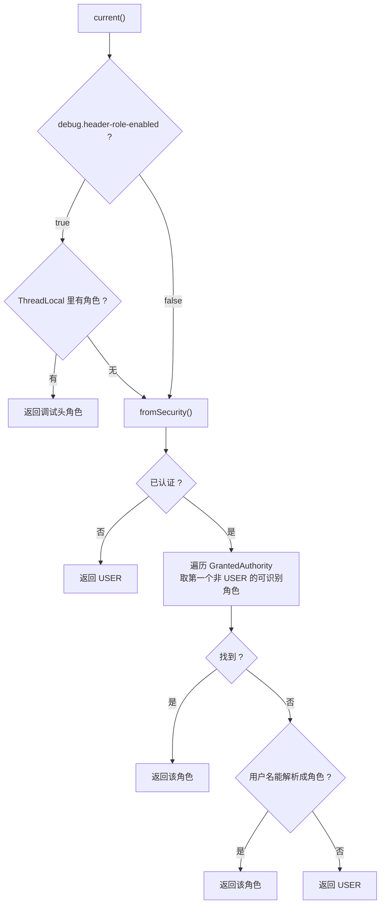

# 第 5 章 谁能看明文：角色上下文

> **本章目标**：让同一份数据对不同角色呈现不同结果。写出角色解析、两个权限判定、以及一个安全的调试开关。
> **前置知识**：知道 Spring Security 的 `SecurityContextHolder` 大致是干什么的（不熟也没关系，本章会讲到够用的程度）；知道 Servlet Filter 的执行时机。
> **预计时长**：50 分钟。
> **本章代码**：`mask-tutorial/src/main/java/com/learn/mask/tutorial/ch05/`

---

## 5.1 问题场景：策略模式解决不了的那个维度

第 4 章我们把「怎么打码」做得很干净了。但第 3 章的实验二暴露了一个策略模式完全没覆盖的需求：

```bash
curl -u user:user123  .../api/jackson/users/1   # → "phone": "138****5678"
curl -u admin:admin123 .../api/jackson/users/1  # → "phone": "13812345678"
```

**同一个字段、同一条规则、同一段代码，结果不同。** 差异来自「谁在请求」。

先想想天真的做法有什么问题。

### 天真做法一：在业务代码里判断

```java
public UserDto loadUser(Long id) {
    UserDto dto = convert(userMapper.findById(id));
    if (!isAdmin()) {
        dto.setPhone(maskPhone(dto.getPhone()));
    }
    return dto;
}
```

这就是第 2 章 2.6 节批判过的侵入式写法。每个方法都要写、漏一处就泄露，而且业务方法从此和「当前用户是谁」耦合。

### 天真做法二：把角色当参数传下去

```java
public String mask(String raw, MaskRule rule, MaskRole role) { ... }
```

看起来干净，但走不通。想想调用链：

```
Controller → Jackson 序列化器 → 策略
```

Jackson 的序列化器是框架实例化的，它的 `serialize()` 方法签名由 Jackson 定义，**你没法往里加参数**。Logback 的转换器、MyBatis 的 TypeHandler 也是同一个问题——它们都是被框架回调的，参数由框架决定。

所以角色不能靠参数传递，它必须是一个**任何位置都能问到的「环境」**。这就是「上下文」（Context）这个词的含义。

### 我们需要的东西

一个可以在任何代码位置调用、不需要参数、能回答三个问题的对象：

1. 当前是什么角色？
2. 这个角色要不要旁路脱敏？
3. 这个角色能不能调用还原接口？

---

## 5.2 三种角色，不是三个等级

```java
public enum MaskRole {
    ADMIN,
    USER,
    CS
}
```

只有三个值，但**不要把它理解成权限从低到高的三档**。它们是三种不同的权限语义：

| 角色      | 常规接口看到什么 | 能调还原接口吗 | 典型使用者        |
| ------- | -------- | ------- | ------------ |
| `USER`  | 打码值      | 不能      | 普通用户、大部分内部系统 |
| `ADMIN` | **明文**   | 能       | 极少数运维/管理岗    |
| `CS`    | 打码值      | **能**   | 客服           |

关键在 `CS` 这一行：**它的默认视图和 `USER` 完全一样干净，区别只在于多了一条通道。**

这个设计不是随便定的，它回答了第 1 章 1.1 节的第五个 bug——「客服要核对手机号怎么办」。有两种做法：

| 做法                       | 后果                                                        |
| ------------------------ | --------------------------------------------------------- |
| 把 CS 加进旁路列表，客服后台所有接口返回明文 | 客服的每一次列表查询都拉到全量明文。一次批量导出就是一起数据泄露事件，而且事后无法区分「哪些明文是业务真的需要的」 |
| **CS 默认打码，需要时调独立还原接口**   | 明文访问变成「按次、有记录、可限流、可审计」。安全团队能回答「上周谁看了多少个手机号」               |

项目选了后者。所以 `CS` 不在 `bypass-roles` 里，只在 `unmask-roles` 里：

```yaml
masking:
  bypass-roles: [ADMIN]        # 常规接口直接给明文
  unmask-roles: [ADMIN, CS]    # 允许调还原接口
```

第 3 章练习 3.2 验证过这个行为：`cs` 账号请求普通接口拿到的是 `138****5678`。

### 为什么 `USER` 是特殊的一个

`USER` 承担了一个额外角色：**所有兜底路径的目标值**。

- 没有认证信息 → `USER`
- 认证了但角色认不出来 → `USER`
- Spring Security 压根不在 classpath 上 → `USER`

因为 `USER` 是最严格的角色（什么都看不到明文），把它当默认值意味着**任何异常情况下系统都是安全的**。

这是安全设计里的一条通用原则：**默认值必须是最严格的那个（fail-safe / fail-closed）。** 如果反过来把 `ADMIN` 当默认，一个 `SecurityContext` 没设置好的边缘场景就变成了明文泄露。

---

## 5.3 动手写：角色解析

```java
public static MaskRole parse(String raw) {
    if (raw == null || raw.isBlank()) {
        return null;
    }
    String normalized = raw.trim().toUpperCase(Locale.ROOT);
    if (normalized.startsWith("ROLE_")) {
        normalized = normalized.substring(5);
    }
    return switch (normalized) {
        case "ADMIN" -> ADMIN;
        case "CS", "CUSTOMER_SERVICE" -> CS;
        case "USER" -> USER;
        default -> null;
    };
}
```

为什么不直接用 `MaskRole.valueOf(raw)`？因为入参来源五花八门：

| 来源                                   | 实际值长什么样                             |
| ------------------------------------ | ----------------------------------- |
| Spring Security 的 `GrantedAuthority` | `ROLE_ADMIN`（默认带前缀）                 |
| 调试请求头                                | `admin`、`ADMIN`、`Admin`，取决于谁在敲 curl |
| `application.yml` 里的列表项              | `ADMIN`，但也可能有人写 `role_admin`        |
| 老系统的用户名字段                            | `CUSTOMER_SERVICE`                  |

`valueOf` 对这些全部抛 `IllegalArgumentException`。与其让每个调用点自己规整，不如在这里一次处理干净。

四个实现细节：

**`Locale.ROOT` 不能省。** 和第 4 章策略表的 `normalize` 是同一个理由：默认 `toUpperCase()` 用系统 locale，土耳其语环境下小写 `i` 会变成 `İ` 而不是 `I`。这里没有含 `i` 的角色名，但保持一致的习惯比记住哪里需要哪里不需要更靠得住。

**`ROLE_` 前缀只剥一层。** `substring(5)` 执行一次，所以 `ROLE_ROLE_ADMIN` 会变成 `ROLE_ADMIN`，落到 `default` 返回 `null`。这是对的——那不是一个合法的角色名，宁可认不出来也不要猜。

**`"CS"` 和 `"CUSTOMER_SERVICE"` 映射到同一个值。** 这类同义词映射在对接老系统时很常见。放在 `switch` 里比让调用方自己转换清晰得多。

**认不出来返回 `null`，不是返回 `USER`。**

这个选择容易被质疑：既然最终都要兜底成 `USER`，为什么不在这里就返回 `USER`？

因为「解析失败」和「确实是 USER」是两件不同的事。混在一起会掩盖配置错误：

```yaml
masking:
  bypass-roles: [ADMINISTRATOR]    # 手误，多了 ISTRATOR
```

如果 `parse("ADMINISTRATOR")` 返回 `USER`，那么 `matches()` 里 `current == MaskRole.parse("ADMINISTRATOR")` 这个比较，在当前角色恰好是 `USER` 时会**意外命中**——普通用户获得了旁路权限。

返回 `null` 之后，这个比较永远不成立，配置手误的后果是「旁路失效」（安全方向），而不是「所有人旁路」（危险方向）。

再次是同一条原则：**出错时要往安全的方向倒。**

---

## 5.4 动手写：两条来源与优先级

```java
public MaskRole current() {
    if (properties.getDebug().isHeaderRoleEnabled()) {
        MaskRole headerRole = HEADER_ROLE.get();
        if (headerRole != null) {
            return headerRole;
        }
    }
    return fromSecurity();
}
```



### 开关判断为什么在最外层

注意这个顺序：**先判断开关，再读 ThreadLocal**。

```java
if (properties.getDebug().isHeaderRoleEnabled()) {   // 先
    MaskRole headerRole = HEADER_ROLE.get();          // 后
```

如果写成反过来（先读 ThreadLocal，有值再判断开关），功能上等价，但少了一层保障：关掉开关之后，**即使有人通过其他途径往 ThreadLocal 里塞了值也不会生效**。

这不是杜撰的场景。测试代码、内部工具、异步任务的上下文传递，都可能直接调 `MaskContext.setHeaderRole()`。开关在最外层意味着「生产环境关掉这个开关」是一个**真正的总闸**，而不是「只挡住了 HTTP 头这一条路」。

测试里验证了这一点：

```java
@Test
@DisplayName("开关关闭时，ThreadLocal 里有值也不生效")
void ignoredWhenSwitchOff() {
    properties.getDebug().setHeaderRoleEnabled(false);
    authenticateAs("alice", "ROLE_USER");
    MaskContext.setHeaderRole(MaskRole.ADMIN);      // 直接塞值

    assertThat(context.current()).isEqualTo(MaskRole.USER);   // 不生效
}
```

### 从 Security 解析：为什么要「跳过 USER」

```java
for (GrantedAuthority authority : authentication.getAuthorities()) {
    MaskRole parsed = MaskRole.parse(authority.getAuthority());
    if (parsed != null && parsed != MaskRole.USER) {
        return parsed;
    }
}
```

一个用户可以有多个权限。常见配置是给所有人 `ROLE_USER`，再给管理员额外加 `ROLE_ADMIN`：

```
alice 的 authorities = [ROLE_USER, ROLE_ADMIN]
```

`getAuthorities()` 返回的集合顺序是不保证的（Spring Security 内部常用 `Set`）。如果不跳过 `USER`，遍历时先碰到 `ROLE_USER` 就直接返回了——**管理员被当成普通用户**，功能时好时坏，取决于集合的迭代顺序。这类 bug 极难排查。

跳过 `USER` 之后，逻辑变成「找一个比 USER 更特殊的角色，找不到就是 USER」，与顺序无关。

测试：

```java
@Test
@DisplayName("多个权限时跳过 USER，取更特殊的角色")
void picksMoreSpecificRoleAmongMany() {
    authenticateAs("bob", "ROLE_USER", "ROLE_ADMIN");
    assertThat(context.current()).isEqualTo(MaskRole.ADMIN);
}
```

（这个实现有一个前提：一个用户不会同时有 `ADMIN` 和 `CS`。如果会，就得定义优先级。这是本章的练习 5.3。）

### 用户名兜底

```java
MaskRole fromName = MaskRole.parse(authentication.getName());
return fromName != null ? fromName : MaskRole.USER;
```

有些项目不用 `GrantedAuthority`，或者用了但角色信息在别处。这一步兜底让「用户名恰好就是角色名」的简单场景也能工作。

代价是一个古怪的行为：如果某个用户的用户名恰好叫 `admin`，即使他没有任何管理权限，也会被解析成 `ADMIN` 角色而看到明文。这是本章的练习 5.2。

---

## 5.5 两个判定：旁路与还原

```java
public boolean shouldBypass() {
    return matches(properties.getBypassRoles());
}

public boolean canUnmask() {
    return matches(properties.getUnmaskRoles());
}

private boolean matches(List<String> roles) {
    MaskRole current = current();
    if (current == null || roles == null) {
        return false;
    }
    for (String role : roles) {
        if (current == MaskRole.parse(role)) {
            return true;
        }
    }
    return false;
}
```

两个细节：

**比较的是 `parse` 之后的枚举，不是字符串。** 所以配置里写 `ADMIN`、`admin`、`role_admin` 都能命中。运维不需要记住准确写法，这在紧急改配置的时候很重要。

**`current == null` 或列表为 null 时返回 `false`。** 又是安全方向：拿不准就不给权限。

顺带一提，配置成空列表就等于关闭这个能力：

```java
@Test
@DisplayName("配置成空列表时谁都不能旁路")
void emptyBypassListBlocksEveryone() {
    properties.setBypassRoles(List.of());
    authenticateAs("alice", "ROLE_ADMIN");
    assertThat(context.shouldBypass()).isFalse();
}
```

这是一个有用的运维手段：出了安全事件要紧急收紧权限时，把 `bypass-roles` 清空即可，配合第 7 章的热更新连重启都不用。

---

## 5.6 `catch (NoClassDefFoundError)` 这个奇怪的写法

`fromSecurity()` 最外层包了一个看起来很可疑的东西：

```java
private MaskRole fromSecurity() {
    try {
        Authentication authentication = SecurityContextHolder.getContext().getAuthentication();
        // ...
    } catch (NoClassDefFoundError ex) {
        return MaskRole.USER;
    }
}
```

捕获 `Error` 一般是坏味道——`Error` 表示 JVM 层面的严重问题，通常不该被应用代码处理。那这里为什么要这么写？

### 因为 `spring-boot-starter-security` 是 optional 依赖

看 `mask-starter/pom.xml`：

```java
<dependency>
    <groupId>org.springframework.boot</groupId>
    <artifactId>spring-boot-starter-security</artifactId>
    <optional>true</optional>
</dependency>
```

`optional=true` 的含义是：**编译 starter 时用得到，但不会传递给依赖 starter 的项目。** 所以一个引入了 `mask-starter` 但没引入 Spring Security 的应用，运行时 classpath 上根本没有 `SecurityContextHolder` 这个类。

这时候执行到那一行，JVM 会抛 `NoClassDefFoundError`——注意是 `Error` 而不是 `Exception`，所以 `catch (Exception)` 挡不住。

捕获它之后返回 `USER`，效果是：**没有 Spring Security 的项目，整套脱敏依然完全可用，只是所有请求都按最严格的角色处理。** 这个降级行为是安全的，也是合理的（没有认证体系，本来就不该有人享有旁路特权）。

### 这个写法的代价

它会**掩盖真正的类加载问题**。假设某天因为依赖冲突，Spring Security 存在但版本不兼容导致 `NoClassDefFoundError`，这段代码会静默降级，所有人变成 `USER`——功能上「安全」了，但 `ADMIN` 莫名其妙看不到明文，排查起来毫无线索。

更规范的做法是用 `@ConditionalOnClass` 在装配阶段就分流，注册两个不同的 `MaskContext` 实现：

```java
@Bean
@ConditionalOnClass(name = "org.springframework.security.core.context.SecurityContextHolder")
public MaskContext securityAwareMaskContext(...) { ... }

@Bean
@ConditionalOnMissingBean(MaskContext.class)
public MaskContext alwaysUserMaskContext(...) { ... }
```

这样「有没有 Security」在启动时就确定了，运行时不需要每次 try-catch，也不会掩盖真问题。代价是多一个类和更复杂的自动配置。

`mask-starter` 选了简单的那条路。**这是一个可以商量的取舍，第 17 章 17.8 节和本章练习 5.4 会再讨论。** 现在你至少知道了：看到 `catch (NoClassDefFoundError)` 时，它大概是在处理 optional 依赖。

---

## 5.7 ThreadLocal 与过滤器：本章最危险的地方

调试头需要经过两个环节：过滤器把头里的角色存起来，后面的代码把它读出来。存在哪？

### 为什么必须是 ThreadLocal

回顾 5.1 节的问题：Jackson 序列化器、Logback 转换器、MyBatis TypeHandler 都拿不到 `HttpServletRequest`。所以不能「把 request 传下去」。

Servlet 容器给每个请求分配一个线程，整条调用链在同一个线程上执行。所以「线程」是天然的请求边界，`ThreadLocal` 就是把请求级数据透传给深处代码的标准手段。

```java
private static final ThreadLocal<MaskRole> HEADER_ROLE = new ThreadLocal<>();
```

### 过滤器

```java
@Order(Ordered.HIGHEST_PRECEDENCE + 20)
public class HeaderRoleFilter extends OncePerRequestFilter {

    @Override
    protected void doFilterInternal(HttpServletRequest request,
                                    HttpServletResponse response,
                                    FilterChain filterChain) throws ServletException, IOException {
        try {
            if (properties.getDebug().isHeaderRoleEnabled()) {
                MaskContext.setHeaderRole(MaskRole.parse(request.getHeader(properties.getDebug().getHeaderName())));
            }
            filterChain.doFilter(request, response);
        } finally {
            MaskContext.clearHeaderRole();
        }
    }
}
```

三个点：

**`OncePerRequestFilter` 而不是裸 `Filter`。** 一次请求可能多次进入过滤器链（forward、include、异步分发）。`OncePerRequestFilter` 用一个 request attribute 保证 `doFilterInternal` 只执行一次，避免重复解析和重复清理。

**`@Order(HIGHEST_PRECEDENCE + 20)`。** 必须在任何可能触发脱敏的环节之前把角色准备好。留 20 的余量是给更基础的过滤器让位——字符编码、追踪 ID、请求日志这些应该排在更前面。

**`finally` 里清理。** 这是本章的重点，下面单独讲。

### 事故复盘：为什么 `finally` 必须有

Servlet 容器的线程是**池化复用**的。Tomcat 默认最多 200 个工作线程，处理完一个请求，线程回到池里等下一个请求。

如果不清理 ThreadLocal：

```
请求 A：管理员发起，带 X-User-Role: ADMIN
        → 线程 http-nio-8080-exec-7 的 ThreadLocal 存入 ADMIN
        → 处理完毕，线程归还线程池，ThreadLocal 里的 ADMIN 还在

请求 B：普通用户发起，什么头都没带
        → 恰好分配到 http-nio-8080-exec-7
        → 读 ThreadLocal，拿到 ADMIN
        → 返回全量明文
```

**这是一次实实在在的越权。** 而且它有几个特别恶劣的性质：

- **概率性触发。** 取决于线程分配，测试环境低并发下几乎复现不了
- **无日志痕迹。** 请求 B 的日志看起来完全正常，认证也是对的
- **越权方向是「向上」。** 普通用户拿到管理员视图，不是反过来

除了越权，ThreadLocal 不清理还会导致**内存泄漏**——`ThreadLocalMap` 的 key 是弱引用但 value 是强引用，线程长期存活会让 value 一直无法回收。这个问题在放大对象（比如整个用户信息）时更明显。

### 一个意外的发现：还有第二道防线

我在写这一章的测试时，本来打算做一个「忘记 clear 的过滤器」来演示泄漏。结果测试失败了——**没有泄漏。**

原因藏在 `MaskContext` 里：

```java
public static void setHeaderRole(MaskRole role) {
    if (role == null) {
        HEADER_ROLE.remove();     // ← 这里
    } else {
        HEADER_ROLE.set(role);
    }
}
```

传 `null` 时执行的是 `remove()`，不是 `set(null)`。

于是：请求 B 不带头 → `request.getHeader(...)` 返回 `null` → `MaskRole.parse(null)` 返回 `null` → `setHeaderRole(null)` **把上一个请求的残留值删掉了**。

所以只犯「忘记 clear」这一个错误还不会泄漏。要真的泄漏，得同时犯第二个错——用「头存在才 set」这种看起来更干净的写法：

```java
String raw = request.getHeader(name);
if (raw != null) {                                  // ← 错误 2
    MaskContext.setHeaderRole(MaskRole.parse(raw));
}
// 少了 finally { clearHeaderRole(); }              ← 错误 1
```

这两个错误单独出现都不致命，凑在一起就是越权。而它们各自看起来都很合理——「没有头就别动 ThreadLocal」是很自然的直觉。

`mask-tutorial` 里的 `LeakyHeaderRoleFilter` 就是这个版本，测试断言了它真的泄漏：

```java
@Test
@DisplayName("有缺陷的过滤器：第二个请求什么头都没带，却越权拿到了 ADMIN")
void leakyFilterLeaksRoleToNextRequest() throws Exception {
    ExecutorService pool = Executors.newSingleThreadExecutor();   // 单线程 = 强制复用
    Filter filter = new LeakyHeaderRoleFilter(properties);
    MaskRole first = pool.submit(() -> runRequest(filter, "ADMIN")).get(5, TimeUnit.SECONDS);
    MaskRole second = pool.submit(() -> runRequest(filter, null)).get(5, TimeUnit.SECONDS);

    assertThat(first).isEqualTo(MaskRole.ADMIN);
    assertThat(second).isEqualTo(MaskRole.ADMIN);   // 越权
}
```

用 `newSingleThreadExecutor()` 强制两个「请求」跑在同一个线程上，把概率性问题变成了确定性测试。**这是测试 ThreadLocal 泄漏的标准手法**，比压测更可靠也更快。

这件事的两个启示：

1. **纵深防御是有价值的。** `setHeaderRole(null) → remove()` 这个不显眼的设计，挡住了一个更常见的错误。写工具方法时多想一层「调用方可能怎么用错」，成本很低。
2. **我原以为的单点故障其实需要两个错误叠加。** 如果不动手写测试，我会在文档里写一个错误的因果解释。这也是为什么本教程每一章都要跑测试验证。

---

## 5.8 生产环境必须关闭调试开关

```yaml
masking:
  debug:
    header-role-enabled: true    # 本地开发方便，生产环境等于把明文接口公开
    header-name: X-User-Role
```

开着它意味着：**任何人加一个 HTTP 头就能拿到全部明文。** 不需要密码，不需要提权，一个 curl 就够了。

```bash
curl -u anyuser:anypass -H "X-User-Role: ADMIN" https://prod.example.com/api/users/1
```

### 代码层面已经做对的部分

```java
private boolean headerRoleEnabled = false;
```

**默认值是 `false`。** 这很重要——忘记配置时是安全的，只有显式打开才有风险。

这是安全默认值的一般原则：**危险开关的默认值必须是关闭。** 反过来（默认开、要求用户显式关）会让每一个忘记配置的项目都带着漏洞上线。

`mask-demo` 的 `application.yml` 里把它设成了 `true`，因为它是演示项目，需要让读者在第 3 章实验三里体验这个功能。真实项目不该这么配。

### 还应该做但项目没做的部分

仅靠「默认 false + 文档提醒」是不够的，因为它挡不住「开发环境配好了，配置文件一路复制到生产」这个最常见的路径。

可以加固的几个方向：

| 手段               | 做法                                                                            | 成本                    |
| ---------------- | ----------------------------------------------------------------------------- | --------------------- |
| **启动时告警**        | 检测到 `header-role-enabled: true` 就打 ERROR 级日志，把它变成上线检查清单上跑不掉的一项                | 极低，几行代码               |
| **与 profile 绑定** | 只在 `dev` / `local` profile 下注册 `HeaderRoleFilter`，`@Profile({"dev","local"})` | 低，但要求 profile 规范统一    |
| **要求配套密钥**       | 除了开关，还要匹配一个 `debug.secret` 头，密钥从环境变量读                                         | 中，但能兼顾「生产环境临时排查」的真实需求 |
| **审计日志**         | 每次通过调试头覆盖角色时记一条 WARN，含来源 IP                                                   | 低，且能事后发现滥用            |

第一条性价比最高，建议任何自建的类似开关都加上。第 17 章 17.6 节会把这条列为高危事故项。

---

## 5.9 验证

```bash
mvn -f mask-tutorial/pom.xml test
```

本章 24 个测试分三个文件：

| 测试类                    | 数量               | 测什么                                                |
| ---------------------- | ---------------- | -------------------------------------------------- |
| `MaskRoleTest`         | 6 组（参数化后 21 个用例） | 大小写/空格/`ROLE_` 前缀/同义写法、认不出返回 null、只剥一层前缀           |
| `MaskContextTest`      | 13               | Security 解析（未认证、匿名、多权限、用户名兜底）、调试头优先级、两个判定          |
| `HeaderRoleFilterTest` | 7                | 开关生效、自定义头名、请求后已清理、抛异常也清理、**同线程复用不串角色**、**缺陷版真的泄漏** |

几个值得单独看的断言：

```java
// 未认证 → USER，不是 null，也不是 ADMIN
assertThat(context.current()).isEqualTo(MaskRole.USER);

// CS 不旁路但能还原 —— 两个不同维度
assertThat(context.shouldBypass()).isFalse();
assertThat(context.canUnmask()).isTrue();

// 链上抛异常时 finally 依然清理
assertThatThrownBy(() -> filter.doFilter(request, response, (req, res) -> {
    throw new IllegalStateException("boom");
})).isInstanceOf(IllegalStateException.class);
assertThat(context.current()).isEqualTo(MaskRole.USER);
```

最后那个测试容易被漏掉。业务代码抛异常是常态（参数校验失败、下游超时），如果清理写在 `doFilter` 之后而不是 `finally` 里，**每一次异常请求都会留下一个脏 ThreadLocal**。异常路径反而成了泄漏的高发路径。

注意 `MaskContextTest` 和 `HeaderRoleFilterTest` 都有 `@AfterEach`：

```java
@AfterEach
void cleanUp() {
    MaskContext.clearHeaderRole();
    SecurityContextHolder.clearContext();
}
```

**测试之间也会串。** JUnit 默认在同一个线程里跑同一个类的所有测试方法，ThreadLocal 和 `SecurityContextHolder` 都是线程级状态。忘了清理，测试就会出现「单独跑能过、一起跑就失败」或者更糟的「顺序不同结果不同」。这和 5.7 节讲的是完全同一个问题，只是换了个场景。

---

## 5.10 对照真实实现

| 方面                      | 你的 `ch05`                | `mask-starter`                                            | 为什么            |
| ----------------------- | ------------------------ | --------------------------------------------------------- | -------------- |
| 配置类                     | `RoleProperties`，只有角色相关项 | `MaskingProperties`，全部配置在一起                               | 第 7 章会合并       |
| `MaskContext` 逻辑        | 完全一致                     | 完全一致                                                      | —              |
| `MaskRole.parse`        | 完全一致                     | 完全一致                                                      | —              |
| `HeaderRoleFilter`      | 完全一致                     | 完全一致                                                      | —              |
| 过滤器如何注册                 | 手动 `new`（测试里）            | `WebMaskingAutoConfiguration` 里的 `FilterRegistrationBean` | 第 8 章接入 Spring |
| `LeakyHeaderRoleFilter` | 有，教学用                    | 没有                                                        | —              |

真实实现的核心逻辑：

```34:42:mask-starter/src/main/java/com/learn/mask/context/MaskContext.java
    public MaskRole current() {
        if (properties.getDebug().isHeaderRoleEnabled()) {
            MaskRole headerRole = HEADER_ROLE.get();
            if (headerRole != null) {
                return headerRole;
            }
        }
        return fromSecurity();
    }
```

```67:84:mask-starter/src/main/java/com/learn/mask/context/MaskContext.java
    private MaskRole fromSecurity() {
        try {
            Authentication authentication = SecurityContextHolder.getContext().getAuthentication();
            if (authentication == null || !authentication.isAuthenticated()) {
                return MaskRole.USER;
            }
            for (GrantedAuthority authority : authentication.getAuthorities()) {
                MaskRole parsed = MaskRole.parse(authority.getAuthority());
                if (parsed != null && parsed != MaskRole.USER) {
                    return parsed;
                }
            }
            MaskRole fromName = MaskRole.parse(authentication.getName());
            return fromName != null ? fromName : MaskRole.USER;
        } catch (NoClassDefFoundError ex) {
            return MaskRole.USER;
        }
    }
```

过滤器的注册方式（第 8 章会写）：

```java
@Bean
public FilterRegistrationBean<HeaderRoleFilter> headerRoleFilter(MaskingProperties properties) {
    FilterRegistrationBean<HeaderRoleFilter> registration =
            new FilterRegistrationBean<>(new HeaderRoleFilter(properties));
    registration.setOrder(Ordered.HIGHEST_PRECEDENCE + 20);
    registration.addUrlPatterns("/*");
    return registration;
}
```

注意这里 `setOrder` 又写了一遍，和过滤器类上的 `@Order` 重复。原因是：`@Order` 注解对通过 `FilterRegistrationBean` 注册的过滤器**不生效**，顺序由 `FilterRegistrationBean.setOrder` 决定。类上的 `@Order` 只在过滤器直接作为 Bean 被 Boot 自动注册时才起作用。两处都写是一种防御——不管用哪种方式注册，顺序都是对的。

---

## 本章小结

- 角色不能靠参数传递，因为 Jackson / Logback / MyBatis 的回调方法签名由框架决定。所以它必须是一个「任何位置都能问到的环境」
- 三个角色是三种语义不是三个等级。**`CS` 的默认视图和 `USER` 一样干净**，区别只在于多一条「按次、可审计」的还原通道
- `USER` 承担了所有兜底路径的目标值。**安全默认值必须是最严格的那个**
- `parse` 认不出来返回 `null` 而不是 `USER`，避免配置手误变成「所有人旁路」
- 从 Security 解析要**跳过 `USER`**，否则 `[ROLE_USER, ROLE_ADMIN]` 的迭代顺序会决定管理员能不能看明文
- `catch (NoClassDefFoundError)` 是在处理 optional 依赖，代价是会掩盖真正的类加载问题。更规范的做法是 `@ConditionalOnClass` 分流
- ThreadLocal 必须在 `finally` 里清理。不清理会导致**概率性、无日志痕迹、向上越权**，同时还有内存泄漏
- 用 `newSingleThreadExecutor()` 强制线程复用，能把概率性的 ThreadLocal 泄漏变成确定性测试
- `setHeaderRole(null) → remove()` 是一道不显眼的第二防线，它让「只忘记 clear」不至于立即出事
- 调试开关默认必须是 `false`，并且建议加启动告警

下一章把第 4 章的策略和本章的角色汇到一起：`MaskEngine` 的 `apply()` 方法，八步判定链，全项目唯一的脱敏入口。

---

## 课后练习

**练习 5.1** 某项目把 `MaskContext.current()` 改成了这样：

```java
public MaskRole current() {
    MaskRole headerRole = HEADER_ROLE.get();
    if (headerRole != null && properties.getDebug().isHeaderRoleEnabled()) {
        return headerRole;
    }
    return fromSecurity();
}
```

功能上和原版等价吗？如果不等价，差在哪？如果等价，原版那个顺序还有什么价值？

**练习 5.2** 系统里有个用户，用户名就叫 `admin`，但他的权限列表是 `[ROLE_USER]`（是个普通员工，只是抢注了这个用户名）。

1. `MaskContext.current()` 会把他解析成什么角色？
2. 他能看到明文吗？
3. 怎么修？给出至少两种方案并比较。

**练习 5.3** 现在需要支持一个用户同时拥有 `ADMIN` 和 `CS` 两个角色。

1. 当前实现会返回哪个？为什么这个结果不可靠？
2. 设计一个可靠的方案。提示：考虑给 `MaskRole` 加一个「特权等级」的概念，但要小心 5.2 节说过的「三种角色不是三个等级」。

**练习 5.4** 阅读 `mask-starter` 的 `pom.xml` 和 `MaskContext.fromSecurity()`，然后：

1. 写出用 `@ConditionalOnClass` 替代 `catch (NoClassDefFoundError)` 的完整方案（两个 `MaskContext` 实现 + 自动配置）
2. 列出这个改动的三个好处和两个代价
3. 判断：对一个教学项目来说该不该改？对一个要给几十个业务方用的内部 starter 该不该改？

---

## 练习答案

### 练习 5.1

**不等价。差别在于「开关关闭时，ThreadLocal 里的残留值会不会被读取」。**

两个版本在**功能结果**上确实一样（开关关闭时都返回 `fromSecurity()`），但在**代码执行路径**上不同：

- 原版：开关关闭 → 根本不调用 `HEADER_ROLE.get()`
- 练习版：开关关闭 → 仍然调用了 `HEADER_ROLE.get()`，只是结果没用上

这个差别在三个方面有实际影响：

**1. 防御深度。** 原版的开关是一个真正的总闸。任何往 ThreadLocal 写值的路径（测试代码、内部工具、异步上下文传播、未来某个同事加的新功能）都被这一个开关挡住。练习版的开关只在「读」的那一刻起作用，语义上更弱——如果哪天有人在 `current()` 之外的地方也读了 `HEADER_ROLE`，原版的开关能覆盖到（因为约定是「开关关了就不该有人读」），练习版则默认了「读是无害的」。

**2. 性能（次要）。** `ThreadLocal.get()` 涉及一次 `Thread.currentThread()` 调用和一次 `ThreadLocalMap` 查找。在生产环境（开关关闭）下，脱敏是热路径——一个返回 100 条记录、每条 5 个敏感字段的接口，一次请求就是 500 次 `current()` 调用。原版把这 500 次 `ThreadLocal.get()` 全省了。虽然单次开销很小，但这是「零成本」和「小成本」的区别，而且是免费拿到的。

**3. 可读性。** 原版读起来是「如果开了调试模式，才考虑调试头」，练习版是「如果有调试头且开了调试模式」。前者的逻辑层次和实际的语义层次一致（开关是前提，值是细节），后者把两个不同层级的条件平铺在一起了。

**结论**：功能等价，但原版在防御深度、性能、可读性三方面都更好。**把"总闸"性质的条件放在最外层**是一个值得养成的习惯。

### 练习 5.2

**1. 解析成 `ADMIN`。**

追一遍 `fromSecurity()`：

```java
for (GrantedAuthority authority : authentication.getAuthorities()) {
    MaskRole parsed = MaskRole.parse(authority.getAuthority());   // ROLE_USER → USER
    if (parsed != null && parsed != MaskRole.USER) {              // 是 USER，跳过
        return parsed;
    }
}
MaskRole fromName = MaskRole.parse(authentication.getName());     // "admin" → ADMIN
return fromName != null ? fromName : MaskRole.USER;               // 返回 ADMIN
```

权限里只有 `ROLE_USER`，被跳过了；然后走到用户名兜底，`"admin"` 被 `parse` 成了 `ADMIN`。

**2. 能看到明文。** `ADMIN` 在 `bypass-roles` 里，所有敏感字段都会旁路。这是一个真实的越权漏洞——只要能注册到 `admin` / `cs` / `Admin` 这类用户名，就能拿到全量明文。

而且这个漏洞很隐蔽：他的权限配置是完全正常的，任何权限审计工具都查不出问题。

**3. 修法**

| 方案               | 做法                                                | 优点                                | 缺点                                                          |
| ---------------- | ------------------------------------------------- | --------------------------------- | ----------------------------------------------------------- |
| **A. 删掉用户名兜底**   | 只从 `GrantedAuthority` 解析，认不出就是 `USER`             | 最彻底，语义最清晰：**角色只能来自权限体系，不能来自身份标识** | 破坏了「用户名恰好是角色名」的简单场景。但那个场景本来就不该被支持                           |
| **B. 加开关控制**     | `masking.role-from-username: false`（默认关），要用的项目显式开 | 兼容老项目                             | 多一个配置项和一条需要文档说明的行为。而且默认关之后，几乎没人会去开它——那还不如删掉                 |
| **C. 用户名加白名单**   | 只有配置在白名单里的用户名才允许解析成角色                             | 保留了兜底能力又堵住了注册攻击                   | 白名单要维护，而且如果白名单里的用户名被删号重注册，漏洞又回来了                            |
| **D. 禁止注册保留用户名** | 在注册逻辑里拦住 `admin` / `cs` / `user` 等                | 不改脱敏代码                            | **治标不治本**。历史数据里可能已经有了；而且脱敏组件的安全性依赖了一个完全不相关的模块（注册逻辑），耦合方向是错的 |

**推荐 A。** 理由：`authentication.getName()` 的语义是「身份标识」，而角色是「授权信息」。**用身份标识去推断授权，是身份认证与授权的混淆（confused deputy 的一种）**，这个方向从设计上就不该走。

兜底的动机是「兼容不用 GrantedAuthority 的项目」，但那类项目的正确适配方式是自己实现 `MaskContext`（starter 的所有 Bean 都有 `@ConditionalOnMissingBean`，见第 18 章 18.2 节），而不是让 starter 猜。

### 练习 5.3

**1. 当前实现返回「迭代到的第一个非 USER 角色」，结果取决于 `getAuthorities()` 的迭代顺序。**

`getAuthorities()` 的返回类型是 `Collection<? extends GrantedAuthority>`，具体实现不保证顺序。Spring Security 内部常用 `Set`（`UsernamePasswordAuthenticationToken` 用的是 `Collections.unmodifiableList`，但 `User.withUsername().roles()` 构造的是 `SortedSet`），而且不同的 `UserDetailsService` 实现、不同的版本、甚至同一个 `HashSet` 在不同 JVM 上的迭代顺序都可能不同。

所以这个用户可能被解析成 `ADMIN`（看到明文），也可能被解析成 `CS`（看不到明文）。**同一份配置、同一个用户、行为不确定**，而且换个环境或升个版本就可能变——这是最难排查的一类 bug。

**2. 可靠的方案**

关键是要有一个**确定的优先级**，而不是依赖迭代顺序。

先注意 5.2 节强调过「三种角色不是三个等级」——那是在说**权限语义**（`CS` 不是「介于中间」，它是另一个维度）。但为了解决多角色冲突，我们需要的是**一个确定的解析优先级**，这和「语义上是不是等级」是两件事。可以理解为：语义上不是等级，但需要一个规约来打破平局。

```java
public enum MaskRole {
    // 数字越大，解析时优先级越高
    USER(0),
    CS(10),
    ADMIN(20);

    private final int precedence;

    MaskRole(int precedence) {
        this.precedence = precedence;
    }

    public int precedence() {
        return precedence;
    }
}
```

```java
private MaskRole fromSecurity() {
    try {
        Authentication authentication = SecurityContextHolder.getContext().getAuthentication();
        if (authentication == null || !authentication.isAuthenticated()) {
            return MaskRole.USER;
        }
        return authentication.getAuthorities().stream()
                .map(a -> MaskRole.parse(a.getAuthority()))
                .filter(Objects::nonNull)
                .max(Comparator.comparingInt(MaskRole::precedence))
                .orElse(MaskRole.USER);
    } catch (NoClassDefFoundError ex) {
        return MaskRole.USER;
    }
}
```

三个好处：

- **结果确定**，与迭代顺序无关
- **不需要「跳过 USER」这个特殊逻辑了**，`USER` 的 precedence 最低，自然会被 `max` 淘汰。原来那行 `parsed != MaskRole.USER` 是在用一个 hack 模拟优先级
- 加新角色时只需要在枚举里给一个 precedence 值，解析逻辑不用改

**但这里有一个必须讨论的安全问题：`ADMIN` 的 precedence 应该最高吗？**

「取权限最大的」意味着一个同时有 `ADMIN` 和 `CS` 的用户会看到明文。但如果安全策略是「多重身份时按最严格的算」（最小权限原则的严格版），那应该用 `min` 而不是 `max`，让 `USER` 的 precedence 最高。

这不是技术问题，是策略问题，必须由安全团队决定。**代码要做的是把这个决定显式化、可配置化**，而不是让它隐含在一个 `for` 循环的迭代顺序里。所以更完整的方案是：

```yaml
masking:
  # HIGHEST: 多角色时取权限最大的（便利优先）
  # LOWEST:  多角色时取权限最小的（安全优先）
  multi-role-resolution: LOWEST
```

顺带说，`precedence` 这个字段名比 `level` 或 `weight` 好——它明确表达了「这是解析时的优先级」，而不是暗示「这是权限等级」，避免了和 5.2 节的语义冲突。

### 练习 5.4

**1. 完整方案**

```java
// 接口化
public interface MaskContext {
    MaskRole current();
    boolean shouldBypass();
    boolean canUnmask();
}
```

```java
// 实现一：有 Spring Security
public class SecurityMaskContext implements MaskContext {
    private final MaskingProperties properties;

    public SecurityMaskContext(MaskingProperties properties) {
        this.properties = properties;
    }

    @Override
    public MaskRole current() {
        if (properties.getDebug().isHeaderRoleEnabled()) {
            MaskRole headerRole = HeaderRoleHolder.get();
            if (headerRole != null) {
                return headerRole;
            }
        }
        // 不再需要 try-catch：能走到这个实现，说明类一定在
        Authentication authentication = SecurityContextHolder.getContext().getAuthentication();
        // ... 原来的解析逻辑
    }
    // shouldBypass / canUnmask 同原实现
}
```

```java
// 实现二：没有 Spring Security
public class HeaderOnlyMaskContext implements MaskContext {
    private final MaskingProperties properties;

    @Override
    public MaskRole current() {
        if (properties.getDebug().isHeaderRoleEnabled()) {
            MaskRole headerRole = HeaderRoleHolder.get();
            if (headerRole != null) {
                return headerRole;
            }
        }
        return MaskRole.USER;
    }
    // ...
}
```

```java
// 自动配置
@AutoConfiguration
public class MaskContextAutoConfiguration {

    @Configuration(proxyBeanMethods = false)
    @ConditionalOnClass(SecurityContextHolder.class)
    static class WithSecurity {
        @Bean
        @ConditionalOnMissingBean(MaskContext.class)
        MaskContext maskContext(MaskingProperties properties) {
            return new SecurityMaskContext(properties);
        }
    }

    @Configuration(proxyBeanMethods = false)
    @ConditionalOnMissingClass("org.springframework.security.core.context.SecurityContextHolder")
    static class WithoutSecurity {
        @Bean
        @ConditionalOnMissingBean(MaskContext.class)
        MaskContext maskContext(MaskingProperties properties) {
            return new HeaderOnlyMaskContext(properties);
        }
    }
}
```

注意 ThreadLocal 被抽到了独立的 `HeaderRoleHolder`，因为两个实现都要用它，而它和 Security 无关。这个拆分本身也是个改进——原来 ThreadLocal 是 `MaskContext` 的 `static` 字段，让一个「实例方法为主」的类带上了静态状态，测试和推理都更麻烦。

**2. 三个好处**

- **不再掩盖真问题。** 依赖冲突导致的 `NoClassDefFoundError` 会正常抛出，而不是静默降级成「所有人都是 USER」。这类问题最怕的就是没有信号
- **运行时零开销。** 判断在启动时完成一次，请求路径上没有 try-catch，也没有异常表查找
- **意图显式。** 读代码的人一眼看到「这个 starter 支持有/无 Security 两种环境」，而不是需要从一个可疑的 `catch (Error)` 里反推

**两个代价**

- **复杂度上升。** 从 1 个类变成 1 个接口 + 2 个实现 + 1 个自动配置 + 1 个 holder。对一个只有 80 行的类来说，这个比例的膨胀不小
- **两个实现要一起维护。** `shouldBypass` / `canUnmask` / 调试头逻辑在两个类里重复。可以抽个抽象基类，但那又多一层

**3. 该不该改**

**教学项目：不该改。** `catch (NoClassDefFoundError)` 只有 3 行，读者一眼能看完，而且它本身就是一个值得讲的知识点（optional 依赖是怎么回事）。换成 `@ConditionalOnClass` 方案会引入自动配置嵌套、`@ConditionalOnMissingClass`、接口抽象这些概念，把第 5 章的焦点从「角色」拉到「Spring 装配」上去——那是第 18 章的内容。

**给几十个业务方用的内部 starter：应该改。** 判断依据是「静默降级的代价」：

- 教学项目里，降级导致的后果是「demo 行为不对」，几分钟就能定位
- 内部 starter 里，降级导致的后果是「某个业务方的 ADMIN 突然看不到明文了」。他们不了解 starter 内部实现，会先怀疑自己的配置、Security 版本、注解，最后可能提一个「你们的组件有 bug」的工单，来回沟通几天。而根因可能只是一个传递依赖被别的库排除了

**通用判断标准：一个「省事」的实现，代价是把排查成本转移给了谁。** 如果转移给了写这段代码的人自己（教学项目、小团队内部工具），省事是划算的；如果转移给了大量不了解内情的使用方，就该多写那 80 行。
