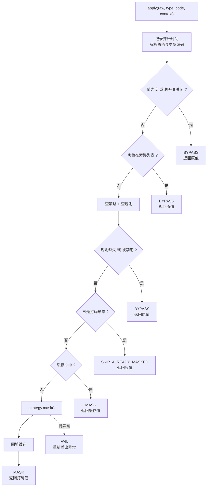

# 第 6 章 唯一入口：MaskEngine 的八步判定链

> **本章目标**：把第 4 章的策略和第 5 章的角色汇成一个方法。写出 `apply()` 的八步判定链，并理解**每一步的顺序为什么不能换**。
> **前置知识**：第 4、5 章。
> **预计时长**：60 分钟。
> **本章代码**：`mask-tutorial/src/main/java/com/learn/mask/tutorial/ch06/`

---

## 6.1 问题场景：如果每个通道自己拼

现在手上有两块零件：

- 第 4 章：`MaskStrategyRegistry.get(code)` → 策略，`strategy.mask(raw, rule)` → 打码
- 第 5 章：`MaskContext.shouldBypass()` → 根据上下文中的角色，要不要旁路（不脱敏）

四个通道各自把它们拼起来就行了，看起来不难：

```java
// Jackson 序列化器里
public void serialize(String value, ...) {
    if (context.shouldBypass()) {
        gen.writeString(value);
        return;
    }
    MaskStrategy strategy = registry.get(code);
    MaskRule rule = properties.ruleOf(code);
    gen.writeString(strategy.mask(value, rule));
}
```

```java
// AOP 切面里
Object masked = ...;
if (!context.shouldBypass()) {
    MaskStrategy strategy = registry.get(code);
    MaskRule rule = properties.ruleOf(code);
    field.set(target, strategy.mask(value, rule));
}
```

Logback、MyBatis 里再各写一遍。

问题不是「重复代码」这么轻。想想接下来会发生什么：

| 需求                            | 后果                            |
| ----------------------------- | ----------------------------- |
| 加一条「值为空就跳过」                   | 改四处                           |
| 加一条「规则被禁用就跳过」                 | 改四处                           |
| 加幂等跳过（第 4 章 4.4 节的伏笔）         | 改四处，而且四处的判定顺序可能不一致            |
| 加缓存                           | 改四处，每处缓存 key 的构造要一致，否则命中率莫名很低 |
| 加指标                           | 改四处，标签要一致，否则 Grafana 上聚不起来    |
| 排查「为什么 CS 在 MyBatis 通道下看到明文了」 | 得读四份实现互相对比                    |

最后一行是真正的杀手。**语义有四份实现，就一定会漂移。** 而漂移的表现是「某个通道下权限判断不对」——这种 bug 不会在测试里暴露（因为测试通常只覆盖一个通道），只会在生产环境某个特定接口上出现。

### 结论

「谁能看明文」「什么时候跳过」「怎么记指标」这些语义**必须只有一份实现**。四个通道只负责一件事：**在自己的时机点上把值交出去、把结果拿回来。**

这就是 `MaskEngine` 存在的理由。它不是为了「复用代码」，是为了**让语义只有一个定义处**。

---

## 6.2 引擎需要什么：先定义依赖

写引擎之前先想清楚它依赖什么。

```java
public MaskEngine(MaskSettings settings,
                  MaskStrategyRegistry registry,
                  MaskResultCache cache,
                  AlreadyMaskedDetector alreadyMaskedDetector,
                  MaskRecorder recorder) {
```

五个依赖，但角色（`MaskContext`）不在里面——它是**每次调用**传进来的参数，因为角色是请求级的，而引擎是单例。

### 为什么 `MaskSettings` 是一个窄接口

```java
public interface MaskSettings {
    boolean isEnabled();
    MaskRule ruleOf(String code);
}
```

引擎需要从配置里知道的**全部**信息就这两件事。所以不要让它依赖一个有几十个 getter 的大配置类，而是定义一个只有两个方法的接口。

收益有三个，而且都很具体：

**1. 第 7 章不用改引擎。** 那一章会写一个从 YAML 绑定、支持热更新、带版本号的 `MaskingProperties implements MaskSettings`。引擎一行都不用动。

**2. 本章的测试不需要 Spring。** 用一个内存实现就行：

```java
SimpleMaskSettings settings = SimpleMaskSettings.withDemoDefaults();
settings.put(SensitiveType.PHONE, MaskRule.of(3, 4));
```

没有 YAML 文件、没有 `@SpringBootTest`、没有上下文启动的几秒钟。29 个引擎测试跑完不到一秒。

**3. 意图变清楚了。** 读接口就知道「引擎只关心开关和规则，不关心角色列表、缓存大小、通道开关」。如果引擎直接依赖大配置类，读者得通读引擎代码才能知道它到底用了哪几项。

这就是依赖倒置：**引擎定义自己需要什么（接口放在引擎这边），而不是去适配别人提供什么。**

### `MaskResultCache` 和 `MaskRecorder`：提前留位置

缓存和指标是第 8 章的内容，但它们的**接口**在本章就定义好，并用 `NO_OP` 实现接上：

```java
public interface MaskResultCache {
    String get(String typeCode, String raw);
    void put(String typeCode, String raw, String masked);
    void invalidateAll();

    MaskResultCache NO_OP = new MaskResultCache() { /* 全部空实现 */ };
}
```

```java
public interface MaskRecorder {
    void record(String typeCode, MaskRole role, MaskAction action, Duration duration);

    MaskRecorder NO_OP = (typeCode, role, action, duration) -> { };
}
```

这么做的理由是：**让判定链写一次就定型。** 如果第 8 章才把缓存塞进来，就得回来在链上插两步，而插的位置恰好是最容易插错的地方（6.6、6.7 节会看到为什么）。提前留好位置，第 8 章只需要换实现。

构造函数里对 null 做了兜底：

```java
this.cache = cache == null ? MaskResultCache.NO_OP : cache;
this.recorder = recorder == null ? MaskRecorder.NO_OP : recorder;
```

这样「不装缓存」「不装指标」是一等公民的用法，不是异常情况。写测试和写 demo 时省了很多样板。

---

## 6.3 `MaskAction`：让分支可断言

```java
public enum MaskAction {
    MASK,
    BYPASS,
    SKIP_ALREADY_MASKED,
    FAIL
}
```

它有三个用途，第三个最容易被忽略：

1. 判定链的**出口标记**——每条分支都以一个 action 结束，读代码时一眼看出「这条路走完了」
2. Micrometer 的**指标标签**（第 8 章）
3. 测试的**断言对象**

第 3 点为什么重要？因为**只看返回值区分不出分支**。

举例：`engine.apply("138****5678", PHONE, adminContext)` 返回 `138****5678`。这个结果可能来自：

- 角色旁路（ADMIN 看明文，而这个「明文」本身就是打码串）
- 幂等跳过（值已经是打码形态）
- 缓存命中

三条路径返回值完全一样，但含义完全不同。有了 `MaskAction`，测试就能断言走的是哪条：

```java
@Test
@DisplayName("ADMIN 遇到已打码值时记 BYPASS，不是 SKIP")
void bypassBeforeIdempotentCheck() {
    authenticateAs("alice", "ROLE_ADMIN");
    assertThat(engine.apply("138****5678", SensitiveType.PHONE, context)).isEqualTo("138****5678");
    assertThat(recorder.lastAction()).isEqualTo(MaskAction.BYPASS);
}
```

这个测试**固化了判定顺序**。如果有人把「角色旁路」挪到「幂等判定」之后，返回值不变、功能看起来正常，但这个测试会红。

---

## 6.4 动手写：八步判定链

完整的 `apply`：

```java
public String apply(String raw, SensitiveType type, String code, MaskContext context) {
    long start = System.nanoTime();
    MaskRole role = context == null ? MaskRole.USER : context.current();
    String resolvedCode = resolveCode(code, type);

    try {
        // 第 1 步：空值与总开关
        if (MaskUtils.isBlank(raw) || !settings.isEnabled()) {
            return record(raw, resolvedCode, role, MaskAction.BYPASS, start);
        }

        // 第 2 步：角色旁路
        if (context != null && context.shouldBypass()) {
            return record(raw, resolvedCode, role, MaskAction.BYPASS, start);
        }

        // 第 3 步：查策略与规则
        MaskStrategy strategy = registry.get(resolvedCode);
        MaskRule rule = settings.ruleOf(resolvedCode);

        // 第 4 步：规则缺失或禁用
        if (strategy == null || rule == null || !rule.enabled()) {
            return record(raw, resolvedCode, role, MaskAction.BYPASS, start);
        }

        // 第 5 步：幂等跳过
        if (alreadyMaskedDetector.isAlreadyMasked(raw, strategy, rule)) {
            return record(raw, resolvedCode, role, MaskAction.SKIP_ALREADY_MASKED, start);
        }

        // 第 6 步：查缓存
        String cached = cache.get(resolvedCode, raw);
        if (cached != null) {
            return record(cached, resolvedCode, role, MaskAction.MASK, start);
        }

        // 第 7 步：真正脱敏
        String masked = strategy.mask(raw, rule);

        // 第 8 步：回填缓存
        cache.put(resolvedCode, raw, masked);
        return record(masked, resolvedCode, role, MaskAction.MASK, start);

    } catch (RuntimeException ex) {
        record(raw, resolvedCode, role, MaskAction.FAIL, start);
        throw ex;
    }
}
```



下面逐段解释顺序。**这一章的价值几乎全在「顺序为什么是这样」上。**

---

## 6.5 顺序解析（上）：前四步

### 计时为什么从最开头开始

```java
long start = System.nanoTime();
MaskRole role = context == null ? MaskRole.USER : context.current();
```

计时器在解析角色**之前**就启动了，所以 `masking.duration` 包含了查规则、查策略、判角色的全部开销。

一个常见的错误是只统计 `strategy.mask()`：

```java
// 不好的做法
long start = System.nanoTime();
String masked = strategy.mask(raw, rule);
record(..., System.nanoTime() - start);
```

这样指标会非常好看（打星就是几次 `substring`，几百纳秒），但**对定位「脱敏拖慢了接口」毫无帮助**。真实的开销可能在别处：

- `context.current()` 要访问 `SecurityContextHolder`，是一次 ThreadLocal 查找
- `settings.ruleOf()` 在热更新场景下可能有锁或 volatile 读
- 缓存查找是一次哈希计算 + 可能的 Caffeine 内部维护

指标要度量的是**调用方感受到的开销**，不是某一行代码的开销。

### 角色为什么先解析

```java
MaskRole role = context == null ? MaskRole.USER : context.current();
```

即使后面走了「值为空」这种最早的旁路分支，指标也需要知道是谁触发的。如果把角色解析放到需要用的地方（第 2 步里面），那么第 1 步的 `record()` 就没有角色标签，Grafana 上 `masking.bypass` 按角色聚合时会出现一堆 `unknown`。

代价是：即使第 1 步就返回，也付了一次角色解析的开销。考虑到 5.4 节讲过 `current()` 在生产配置下（调试开关关闭）就是一次 `SecurityContextHolder` 读取，这个代价可以接受。

### 第 1 步：空值与总开关放最前

两个理由：

**最便宜。** `isBlank()` 是一次 null 检查加一次长度检查。总开关是一次布尔读。放在最前面意味着最廉价的判断先执行。

**能挡掉大量调用。** 真实数据里空值占比很高（可选字段、未填写的联系方式）。第 3 章实验一的 `UserDto` 里就有 `contacts` 为空的情况。

注意 `MaskUtils.isBlank` 把 `"   "` 也算空值，所以纯空格字符串会原样返回。这是对的——空格里没有敏感信息。

**关于总开关的一个观察**：`masking.enabled: false` 会让整个方案彻底失效。这个开关的存在是为了应急（脱敏组件出了严重 bug，需要立刻关掉保业务），但它也是一个危险的按钮。教程把空值和总开关都记成 `BYPASS`；starter 把总开关拆成 `MaskAction.DISABLED`，启动和热更新打 error 日志，见 6.11。

### 第 2 步：角色旁路必须在查规则之前

这个顺序是**语义要求**，不是优化。

`ADMIN` 的语义是「看明文，不受任何规则配置影响」。如果先查规则：

```java
// 错误的顺序
MaskRule rule = settings.ruleOf(resolvedCode);
if (rule == null) { ... }
if (context.shouldBypass()) { ... }   // 太晚了
```

那么「规则不存在」这条分支会先命中。虽然两条分支的返回值都是明文，**但记录的 action 不同**（都是 `BYPASS`，但如果哪天要区分开就分不了），而且更重要的是：一旦第 4 步的行为将来改成「规则缺失时报错」或「规则缺失时全星兜底」，`ADMIN` 就会被卷进去。

测试固化了这个顺序：

```java
@Test
@DisplayName("角色旁路优先于规则查找：即使规则不存在，ADMIN 的行为也一致")
void bypassHappensBeforeRuleLookup() {
    authenticateAs("alice", "ROLE_ADMIN");
    settings.remove("PHONE");
    assertThat(engine.apply("13812345678", SensitiveType.PHONE, context)).isEqualTo("13812345678");
}
```

还有一个副作用值得注意：**旁路分支在缓存之前，所以明文永远不会进缓存。**

```java
@Test
@DisplayName("旁路分支在查缓存之前，明文不会被写进缓存")
void bypassDoesNotPopulateCache() {
    authenticateAs("alice", "ROLE_ADMIN");
    engine.apply("13812345678", SensitiveType.PHONE, context);
    assertThat(cache.putCount).isZero();
}
```

这不是巧合，是必须保证的性质。第 8 章会看到缓存的 key 是「规则版本 + 类型 + 明文」、value 是打码值。如果 `ADMIN` 的旁路结果（明文）也被写进去，那么 value 就是明文，缓存变成了一个存明文的地方——一旦 heap dump 泄露，或者缓存被某个 debug 端点暴露，就是一次数据泄露。

### 第 4 步：为什么还要判 `strategy == null`

第 4 章 4.8 节说过，注册表未命中会回落 `CUSTOM`，所以 `registry.get()` 理论上不会返回 null。那这个判断是多余的吗？

不是。原因是**注册表可能被业务替换**。第 18 章 18.2 节会讲，starter 的所有 Bean 都有 `@ConditionalOnMissingBean`，业务可以自己定义 `MaskStrategyRegistry`。如果他们的实现没有 `CUSTOM` 兜底策略，`get()` 就会返回 null。

这行判断的代价是一次引用比较，收益是「引擎不会因为使用方的实现而 NPE」。防御性判断的成本收益比在这里是划算的。

**但注意它的方向：`strategy == null` 时走的是 BYPASS，也就是返回明文。** 这和第 4 章反复强调的「遮得更多优于放过」相反。这是引擎里一个值得质疑的设计，本章练习 6.2 会讨论。

### 第 4 步的另一面：规则缺失返回明文

```java
if (strategy == null || rule == null || !rule.enabled()) {
    return record(raw, resolvedCode, role, MaskAction.BYPASS, start);
}
```

`rule == null` 意味着「配置里没有为这个类型配规则」。当前行为是返回明文。

测试里我把这件事明确写出来了：

```java
@Test
@DisplayName("没配规则时旁路 —— 注意这里会返回明文")
void missingRuleBypasses() {
    authenticateAs("dave", "ROLE_USER");
    settings.remove("PHONE");
    assertThat(engine.apply("13812345678", SensitiveType.PHONE, context)).isEqualTo("13812345678");
}
```

**一个 `USER` 角色的请求，因为运维漏配了一条规则，拿到了完整手机号。** 而且没有任何告警。

这是整个项目里我认为最需要改的一个设计。第 17 章 17.8 节会把它列为高优先级改进项，练习 6.2 会让你设计替代方案。

---

## 6.6 顺序解析（下）：幂等与缓存

### 第 5 步：幂等跳过必须在缓存之前

这是最容易插错的一步。

先看第 4 章 4.4 节埋的伏笔终于兑现：

```java
@Test
@DisplayName("两个通道叠加：第二次调用被幂等跳过")
void twoChannelsInARow() {
    authenticateAs("dave", "ROLE_USER");

    String afterAop = engine.apply("13812345678", SensitiveType.PHONE, context);
    String afterJackson = engine.apply(afterAop, SensitiveType.PHONE, context);

    assertThat(afterAop).isEqualTo("138****5678");
    assertThat(afterJackson).isEqualTo("138****5678");
    assertThat(recorder.actions()).containsExactly(MaskAction.MASK, MaskAction.SKIP_ALREADY_MASKED);
}
```

这就是第 2 章 2.3 节讲的「AOP 改了内存对象，Jackson 又走一遍」的场景。第二次调用被识别并跳过。

**那为什么必须在缓存之前？**

假设顺序反了（先查缓存，再判幂等）：

```
第一次：apply("13812345678")
  → 缓存未命中
  → 脱敏得到 "138****5678"
  → 缓存写入 {PHONE:13812345678 → 138****5678}

第二次：apply("138****5678")     ← AOP 改过的值
  → 先查缓存：key 是 PHONE:138****5678，未命中
  → 判幂等：是已打码形态，跳过
  → 但已经白查了一次缓存
```

白查一次不算大问题。真正的问题在这个场景：

```
如果幂等判定失败了（比如换了 maskChar，第 4 章测试过这个边界）
第二次：apply("138****5678")
  → 缓存未命中
  → 脱敏得到 "138****5678"（碰巧一样）
  → 缓存写入 {PHONE:138****5678 → 138****5678}   ← 打码值成了缓存的 key
```

**缓存里出现了「打码值 → 打码值」的条目。** 这些条目：

- 占用缓存容量，挤掉真正有用的「明文 → 打码值」条目
- 让命中率统计失真（第 8 章要用命中率判断缓存大小配得对不对）
- 在缓存容量有限时，可能导致真实明文的条目被淘汰，反而降低整体性能

把幂等放在缓存之前，这些条目就永远不会产生。测试：

```java
@Test
@DisplayName("幂等跳过在查缓存之前，已打码值不会占用缓存空间")
void skipDoesNotTouchCache() {
    authenticateAs("dave", "ROLE_USER");
    engine.apply("138****5678", SensitiveType.PHONE, context);

    assertThat(cache.getCount).isZero();
    assertThat(cache.putCount).isZero();
}
```

注意断言的是 `getCount` 为 0——**连读都没读**。这是用 `CountingCache` 这个测试替身才能验证的性质，只看返回值是看不出来的。

### 第 6 步：缓存命中为什么记 `MASK` 而不是 `CACHE_HIT`

```java
String cached = cache.get(resolvedCode, raw);
if (cached != null) {
    return record(cached, resolvedCode, role, MaskAction.MASK, start);
}
```

从调用方的角度，「缓存命中」和「实际脱敏」的语义完全相同：都是「这个值被脱敏了」。所以 `masking.invoke{result=mask}` 应该包含两者，否则「一共脱敏了多少次」这个最基本的问题就要把两个指标加起来才能回答。

那缓存命中率怎么度量？**由缓存组件自己的指标来管。** Caffeine 有内建的 `hitRate()`，第 8 章会把它接到 Micrometer 上。

这是一个通用的指标设计原则：**一个指标回答一个问题，不要让业务指标承担基础设施指标的职责。**

### 第 8 步：回填在 `record` 之前

```java
String masked = strategy.mask(raw, rule);
cache.put(resolvedCode, raw, masked);
return record(masked, resolvedCode, role, MaskAction.MASK, start);
```

顺序是「脱敏 → 回填 → 记指标」。所以 `masking.duration` 里**包含了缓存写入的开销**。

这是有意的，理由和 6.5 节的计时一样：调用方感受到的耗时确实包含缓存写入。如果把 `record` 放在 `put` 之前，指标会漏掉这部分——而 Caffeine 的 `put` 在触发容量淘汰时是有可观开销的，恰恰是需要被监控到的那种。

---

## 6.7 类型编码的解析

```java
private static String resolveCode(String code, SensitiveType type) {
    if (code != null && !code.isBlank()) {
        return MaskStrategyRegistry.normalize(code);
    }
    return MaskStrategyRegistry.normalize(type == null ? null : type.name());
}
```

规则很简单：**`code` 优先于 `type`，两者都空时归一化成 `CUSTOM`**（`normalize(null)` 的行为，见第 4 章 4.8 节）。

为什么 `code` 优先？因为业务自定义类型的注解写法是：

```java
@Sensitive(code = ExpressNoMaskStrategy.EXPRESS)
private String expressNo;
```

而 `@Sensitive` 的 `type` 属性有默认值（`SensitiveType.CUSTOM`），所以这个注解实际上同时提供了 `type = CUSTOM` 和 `code = "EXPRESS"`。如果 `type` 优先，自定义编码就永远不生效。

测试：

```java
@Test
@DisplayName("code 优先于 type")
void codeWinsOverType() {
    registry.register(new ExpressNoMaskStrategy());
    settings.put(ExpressNoMaskStrategy.CODE, MaskRule.of(2, 4));

    String result = engine.apply("SF1234567890123", SensitiveType.CUSTOM,
            ExpressNoMaskStrategy.CODE, context);

    assertThat(result).isEqualTo("SF12*******0123");
    assertThat(recorder.last().typeCode()).isEqualTo("EXPRESS");
}
```

注意最后一行：**指标标签用的也是解析后的编码。** 所以 Grafana 上能按业务自定义类型分别看脱敏量，这在排查「哪个类型的脱敏最耗时」时很有用。

归一化用的是第 4 章的 `MaskStrategyRegistry.normalize`，保证「查策略」「查规则」「打指标标签」三处用的是同一个编码形态。如果三处各自处理大小写，就会出现「策略查到了但规则查不到」这种诡异情况。

---

## 6.8 异常处理：为什么不能吞

```java
} catch (RuntimeException ex) {
    record(raw, resolvedCode, role, MaskAction.FAIL, start);
    throw ex;
}
```

记了 `FAIL` 指标，然后**重新抛出**。

这个决策值得仔细讨论，因为「吞掉异常」在这里非常有诱惑力：脱敏只是一个横切关注点，凭什么因为它挂掉整个接口？

来看吞掉之后有哪些选择：

| 吞掉后返回什么      | 后果                                                                 |
| ------------ | ------------------------------------------------------------------ |
| 返回 `null`    | 业务拿到 null。前端页面显示空白，或者下游 NPE。**问题被转移到了一个和脱敏毫无关系的地方**，排查时根本不会想到是脱敏组件 |
| 返回 `raw`（明文） | **直接是数据泄露。** 而且是静默的——接口 200，日志正常，没有任何人知道有多少明文流了出去                  |
| 返回全星         | 看起来最安全。但业务数据变成了一串星号，用户看到「您的手机号：***********」，会以为是数据错了。而且这个降级同样是静默的  |
| 抛出去          | 接口 500，监控告警，问题立刻可见                                                 |

**最后一个是唯一让问题可见的选项。**

这背后是一条通用原则：**安全组件出错时应该 fail-closed 且 fail-loud。** 「关闭」（不放过明文）和「大声」（让人知道）都要满足。前三个选项各自缺一样：

- 返回 null：closed 但不 loud，而且破坏了业务
- 返回明文：既不 closed 也不 loud，最糟
- 返回全星：closed 但不 loud

抛异常是 closed（值没出去）+ loud（500 + 告警）。

### 代价必须承认

抛异常意味着**一个策略的 bug 会让接口挂掉**。如果某个自定义策略在特定输入下抛 `IndexOutOfBoundsException`，那么所有包含这个字段的接口全部 500。

这个代价是真实的，缓解手段有：

- **`masking.enabled: false` 总开关**（第 1 步），出事时能立刻关掉整个组件保业务
- **`masking.rules.<type>.enabled: false`** 精确关掉出问题的类型（第 4 步）
- **`masking.fail` 指标**告警，配合第 7 章的热更新，可以在不重启的情况下关掉问题类型

所以设计是「默认严格 + 出事有开关」，而不是「默认宽松」。这个组合比「默认吞异常」好，因为前者的失效是可见的、可控的，后者是不可见的。

### 两个测试

```java
@Test
@DisplayName("策略抛异常时记 FAIL 并重新抛出，绝不返回明文")
void rethrowsInsteadOfLeaking() {
    registry.register(explodingStrategy());
    assertThatThrownBy(() -> engine.apply("13812345678", SensitiveType.PHONE, context))
            .isInstanceOf(IllegalStateException.class)
            .hasMessage("strategy blew up");
    assertThat(recorder.lastAction()).isEqualTo(MaskAction.FAIL);
}

@Test
@DisplayName("异常时不会往缓存里写脏数据")
void failureDoesNotPopulateCache() {
    registry.register(explodingStrategy());
    assertThatThrownBy(() -> engine.apply("13812345678", SensitiveType.PHONE, context))
            .isInstanceOf(IllegalStateException.class);
    assertThat(cache.size()).isZero();
}
```

第二个测试保证了异常路径的**原子性**：`cache.put` 在 `strategy.mask` 之后，所以异常发生时缓存里什么都没写。如果顺序反了（先占位后计算），缓存里就会留下脏条目，而且会被后续请求命中——一个瞬时错误变成了持久错误。

### 只 catch `RuntimeException`

注意 catch 的是 `RuntimeException` 而不是 `Exception` 或 `Throwable`。

- `Exception`：`mask()` 的签名没有声明受检异常，所以不会有
- `Throwable`：会捕获 `Error`，包括 `OutOfMemoryError` 和 `StackOverflowError`。这些不该被应用代码干预（第 5 章 5.6 节的 `NoClassDefFoundError` 是一个有明确理由的例外）

---

## 6.9 一个值得质疑的抽象：`AlreadyMaskedDetector`

```java
public final class AlreadyMaskedDetector {
    public boolean isAlreadyMasked(String raw, MaskStrategy strategy, MaskRule rule) {
        if (raw == null || strategy == null || rule == null) {
            return false;
        }
        return strategy.alreadyMasked(raw, rule);
    }
}
```

三行代码，一个类。为什么不直接在引擎里写 `strategy.alreadyMasked(raw, rule)`？

**支持它存在的理由：**

1. **空值守卫需要一个归属地。** 引擎的 `apply` 已经有八步判定了，再塞三行 null 检查会让主流程更难读。
2. **它是一个扩展点。** 幂等判定可能需要全局调整——某些团队想加一条「值里含掩码字符就算已脱敏」的全局兜底（第 4 章练习 4.3 讨论过它的风险），或者想在判定为「已脱敏」时打 debug 日志来排查通道叠加。有这个类在，改一处就够了。

**反对它的理由：**

它是一个**预留的**扩展点，当前**没有第二个实现**，也没有任何配置项会改变它的行为。按 YAGNI，这就是过度设计——三行代码换来一个类、一个构造参数、一次间接调用。

**我的判断**：这个抽象的价值在临界线上，倾向于「留着无害」。判断依据不是「将来会不会用到」（这个谁也不知道），而是**成本**：

- 这个类没有状态、没有配置、没有生命周期，理解成本接近零
- 它出现在构造函数里，所以读引擎构造函数的人会知道「幂等判定是可替换的」——这本身是有信息量的
- 如果哪天真要加全局兜底，改动范围是一个文件

对比一个反例：如果为了「将来可能支持多种缓存」而定义 `CacheProvider` + `CacheFactory` + `CacheConfig` 三个接口，那就是明确的过度设计——理解成本高、当前收益零。

**判断抽象值不值得的实用标准：如果将来不需要它，删掉它的成本有多高？** `AlreadyMaskedDetector` 删掉是一次内联重构，IDE 一键完成。三层工厂删掉要动几十个文件。前者可以留，后者不该建。

---

## 6.10 验证

```bash
mvn -f mask-tutorial/pom.xml test
```

本章 29 个测试，分组对应判定链的每一步：

| 分组            | 数量  | 覆盖什么                                               |
| ------------- | --- | -------------------------------------------------- |
| 正常路径          | 3   | 按规则打码、指标标签、四种内置类型                                  |
| 第 1 步 空值与总开关  | 3   | null / 空串 / 纯空格、总开关关闭、**没碰缓存**                     |
| 第 2 步 角色旁路    | 5   | ADMIN 明文、CS 仍打星、context 为 null、**明文不入缓存**、旁路早于规则查找 |
| 第 4 步 规则缺失/禁用 | 2   | 规则缺失返回明文、规则禁用返回明文                                  |
| 第 5 步 幂等跳过    | 4   | 已打码跳过、**两通道叠加**、**没碰缓存**、邮箱幂等                      |
| 第 6、8 步 缓存    | 4   | 未命中回填 / 命中、命中记 MASK、key 含类型、null 缓存兜底              |
| 自定义编码         | 3   | code 优先、都空落 CUSTOM、大小写不敏感                          |
| 异常处理          | 2   | 重新抛出 + 记 FAIL、不写脏缓存                                |
| 判定顺序          | 3   | 旁路早于幂等、空值早于角色、调试头影响旁路                              |

两个测试替身是本章测试能验证「顺序」的关键：

```java
class CountingCache implements MaskResultCache {
    int getCount;
    int putCount;
    // ...
}
```

```java
class RecordingRecorder implements MaskRecorder {
    record Entry(String typeCode, MaskRole role, MaskAction action, Duration duration) { }
    // ...
}
```

**这就是 6.2 节「提前定义接口」的回报。** 因为引擎依赖的是 `MaskResultCache` 和 `MaskRecorder` 接口，测试可以塞进任何实现来观察引擎的行为。如果引擎直接 `new Caffeine...`，这些「有没有查缓存」「走了哪条分支」的断言全都写不出来。

顺带一提，这种「可观察的测试替身」比 Mockito 的 `verify()` 更好读：

```java
// 用替身
assertThat(cache.getCount).isZero();

// 用 Mockito
verify(cache, never()).get(anyString(), anyString());
```

前者是普通的断言，后者要理解 Mockito 的验证语义。而且替身可以累积状态、做多个维度的断言，不需要每种验证都写一行 `verify`。

---

## 6.11 对照真实实现

`mask-starter` 已按本章方案落地：引擎只依赖三个窄接口，判定顺序与教程相同。

| 方面    | 你的 `ch06`                        | `mask-starter`                                      | 评价                |
| ----- | -------------------------------- | --------------------------------------------------- | ----------------- |
| 配置依赖  | `MaskSettings`                   | 同左；`MaskingProperties` 实现该接口                        | 测试可用替身，不必构造完整配置   |
| 缓存依赖  | `MaskResultCache`                | 同左；`MaskCache` 实现该接口，构造函数 `null` → `NO_OP`          | 可不启动 Caffeine 测引擎 |
| 指标依赖  | `MaskRecorder`                   | 同左；`MaskingMetrics` 实现该接口                           | 同左                |
| 空值判断  | `MaskUtils.isBlank(raw)`         | 同左                                                  | `isBlank` 已含 null |
| 编码归一化 | `MaskStrategyRegistry.normalize` | `MaskStrategyRegistry.resolve`；`normalizeCode` 只做委托 | 只留一份 trim + 大写    |
| 总开关   | 记 `BYPASS`                       | 单独的 `MaskAction.DISABLED`，启动和热更新打 error 日志          | starter 可观测性更强    |
| 判定顺序  | 八步                               | 八步，完全一致                                             | —                 |

成品核心：

```50:88:mask-starter/src/main/java/com/learn/mask/engine/MaskEngine.java
    public String apply(String raw, SensitiveType type, String code, MaskContext context) {
        long start = System.nanoTime();
        MaskRole role = context == null ? MaskRole.USER : context.current();
        String resolvedCode = MaskStrategyRegistry.resolve(code, type);
        try {
            if (MaskUtils.isBlank(raw)) {
                return record(raw, resolvedCode, role, MaskAction.BYPASS, start);
            }
            if (!settings.isEnabled()) {
                return record(raw, resolvedCode, role, MaskAction.DISABLED, start);
            }
            // ...
            return record(masked, resolvedCode, role, MaskAction.MASK, start);
        } catch (RuntimeException ex) {
            record(raw, resolvedCode, role, MaskAction.FAIL, start);
            throw ex;
        }
    }
```

`record(...)` 返回结果，避免「记了指标但忘了 return」。`masking.enabled=false` 记 `DISABLED` 而不是 `BYPASS`，才能配「出现 `result=disabled` 即告警」。

未知规则：`ruleOf` 回落快照里的 `CUSTOM`（第 7 章），引擎第 4 步的 `rule == null` 只是防注册表被换掉。不会因为漏配 extras 就返回明文。

自动配置同样按接口装配：`@ConditionalOnMissingBean(MaskResultCache.class)` / `MaskRecorder`，引擎 Bean 注入的是接口而不是 `MaskCache` / `MaskingMetrics`。业务可以整类替换缓存或指标实现。

---

## 本章小结

- 引擎存在的理由**不是复用代码，是让语义只有一个定义处**。四个通道各自拼装会导致「谁能看明文」有四份实现，而四份实现一定会漂移
- 引擎依赖三个窄接口（`MaskSettings` / `MaskResultCache` / `MaskRecorder`）而不是具体类。收益是第 7、8 章换实现时引擎不用改，测试不需要 Spring，以及**能断言「有没有查缓存」这类行为**
- 提前为缓存和指标留出接口位置，让判定链**写一次就定型**
- `MaskAction` 让测试能断言「走了哪条分支」。这很重要，因为多条分支的返回值可能完全相同
- **计时从最开头开始**，包含查规则、判角色的全部开销。只统计 `strategy.mask()` 的指标好看但没用
- **角色旁路必须在查规则之前**（语义要求），也因此**明文永远不会进缓存**
- **幂等跳过必须在查缓存之前**，否则「打码值 → 打码值」的条目会污染缓存和命中率统计
- 缓存命中记 `MASK` 而不是单独的 action：一个指标回答一个问题，命中率由缓存组件自己度量
- `code` 优先于 `type`，因为 `@Sensitive` 的 `type` 有默认值，否则自定义编码永不生效
- 异常**重新抛出**，不吞。安全组件出错要 **fail-closed 且 fail-loud**。代价是策略 bug 会让接口 500，用总开关和类型级开关来兜
- 教程版 `rule == null` 仍返回明文（练习 6.2）；starter 的 `ruleOf` 回落 `CUSTOM`，漏配 extras 不会裸奔
- 判断抽象值不值得的标准：**如果将来不需要它，删掉的成本有多高**

下一章把硬编码的规则搬到 `application.yml`，并让它支持不重启生效。

---

## 课后练习

**练习 6.1** 有人把第 5 步（幂等跳过）和第 6 步（查缓存）调换了顺序。

1. 写一个能让这个改动失败的测试
2. 说明在什么真实场景下，这个改动会导致**可观测的**问题（不只是「多查了一次缓存」）

**练习 6.2** 6.5 节指出：`rule == null` 时引擎返回明文，一个漏配的规则会导致 `USER` 看到完整手机号。

1. 设计至少三种替代方案
2. 每种方案的行为、代价、以及「会不会破坏现有使用方」
3. 给出你的推荐，并说明如果这是一个已经有 50 个业务方在用的 starter，你的推荐会不会变

**练习 6.3** 现在要给引擎加一个能力：**某些字段即使 `ADMIN` 也不能看明文**（比如密码、密钥、生物特征）。

1. 这个需求应该在判定链的哪一步实现？为什么不能放在别的位置？
2. 写出代码改动
3. 这个改动会影响缓存吗？会影响指标吗？

**练习 6.4** 下面答案里的三处，曾经是 starter 相对教程的缺口。阅读当前 `mask-starter` 的 `MaskEngine`、`MaskStrategyRegistry`、`MaskingChannelValidator`、`MaskingReloadService`，对照每一处**已经落地的改法**，说明它解决了什么问题。若还能找出教程没写、starter 也还没改的点，同样按「现状 / 问题 / 改法 / 不改的后果」写下来。

---

## 练习答案

### 练习 6.1

**1. 能让改动失败的测试**

已经在本章代码里了：

```java
@Test
@DisplayName("幂等跳过在查缓存之前，已打码值不会占用缓存空间")
void skipDoesNotTouchCache() {
    authenticateAs("dave", "ROLE_USER");
    engine.apply("138****5678", SensitiveType.PHONE, context);

    assertThat(cache.getCount).isZero();
    assertThat(cache.putCount).isZero();
}
```

关键在 `assertThat(cache.getCount).isZero()`。如果两步调换，引擎会先查缓存，`getCount` 变成 1，测试红。

注意这个断言**只能靠可观察的测试替身写出来**。用真实的 Caffeine 缓存，或者只断言返回值，都测不出「有没有查」。这是 6.10 节说的那个回报的具体例子。

**2. 真实场景下的可观测问题**

「多查一次缓存」本身几乎无成本（一次哈希查找）。真正的问题有三个层次，从轻到重：

**层次一：缓存被打码值污染，命中率失真。**

前提是幂等判定失效。什么时候会失效？第 4 章测过一个边界：

```java
assertThat(phone.alreadyMasked("138####5678", MaskRule.of(3, 4))).isFalse();
```

规则热更新把 `maskChar` 从 `#` 改成 `*` 之后，历史打码值就认不出来了。此时：

```
apply("138####5678") → 缓存未命中 → 脱敏 → 缓存写入 {PHONE:138####5678 → 138****5678}
```

缓存里出现了一条 key 是打码值的条目。它永远不会被真实明文命中，纯粹占位。

在「AOP + Jackson 同时开启」且「规则刚改过掩码字符」的窗口期内，每个字段都会产生一条这样的垃圾条目。假设一个接口返回 100 条记录 × 5 个敏感字段，一次请求就是 500 条垃圾。缓存默认容量如果是 10000，20 次请求就把缓存塞满了。

**可观测的表现**：Caffeine 的 `hitRate` 断崖式下跌，`evictionCount` 飙升，`masking.duration` 的 P99 变差（因为真实明文的条目被淘汰了，每次都要重算）。

**层次二：真实明文条目被挤出，性能反向下降。**

这是层次一的后果。缓存的价值在于「高频重复的明文」——比如一个热门商品的客服联系电话，会在成千上万个请求里出现。这些条目被垃圾挤掉之后，每次都要重新走 `strategy.mask()`。

对于正则类策略（第 4 章的 `ExpressNoMaskStrategy`），重算的开销是一次正则匹配，比哈希查找贵一到两个数量级。**加了缓存反而变慢**，而且原因藏在一个「看起来无害」的顺序调换里。

**层次三：内存占用翻倍。**

缓存里同时存着「明文 → 打码值」和「打码值 → 打码值」两套条目。在 `maximumSize` 限制下表现为有效容量减半；如果配置的是 `maximumWeight` 或没有严格上限，就是内存占用翻倍。

**排查难度**：这三个层次的表现都是「性能问题」，而根因是一个顺序。没人会在排查缓存命中率时想到去看引擎的判定顺序。这就是为什么要有 `skipDoesNotTouchCache` 这个测试——**把「顺序」这个隐式约定变成一个会红的断言。**

### 练习 6.2

**1. 三种替代方案**

**方案 A：缺失规则时用默认规则兜底**

```java
MaskRule rule = settings.ruleOf(resolvedCode);
if (rule == null) {
    rule = settings.defaultRule();     // 比如 keepPrefix=0, keepSuffix=0 → 全星
}
if (strategy == null || !rule.enabled()) {
    return record(raw, resolvedCode, role, MaskAction.BYPASS, start);
}
```

**方案 B：启动时校验，缺失就启动失败**

```java
// 在自动配置的 afterPropertiesSet 里
for (SensitiveType type : SensitiveType.values()) {
    if (properties.ruleOf(type.name()) == null) {
        throw new IllegalStateException(
                "masking.rules 缺少类型 " + type + " 的规则配置");
    }
}
```

**方案 C：缺失时按配置的严格模式决定行为**

```yaml
masking:
  # BYPASS：返回明文（当前行为，兼容旧版）
  # MASK_ALL：全星兜底
  # FAIL：抛异常
  missing-rule-behavior: MASK_ALL
```

**2. 逐个评价**

| 方案            | 行为                      | 代价                                                                 | 会不会破坏现有使用方                                                                      |
| ------------- | ----------------------- | ------------------------------------------------------------------ | ------------------------------------------------------------------------------- |
| **A. 默认规则兜底** | 漏配 → 全星。数据不泄露，但字段变成一串星号 | 需要定义「默认规则」是什么。全星最安全但业务可用性最差；「保留前 1 后 1」可用性好但对短字段等于不脱敏              | **会。** 那些「故意不配规则来关闭某类型脱敏」的使用方，会突然发现字段全星了。虽然他们的用法本来就该改用 `enabled: false`，但破坏是真实的 |
| **B. 启动时校验**  | 漏配 → 启动失败，日志明确指出缺哪个类型   | 需要在自动配置里加校验。**内置类型可以穷举，但自定义编码（`code = "EXPRESS"`）无法穷举**，所以只能覆盖枚举类型 | **会，而且更严重。** 现有使用方升级后可能直接起不来。必须配合「先 WARN 一个版本，再改成 FAIL」的迁移路径                    |
| **C. 配置化行为**  | 由使用方决定                  | 多一个配置项、多一条要测的分支、文档要解释三种模式的区别                                       | **不会**（默认值设成 `BYPASS` 即保持现状）                                                    |

**3. 我的推荐**

**对这个教学项目：B + A 组合。**

具体做法是：启动时校验内置枚举类型（B），缺失打 ERROR 日志但不阻止启动；运行时对任何缺失规则的类型走全星兜底（A，默认规则设为 `keepPrefix=0, keepSuffix=0`）。

理由是这个组合同时满足两个方向：

- **启动时可发现**——这是第 4 章练习 4.4 就得出的结论：能在启动时发现的问题绝不留到运行时
- **运行时不泄露**——即使有人忽略了启动日志，或者是无法穷举的自定义编码，行为也是「遮更多」而不是「放过」

而且它符合第 4 章 4.5 节反复强调的那个取向。当前设计（返回明文）是整个项目里**唯一违反这个取向**的地方，这本身就说明它是个疏漏而不是有意的取舍。

**如果这是一个有 50 个业务方在用的 starter：推荐会变成 C，但默认值不同。**

不是因为方案 B/A 不对，而是因为**破坏性变更的成本完全不同**。50 个业务方意味着：

- 你无法知道有多少人依赖了「不配规则 = 不脱敏」这个隐式行为
- 你无法要求所有人在同一个版本窗口内改配置
- 一次「升级后起不来」会消耗掉大量的信任和支持成本

所以路径应该是：

1. **v1.1**：加方案 C 的配置项，默认 `BYPASS`（行为完全不变）。同时无条件打 WARN 日志：「类型 X 缺少规则配置，当前行为是返回明文，这不安全。请显式配置 `missing-rule-behavior`」
2. **v1.2 ~ v1.x**：观察埋点，主动联系那些日志里出现 WARN 的业务方
3. **v2.0**（大版本）：默认值改成 `MASK_ALL`，在 release note 里作为 breaking change 明确列出

这个路径慢，但它把「安全改进」和「破坏使用方」这两件事解耦了。

**一个更深的观察**：这道题的答案取决于「你有多少使用方」，而不取决于「哪种技术方案更优雅」。同一个安全问题，在自己的项目里应该立刻改对，在公共组件里必须给迁移路径。**判断标准是「改错的代价由谁承担」**——这和第 5 章练习 5.4 的结论是同一条原则。

### 练习 6.3

**1. 应该在第 2 步（角色旁路）之前，或者说要改造第 2 步本身**

需求是「某些字段即使 `ADMIN` 也不能看明文」，所以它必须**在旁路判断生效之前介入**。

```java
// 第 2 步改造后
if (context != null && context.shouldBypass() && !isNeverBypassable(resolvedCode)) {
    return record(raw, resolvedCode, role, MaskAction.BYPASS, start);
}
```

为什么不能放在别的位置：

| 位置                               | 为什么不行                                                                                                                  |
| -------------------------------- | ---------------------------------------------------------------------------------------------------------------------- |
| 第 1 步之前                          | 第 1 步是空值和总开关。把类型判断插在空值之前，等于对 null 也做一次类型查找，纯浪费。而且总开关 `enabled: false` 应该是真正的总闸，不该有例外——出事要关的时候必须能关干净                    |
| 第 3、4 步之间                        | 太晚。第 2 步已经把 `ADMIN` 放走了                                                                                                |
| 第 5 步之后                          | 同上，更晚                                                                                                                  |
| 在 `MaskContext.shouldBypass()` 里 | 看起来很诱人，但**上下文不知道当前在处理哪个字段**。`shouldBypass()` 的签名里没有类型信息，硬加进去会让「角色」和「字段」两个概念耦合。第 5 章的 `MaskContext` 之所以干净，正是因为它只回答「我是谁」 |

**2. 代码改动**

先扩展 `MaskSettings`：

```java
public interface MaskSettings {
    boolean isEnabled();
    MaskRule ruleOf(String code);

    /**
     * 这些类型即使角色在旁路列表里也必须脱敏。
     * 用于密码、密钥、生物特征这类「任何人都不该看到明文」的字段。
     */
    default Set<String> neverBypassCodes() {
        return Set.of();
    }
}
```

用 `default` 方法而不是抽象方法，这样现有实现不用改——对一个已经发布的接口很重要。

引擎改动：

```java
// 第 2 步
if (context != null && context.shouldBypass() && !isNeverBypassable(resolvedCode)) {
    return record(raw, resolvedCode, role, MaskAction.BYPASS, start);
}

private boolean isNeverBypassable(String resolvedCode) {
    Set<String> codes = settings.neverBypassCodes();
    return codes != null && codes.contains(resolvedCode);
}
```

注意 `neverBypassCodes()` 里存的必须是**已归一化**的编码，否则配置里写 `password` 就匹配不上引擎解析出的 `PASSWORD`。所以 `MaskSettings` 的实现方要负责归一化：

```java
// SimpleMaskSettings 里
public SimpleMaskSettings neverBypass(String... codes) {
    for (String code : codes) {
        neverBypassCodes.add(MaskStrategyRegistry.normalize(code));
    }
    return this;
}
```

配置形态：

```yaml
masking:
  never-bypass-codes: [PASSWORD, API_KEY, FINGERPRINT]
```

测试：

```java
@Test
@DisplayName("never-bypass 类型即使 ADMIN 也要脱敏")
void adminCannotBypassProtectedTypes() {
    authenticateAs("alice", "ROLE_ADMIN");
    settings.put("PASSWORD", MaskRule.of(0, 0));
    settings.neverBypass("PASSWORD");
    registry.register(passwordStrategy());

    assertThat(engine.apply("hunter2", null, "PASSWORD", context)).isEqualTo("*******");
    assertThat(recorder.lastAction()).isEqualTo(MaskAction.MASK);
}

@Test
@DisplayName("其他类型的 ADMIN 旁路不受影响")
void otherTypesStillBypass() {
    authenticateAs("alice", "ROLE_ADMIN");
    settings.neverBypass("PASSWORD");

    assertThat(engine.apply("13812345678", SensitiveType.PHONE, context)).isEqualTo("13812345678");
    assertThat(recorder.lastAction()).isEqualTo(MaskAction.BYPASS);
}
```

**3. 对缓存和指标的影响**

**对缓存：有影响，而且是好的方向。**

改动前，`ADMIN` 请求这些字段走旁路，`cache.put` 完全不执行（6.5 节验证过）。改动后，`ADMIN` 请求会走到第 7、8 步，于是**打码结果被写进了缓存**。

这是安全的，因为缓存里存的是「明文 → 打码值」，value 是打码值。缓存里出现明文的唯一风险来自「旁路结果被缓存」，而这个改动恰恰是让这些字段**不再走旁路**。

但有一个需要注意的点：**缓存的 key 里包含明文。** 对于密码这类字段，「密码明文出现在缓存 key 里」本身就值得警惕——heap dump 里能直接看到。所以对 `never-bypass` 类型，更彻底的做法是**同时禁用缓存**：

```java
// 第 6 步
String cached = isNeverBypassable(resolvedCode) ? null : cache.get(resolvedCode, raw);
```

这是一个额外的设计决策，取决于这些字段的敏感级别。如果是密码，我会选择禁用缓存——密码脱敏的调用频率很低（不像手机号会在列表里出现几百次），缓存收益本来就小，不值得把明文放进 key。

**对指标：有影响，而且需要主动关注。**

改动前，`ADMIN` 对这些字段的调用记的是 `masking.invoke{result=bypass}`；改动后记的是 `result=mask`。

这意味着：

- 现有的「`bypass` 数量」看板会出现一次台阶式下降
- `masking.duration` 里 `role=ADMIN` 的耗时会上升（因为真的执行脱敏了）

两个都是预期变化，但**如果有基于这些指标的告警规则（比如「bypass 突降 50% 报警」），会误报。** 上线这个改动时要同步调整告警阈值。

这是一个容易被忽略的连带影响：**改变代码分支会改变指标分布，而指标上往往挂着告警。** 值得在改动的 PR 描述里明确列出来。

### 练习 6.4

这三处已经按建议改入 starter。下面保留「为什么要改」的论证，并注明当前代码位置。

---

**改进点一：`normalizeCode` 逻辑存在两份实现（已改）**

**改前**

曾经有两个做同一件事的方法：

```java
// MaskStrategyRegistry.normalize，策略表用
private static String normalize(String code) {
    if (code == null || code.isBlank()) {
        return SensitiveType.CUSTOM.name();
    }
    return code.trim().toUpperCase(Locale.ROOT);
}
```

```java
// MaskingProperties.normalizeCode，引擎和缓存用
public static String normalizeCode(String code, SensitiveType type) { ... }
```

引擎用 `MaskingProperties.normalizeCode` 得到 `resolvedCode`，然后拿它去调 `registry.get(resolvedCode)`——而 `registry.get` 内部**又归一化了一次**。

**问题**

三个：

1. **双重归一化是浪费。** 每次 `apply` 多一次 `trim` + `toUpperCase` + 字符串分配。在热路径上（一次请求几百次调用）不是零成本
2. **两份实现必须保持一致，但没有任何机制保证。** 今天它们逻辑相同，如果有人给其中一个加了「把连字符转成下划线」这种规整，另一个不改，就会出现「策略查到了但规则查不到」——引擎第 4 步判定 `rule == null` 走旁路，**字段静默返回明文**
3. **归一化的职责归属不清。** 它既不属于「配置」也不属于「策略表」，它属于「类型编码」这个概念本身

**改后**

没有单独抽 `TypeCode` 类：`MaskStrategyRegistry.normalize` / `resolve` 是唯一实现，`MaskingProperties.normalizeCode` 只做委托，缓存 key 也走 `normalize`。`registry.get` 仍内部再归一化一次（幂等，已是大写时几乎只是一次 Map 查找前的 trim），当作防调用方漏归一化的保险。

**不改的后果**（改前）

长期是「安静的定时炸弹」：改了其中一份归一化，另一份没跟上，就会「策略查到了但规则查不到」，字段静默返回明文。

---

**改进点二：`masking.enabled: false` 是一个没有任何提示的核弹按钮（已改）**

**改前**

```java
if (raw == null || MaskUtils.isBlank(raw) || !properties.isEnabled()) {
    record(resolvedCode, role, MaskAction.BYPASS, start);
    return raw;
}
```

`masking.enabled: false` 会让整个脱敏方案失效。这个配置项：

- 没有启动日志提示
- 没有专门的指标（只是让所有调用都记成 `bypass`，混在正常的 `ADMIN` 旁路里）
- 配合第 7 章的热更新，可以**在运行时被改成 false**

**问题**

这是一个「一行配置让所有敏感数据裸奔」的开关，但它没有任何与其危险程度匹配的可观测性。

三个具体的失事路径：

1. **配置误传播。** 某人为了本地调试改成 false，配置文件一路复制到生产（和第 5 章 5.8 节的调试开关是同一个失事模式）
2. **应急后忘记恢复。** 生产出了脱敏相关的故障，运维按文档关掉总开关保业务，故障解决后忘了改回来。因为没有任何提示，可能几个月都没人发现
3. **热更新被滥用。** 第 7 章的 reload 接口能改这个开关。虽然接口有权限控制，但一次误操作或一次接口越权就足够了

**改后**

三层都进了 starter：`MaskingChannelValidator` 启动时若关掉总开关打 `log.error`；引擎记 `MaskAction.DISABLED`（Micrometer 标签 `result=disabled`，可单独告警）；`MaskingReloadService` 从开打到关时打 `log.error`。热更新日志目前没有操作者 / 来源 IP（Service 不持有请求上下文），要补应在 Controller 层取 `Authentication` 再传入。

**不改的后果**（改前）

**这是我在整个项目里认为最危险的一处。** 理由是它的三个性质同时满足最坏组合：

| 性质   | 这个开关                 |
| ---- | -------------------- |
| 触发难度 | 极低（一行配置，或一次 HTTP 调用） |
| 后果范围 | 全部敏感字段、全部通道、全部角色     |
| 可观测性 | 无                    |

对比第 5 章 5.8 节的调试头开关：那个至少需要攻击者知道头的名字、并且每个请求都要带上，而且默认值是安全的。这个开关一关，**不需要任何后续动作，全站明文。**

严重性评级：高。第 1 条改动只有五行代码，已经加上。

---

**改进点三（额外）：`raw == null || MaskUtils.isBlank(raw)` 里的冗余（已改）**

这个纯属代码整洁问题，但值得一提，因为它暗示了一件事。

`MaskUtils.isBlank` 的实现是：

```java
public static boolean isBlank(String value) {
    return value == null || value.isBlank();
}
```

已经含了 null 检查。所以 `raw == null || MaskUtils.isBlank(raw)` 里的前半段是死代码。

**它暗示的问题**：写这行代码的人当时不确定 `isBlank` 是否处理 null，于是加了一道保险。这种「不确定就加一层」的模式本身无害，但它是一个信号——**如果连作者都需要猜工具方法的空值行为，那么工具方法的契约没有表达清楚。**

**改后**

引擎只调 `MaskUtils.isBlank(raw)`；javadoc 写明 `value` 可以为 null。

严重性评级：低。但这类小信号积累起来，就是「这个代码库让人不敢相信」的来源。
