# 第 7 章 规则外部化与热更新

> **本章目标**：把硬编码的规则搬到 `application.yml`，并让它在不重启的情况下生效。核心是一个设计：**可变的配置容器 + 不可变的规则快照**。
> **前置知识**：第 4、6 章。知道 `@ConfigurationProperties` 大致做什么。
> **预计时长**：60 分钟。
> **本章代码**：`mask-tutorial/src/main/java/com/learn/mask/tutorial/ch07/`

---

## 7.1 问题场景：规则改一次要发一次版

第 6 章的引擎依赖一个窄接口：

```java
public interface MaskSettings {
    boolean isEnabled();
    MaskRule ruleOf(String code);
}
```

到目前为止只有一个内存实现 `SimpleMaskSettings`，规则是代码里写的。这带来两个问题。

**第一个问题：改规则要发版。**

风控部门说「手机号后四位也不能露了，改成保留前 3 位」。这是一次配置调整，但在当前实现下要走完整的发布流程：改代码、提 PR、评审、CI、灰度、全量。快的话半天，慢的话一周。

**第二个问题：出事的时候来不及。**

假设线上发现某个自定义策略在特定输入下会抛异常（第 6 章 6.8 节说过这会导致接口 500）。正确的应急动作是「关掉这个类型的脱敏」，但如果规则在代码里，应急就变成了发版——而发版本身需要时间，故障时长就等于发版时长。

所以需要两件事：

1. **规则从代码里搬到配置文件**（本章 7.2 ~ 7.4 节）
2. **配置能在运行时改，不重启**（7.5 ~ 7.8 节）

第二件事听起来是第一件事的自然延伸，实际上它引入了本章最难的部分：**并发**。配置对象会被四个通道并发读取，同时可能有人在改它。

---

## 7.2 动手写：先让配置能绑定进来

Spring Boot 的做法是 `@ConfigurationProperties`：

```java
@ConfigurationProperties(prefix = "masking")
public class MaskingProperties implements MaskSettings {
    private boolean enabled = true;
    // ...
}
```

对应 YAML：

```yaml
masking:
  enabled: true
  rules:
    phone:
      keep-prefix: 3
      keep-suffix: 4
```

注意 `keep-prefix` 和字段名 `keepPrefix` 不一样。Spring Boot 的**宽松绑定**（relaxed binding）会把 `keep-prefix`、`keepPrefix`、`keep_prefix`、`KEEP_PREFIX` 都映射到同一个字段。这让 YAML 可以用 kebab-case（YAML 社区惯例），Java 用 camelCase（Java 惯例），两边都自然。

测试验证：

```java
@Test
@DisplayName("宽松绑定：YAML 的 keep-prefix 映射到 keepPrefix")
void relaxedBindingWorks() {
    runner.withPropertyValues("masking.rules.phone.keep-prefix=0")
            .run(context -> {
                MaskingProperties properties = context.getBean(MaskingProperties.class);
                assertThat(properties.ruleOf(SensitiveType.PHONE).keepPrefix()).isZero();
            });
}
```

### 用 `ApplicationContextRunner` 而不是 `@SpringBootTest`

上面测试里的 `runner` 是这么建的：

```java
@Configuration(proxyBeanMethods = false)
@EnableConfigurationProperties(MaskingProperties.class)
static class TestConfig {
}

private final ApplicationContextRunner runner = new ApplicationContextRunner()
        .withConfiguration(AutoConfigurations.of())
        .withUserConfiguration(TestConfig.class);
```

`ApplicationContextRunner` 启动一个最小容器，一个用例几十毫秒。对比 `@SpringBootTest`：

|           | `ApplicationContextRunner`   | `@SpringBootTest`                                |
| --------- | ---------------------------- | ------------------------------------------------ |
| 启动内容      | 只有你指定的配置类                    | 整个应用（Web 服务器、数据源、全部自动配置）                         |
| 单用例耗时     | 几十毫秒                         | 几秒                                               |
| 每个用例用不同配置 | `withPropertyValues(...)` 一行 | 要么建多个 properties 文件，要么用 `@TestPropertySource` 分类 |
| 适合测什么     | 配置绑定、条件装配、Bean 是否存在          | 端到端行为、HTTP 接口                                    |

本章 7 个绑定测试用 `ApplicationContextRunner` 跑完不到一秒。如果用 `@SpringBootTest`，同样的覆盖需要 7 个配置文件和十几秒。

---

## 7.3 第一个坑：`MaskRule` 是 record，绑不进来

第 4 章的 `MaskRule` 是不可变 record：

```java
public record MaskRule(boolean enabled, int keepPrefix, int keepSuffix, char maskChar) { }
```

直接让它承接 YAML 会遇到问题。想想 Spring 要怎么处理这段配置：

```yaml
masking:
  rules:
    phone:
      keep-prefix: 0      # 只写了这一项
```

期望的行为是「`keepPrefix` 改成 0，其余字段保留默认值 4 / true / `*`」。

但 record 的构造器要求**一次性给全所有参数**。Spring 拿不到 `keepSuffix` 的值，只能填类型默认值（`int` → 0），于是 `keepSuffix` 意外变成了 0。**「部分覆盖」这个最常用的配置方式做不到。**

（Spring Boot 确实支持 record 的构造器绑定，还能用 `@DefaultValue` 指定默认值。但那要求把默认值写在构造参数注解上，而不是字段初始化里，可读性和维护性都更差，也和第 4 章那份干净的 record 冲突。）

### 解法：把「配置载体」和「规则」分成两个类

```java
public class RuleConfig {
    private boolean enabled = true;
    private int keepPrefix = 1;
    private int keepSuffix = 1;
    private char maskChar = '*';

    /** 生成不可变快照。 */
    public MaskRule toRule() {
        return new MaskRule(enabled, keepPrefix, keepSuffix, maskChar);
    }

    // getter / setter ...
}
```

分工很清晰：

| 类            | 可变性     | 职责               | 谁在用                   |
| ------------ | ------- | ---------------- | --------------------- |
| `RuleConfig` | **可变**  | 承接 YAML 绑定和热更新写入 | Spring 的 Binder、热更新服务 |
| `MaskRule`   | **不可变** | 给引擎读的规则快照        | 策略、引擎                 |

有了无参构造 + setter，「部分覆盖」就成立了：Spring 先 `new RuleConfig()`（字段拿到初始化值），再对配置里出现的项调 setter。

测试：

```java
@Test
@DisplayName("只覆盖一个字段时，同一条规则的其他字段保留默认值")
void partialOverrideKeepsOtherFields() {
    runner.withPropertyValues("masking.rules.phone.keep-prefix=0")
            .run(context -> {
                MaskingProperties properties = context.getBean(MaskingProperties.class);
                assertThat(properties.ruleOf(SensitiveType.PHONE).keepSuffix()).isEqualTo(4);
                assertThat(properties.ruleOf(SensitiveType.PHONE).maskChar()).isEqualTo('*');
            });
}
```

**这个「可变载体 + 不可变值对象」的分工不只是为了绑定。** 7.5 节会看到它同时解决了并发问题——这是本章最重要的收获。

---

## 7.4 规则表的结构：具名字段 + Map

```java
public class RuleSet {
    private RuleConfig phone = new RuleConfig(3, 4);
    private RuleConfig idCard = new RuleConfig(6, 4);
    private RuleConfig bankCard = new RuleConfig(4, 4);
    private RuleConfig email = new RuleConfig(1, 0);
    private RuleConfig custom = new RuleConfig(1, 1);

    /** 键是策略编码，例如 EXPRESS。 */
    private Map<String, RuleConfig> extras = new LinkedHashMap<>();
}
```

内置类型用具名字段，自定义类型用 Map。为什么不统一成一个 Map？

**因为具名字段能让 IDE 帮上忙。** `spring-boot-configuration-processor` 会为具名字段生成 `spring-configuration-metadata.json`，于是在 IDE 里写 `masking.rules.` 会弹出候选，写错的属性名有黄色波浪线，鼠标悬停能看到 javadoc。Map 的键是任意字符串，这些全都没有。

配置项写错是很常见的失误，而且后果隐蔽：`masking.rules.phon.keep-prefix: 0`（少个 e）不会有任何报错，规则就是没生效。IDE 提示能挡掉大部分这类问题。

**代价是两种类型的配置写法不一致：**

```yaml
masking:
  rules:
    phone:                    # 内置类型：直接写
      keep-prefix: 3
    extras:
      EXPRESS:                # 自定义类型：多一层 extras
        keep-prefix: 2
```

这个不一致会让人困惑，第一次配自定义类型的人几乎一定会先写错。缓解手段是文档和示例，但本质上是「IDE 支持」和「一致性」之间的取舍，没有两全的方案。

（还有一个隐性代价：`RuleSet` 每加一个内置类型就要加一个字段 + getter + setter，而这违背了第 4 章「新增类型不改已有文件」的追求。第 4 章练习 4.4 讨论的 `ADDRESS` 问题，根子也在这里。）

### 一个必须防的 null

```java
public void setExtras(Map<String, RuleConfig> extras) {
    this.extras = extras == null ? new LinkedHashMap<>() : extras;
}
```

YAML 里这样写：

```yaml
masking:
  rules:
    extras:
```

`extras` 有键但没有值，Spring 绑定的结果是 `null`。如果不防，后面 `rules.getExtras().forEach(...)` 直接 NPE，而且是**启动时** NPE——应用起不来，错误栈里全是 Spring 内部类，很难看出是一行空配置导致的。

这类「写了键没写值」的 YAML 在真实项目里很常见（注释掉了内容、准备填但忘了）。所有集合类型的 setter 都值得加这道防护。

---

## 7.5 核心设计：可变容器 + 不可变快照

现在到本章最关键的部分。

### 先看问题

配置对象会被**四个通道并发读取**。一个返回 100 条记录的接口，Jackson 序列化时会调 `ruleOf()` 几百次，而这些调用可能来自不同线程（如果用了并行流或异步）。同时，热更新可能正在改规则。

如果引擎直接读可变的 `RuleConfig`，会发生什么？

热更新改一条规则要写四个字段：

```java
target.setKeepPrefix(6);
target.setKeepSuffix(2);
target.setMaskChar('#');
target.setEnabled(true);
```

**这是四次独立的写操作，不是一个原子动作。** 在第一次和第二次之间，规则处于「新前缀 + 旧后缀」的状态——一个**运维从来没有配置过**的组合。

这个中间态有多危险？我把它做成了一个确定性测试：

```java
@Test
@DisplayName("这个中间态会让 11 位手机号只剩 1 个星号 —— 实质是一次泄露")
void intermediateStateLeaksAlmostEverything() {
    InPlaceMutableRule rule = new InPlaceMutableRule(3, 4);
    rule.setKeepPrefix(6);   // 中间态：6/4

    String leaked = rule.mask(PHONE);

    assertThat(leaked).isEqualTo("138123*5678");
    assertThat(leaked.chars().filter(c -> c == '*').count()).isEqualTo(1);
}
```

规则从 `3/4` 改成 `6/2`，中间态是 `6/4`。对一个 11 位手机号：保留前 6 位、后 4 位，**只有 1 位被遮住**。

```
明文：13812345678
预期（6/2）：138123***78
中间态（6/4）：138123*5678    ← 11 位数字只遮了 1 位
```

这实质上就是一次数据泄露。而它的窗口期只有几纳秒，**在测试里几乎不可能复现**，只会在生产环境高并发 + 恰好在改配置的那一瞬间发生一次。事后查日志也查不出来。

（顺带说，`InPlaceMutableRule` 的字段还不是 `volatile`，所以严格来说连「读到新值」都没有保证——JMM 允许读线程长期看到旧值。不过这个问题比中间态轻，因为「看到旧值」至少是个合法的规则组合。）

### 解法：读路径完全不碰可变对象

```java
public class MaskingProperties implements MaskSettings, InitializingBean {

    private final RuleSet rules = new RuleSet();          // 可变，只给写方
    private volatile Map<String, MaskRule> snapshot;      // 不可变，只给读方

    public void rebuildSnapshot() {
        Map<String, MaskRule> next = new HashMap<>();
        next.put(SensitiveType.PHONE.name(), rules.getPhone().toRule());
        // ... 其余类型
        rules.getExtras().forEach((code, config) -> {
            if (code != null && config != null) {
                next.put(MaskStrategyRegistry.normalize(code), config.toRule());
            }
        });
        this.snapshot = Map.copyOf(next);
    }

    @Override
    public MaskRule ruleOf(String code) {
        return snapshot.get(MaskStrategyRegistry.normalize(code));
    }
}
```



```mermaid
flowchart LR
  subgraph W["写路径（低频）"]
    Yaml["application.yml"]
    Reload["热更新请求"]
    RS["RuleSet<br/>可变 RuleConfig"]
    Build["rebuildSnapshot&#40;&#41;"]
  end
  subgraph R["读路径（热点）"]
    Snap["volatile snapshot<br/>不可变 Map<String, MaskRule>"]
    Engine["MaskEngine"]
  end
  Yaml --> RS
  Reload --> RS
  RS --> Build
  Build -->|整体替换引用| Snap
  Engine -->|一次 volatile 读<br/>一次哈希查找| Snap
```

三个机制叠起来保证了正确性：

**1. `MaskRule` 不可变。** 一旦交给调用方就不会再变。所以策略在 `keepMask` 里连续读 `keepPrefix()` 和 `keepSuffix()`，两次读到的一定属于同一个规则版本。

**2. 快照 Map 用 `Map.copyOf`。** 真正不可变，即使有人拿到引用也改不了。测试验证：

```java
@Test
@DisplayName("快照是不可变的，拿到引用也改不了")
void snapshotIsImmutable() {
    assertThatThrownBy(() -> properties.currentRules().put("HACK", MaskRule.of(0, 0)))
            .isInstanceOf(UnsupportedOperationException.class);
}
```

**3. `snapshot` 字段是 `volatile`，整体替换引用。** 读线程要么看到旧 Map、要么看到新 Map，不存在中间态。`volatile` 保证了写入对其他线程立即可见。

### 这个设计的三个副作用

**副作用一：改了 `RuleSet` 不重建快照，引擎看不见。**

```java
@Test
@DisplayName("改了 RuleSet 但没重建快照时，引擎读到的还是旧规则")
void mutatingRuleSetDoesNotLeakBeforeRebuild() {
    properties.getRules().getPhone().setKeepPrefix(0);

    assertThat(properties.ruleOf(SensitiveType.PHONE).keepPrefix()).isEqualTo(3);

    properties.rebuildSnapshot();

    assertThat(properties.ruleOf(SensitiveType.PHONE).keepPrefix()).isEqualTo(0);
}
```

这是设计的一部分（写和读解耦了），但也是一个**容易踩的坑**：忘了调 `rebuildSnapshot()` 就等于改了个没用。所以有 `afterPropertiesSet()`：

```java
@Override
public void afterPropertiesSet() {
    rebuildSnapshot();
}
```

Spring 在完成属性绑定后会调它，所以从 YAML 来的配置一定会进快照。测试验证了这一点：

```java
@Test
@DisplayName("afterPropertiesSet 会在绑定后重建快照 —— 否则配置改了引擎看不见")
void snapshotIsRebuiltAfterBinding() { ... }
```

**副作用二：构造函数里也要建一次快照。**

```java
public MaskingProperties() {
    rebuildSnapshot();
}
```

否则「手动 `new MaskingProperties()` 然后直接调 `ruleOf()`」会 NPE。这个场景在单元测试里很常见（本章 12 个 `MaskingPropertiesTest` 用例全都是这么用的）。

代价是启动时多建一次快照（构造时一次，绑定后一次）。这是一次性的、几十微秒的开销，换来「任何时刻 `ruleOf()` 都不会 NPE」，很划算。

**副作用三：已交出的规则不受后续更新影响。**

```java
@Test
@DisplayName("已经取出的 MaskRule 不会因为后续热更新而变化")
void handedOutRuleIsStable() {
    MaskRule before = properties.ruleOf(SensitiveType.PHONE);

    properties.getRules().getPhone().setKeepPrefix(0);
    properties.rebuildSnapshot();

    assertThat(before.keepPrefix()).isEqualTo(3);      // 老引用还是老值
    assertThat(properties.ruleOf(SensitiveType.PHONE).keepPrefix()).isZero();
}
```

这个性质在实践中意味着：**一次 `apply()` 调用内部看到的规则是一致的**，不会出现「判幂等时用新规则、打码时用旧规则」。

---

## 7.6 规则版本号：缓存怎么跟着失效

规则改了，缓存里的旧结果怎么办？

第一反应是「清空缓存」。但清空是一个**动作**，动作可能漏、可能失败、可能被并发穿透。更稳的做法是让旧结果**自动变得不可达**。

```java
private final AtomicLong ruleVersion = new AtomicLong(1);

public void bumpRuleVersion() {
    ruleVersion.incrementAndGet();
}
```

缓存 key 里带上版本号（第 8 章会实现）：

```java
private String key(String typeCode, String raw) {
    return properties.getRuleVersion() + ":" + normalize(typeCode) + ":" + raw;
}
```

版本号一变，所有旧 key 就再也不会被查到——**不依赖任何清理动作**。

### 那 `invalidateAll()` 还需要吗

需要，但目的变了。版本号保证了**正确性**（旧结果不会被命中），`invalidateAll()` 负责**内存**（立刻回收，而不是等 `expireAfterAccess` 到期）。

两个机制职责分离：

| 机制                | 保证什么 | 失效时的后果                                                 |
| ----------------- | ---- | ------------------------------------------------------ |
| 版本号在 key 里        | 正确性  | 如果没有它，改规则后旧结果会被继续命中，用户看到陈旧的打码值                         |
| `invalidateAll()` | 内存   | 如果没有它，旧条目占用内存直到过期。缓存有 `maximumSize` 限制，所以最坏情况是有效容量暂时减半 |

「用不变量代替动作」是并发编程里的一个通用思路：**能靠数据结构保证的性质，不要靠调用方记得执行某个步骤来保证。**

本章的测试演示了没有版本号会怎样：

```java
@Test
@DisplayName("如果不清缓存，旧结果会被继续命中 —— 所以 invalidateAll 是必需的")
void staleResultWithoutInvalidation() {
    MaskEngine engine = new MaskEngine(properties, MaskStrategyRegistry.withBuiltins(),
            cache, new AlreadyMaskedDetector(), MaskRecorder.NO_OP);
    engine.apply("13812345678", SensitiveType.PHONE, null);

    // 手动模拟「只改规则、不清缓存」
    properties.getRules().getPhone().setKeepSuffix(0);
    properties.rebuildSnapshot();

    assertThat(engine.apply("13812345678", SensitiveType.PHONE, null))
            .as("本教程的 TrackingCache 的 key 里没有版本号，所以会命中旧结果")
            .isEqualTo("138****5678");     // 陈旧结果
}
```

注意这个测试用的 `TrackingCache` 是测试替身，key 里**没有**版本号。所以它演示的正是「只有清理动作、没有版本号」的脆弱之处。第 8 章的真实缓存会把版本号加进 key。

---

## 7.7 热更新的四步顺序

```java
public long reload(ReloadRequest request) {
    synchronized (reloadLock) {
        // 第 1 步：写入新值
        if (request != null) {
            if (request.enabled() != null) {
                properties.setEnabled(request.enabled());
            }
            if (request.rules() != null) {
                request.rules().forEach(this::applyRule);
            }
        }
        properties.rebuildSnapshot();     // 第 2 步：重建快照
        properties.bumpRuleVersion();     // 第 3 步：提取版本号
        cache.invalidateAll();            // 第 4 步：清缓存
        return properties.getRuleVersion();
    }
}
```

四步：**写入 `RuleSet` → 重建快照 → 提版本号 → 清缓存**。

### 为什么第 2 步必须在第 3 步之前

这是本节唯一的难点，值得推演一遍。假设顺序反了（先提版本号，再发布快照），中间有一个请求进来：

```
时刻 T0：ruleVersion = 1，快照 = 旧规则（3/4）
时刻 T1：bumpRuleVersion()  →  ruleVersion = 2
时刻 T2：请求进来
         读快照 → 还是旧规则（3/4）
         算出 "138****5678"
         缓存写入 key = "2:PHONE:13812345678"     ← 用了新版本号！
时刻 T3：发布新快照（3/0）
时刻 T4：后续请求
         读快照 → 新规则（3/0），期望 "138********"
         但查缓存 key = "2:PHONE:13812345678"  →  命中 "138****5678"
```

**后续所有请求都会拿到用旧规则算出来的陈旧结果**，直到缓存过期。这不是几纳秒的窗口，是持续 10 分钟（默认 `expireAfterAccess`）的错误。

再看正确的顺序（先发布快照，后提版本号）：

```
时刻 T1：发布新快照（3/0）
时刻 T2：请求进来
         读快照 → 新规则（3/0）
         算出 "138********"      ← 结果是对的
         缓存写入 key = "1:PHONE:13812345678"   ← 用了旧版本号
时刻 T3：bumpRuleVersion()  →  ruleVersion = 2
时刻 T4：后续请求
         查缓存 key = "2:PHONE:..."  →  未命中，重算
```

那条 `1:` 开头的条目成了不可达的垃圾，等着被 `invalidateAll()` 或过期清掉。**返回给用户的结果始终是正确的**，代价只是一次多余的计算。

这就是一条通用原则的具体应用：**发布新数据要在使旧数据失效之前**。反过来会有一个「新标识指向旧数据」的窗口，而这个窗口里产生的错误会被持久化下来。

### `synchronized` 为什么需要

`reloadLock` 保证多个并发 reload 请求串行执行。如果两个请求同时改规则：

```
请求 A：改 PHONE 的 keepPrefix = 6
请求 B：改 PHONE 的 keepSuffix = 0
```

不加锁，两个请求各自写 `RuleConfig` 然后各自 `rebuildSnapshot()`，最终快照的内容取决于两次 `rebuildSnapshot()` 的交错，可能丢掉其中一个改动。

热更新是极低频操作（一天可能都不会调用一次），所以加锁的性能代价为零。**而读路径完全没有锁**——一次 volatile 读加一次哈希查找。这是「读多写少」场景的标准处理方式。

### 部分更新：必须能区分「没传」和「传了假值」

```java
public record ReloadRequest(Boolean enabled, Map<String, RuleConfig> rules) { }
```

`enabled` 用**包装类型** `Boolean` 而不是 `boolean`。理由：

```json
{"rules": {"PHONE": {"keepPrefix": 3, "keepSuffix": 0}}}
```

这个请求只想改手机号规则，没提 `enabled`。如果字段类型是 `boolean`，Jackson 反序列化时会填默认值 `false`——**一次改规则的调用把整个脱敏组件关掉了**，全站明文。

用 `Boolean` 之后，`null` 表示「不改」：

```java
if (request.enabled() != null) {
    properties.setEnabled(request.enabled());
}
```

测试：

```java
@Test
@DisplayName("enabled 传 null 表示不改总开关")
void nullEnabledDoesNotTouchGlobalSwitch() {
    service.reload(phoneRule(3, 0));
    assertThat(properties.isEnabled()).isTrue();
}
```

**这是所有「部分更新」（PATCH 语义）接口的通用要求。** 同样的道理，`keepPrefix` 用负数表示「不改」：

```java
if (incoming.getKeepPrefix() >= 0) {
    target.setKeepPrefix(incoming.getKeepPrefix());
}
```

这里用「哨兵值」而不是包装类型，是因为 `RuleConfig` 同时承担了 YAML 绑定的职责，而 YAML 绑定用包装类型会让「没配」和「配成 0」也混淆。用哨兵值算是一个折中，代价是 `-1` 这个魔法数字需要文档说明。（更干净的做法是给热更新单独定义一个全包装类型的 DTO，本章练习 7.3 会讨论。）

### 并发原子性的验证

```java
@Test
@DisplayName("读到的规则永远是完整组合，不会出现中间态")
void readerNeverSeesPartialRule() throws Exception {
    // 一个线程持续 reload，在 3/4 和 6/2 之间来回切
    // 另一个线程持续读 ruleOf(PHONE)，记录看到的所有组合
    // ...
    assertThat(observed.keySet())
            .as("只应出现两种配置过的组合，不该有 3/2 或 6/4 这类中间态")
            .containsExactlyInAnyOrder("3/4", "6/2");
}
```

跑 300 毫秒，读线程能观察到几十万次规则读取。如果快照机制有问题，`observed` 里会出现 `3/2` 或 `6/4` 这样的中间组合。

这个测试和 7.5 节 `InPlaceMutableRule` 的测试是一对：一个证明原地修改会产生中间态，一个证明快照方案不会。

---

## 7.8 为什么逻辑放在 Service 而不是 Controller

`mask-starter` 把热更新逻辑全写在 `MaskingReloadController` 里。教程版拆出了 `MaskingReloadService`。

理由不是「分层规范」这种教条，而是**可测性**：

|                          | 逻辑在 Controller             | 逻辑在 Service                        |
| ------------------------ | -------------------------- | ---------------------------------- |
| 测「四步顺序对不对」               | 要起 MockMvc 或 WebTestClient | 直接 `new MaskingReloadService(...)` |
| 测「并发 reload 会不会丢改动」      | 需要并发发 HTTP 请求，慢且不稳定        | 起两个线程调方法，300ms 跑完                  |
| 测「`enabled` 传 null 不改开关」 | 要构造 JSON 请求体               | 传一个 record                         |

本章 12 个 `MaskingReloadServiceTest` 用例里，有 1 个是并发测试、2 个是端到端（含引擎）。这些全都不需要 HTTP 层。

Controller 剩下的职责就很薄了：

```java
@RestController
@RequestMapping("/api/admin/masking")
public class MaskingReloadController {

    private final MaskingReloadService service;
    private final MaskingProperties properties;

    @PostMapping("/reload")
    public Map<String, Object> reload(@RequestBody(required = false) ReloadRequest request) {
        long version = service.reload(request);
        return Map.of("ruleVersion", version, "enabled", properties.isEnabled());
    }

    @GetMapping("/rules")
    public Map<String, Object> current() {
        return Map.of(
                "enabled", properties.isEnabled(),
                "ruleVersion", properties.getRuleVersion(),
                "rules", properties.currentRules());
    }
}
```

这样 Controller 里没有值得单元测试的逻辑，只需要一个「路由通了、权限对了」的集成测试。

（`mask-tutorial` 里没有写这个 Controller，因为它不引入任何新概念，而且第 3 章已经用 curl 验证过真实项目的接口了。）

### 这个接口的权限必须收紧

第 3 章实验六用的是：

```bash
curl -u admin:admin123 -X POST http://localhost:8080/api/admin/masking/reload ...
```

`mask-demo` 的 `SecurityConfig` 把 `/api/admin/**` 限制成了 `ADMIN` 角色。这是**最低要求**，实际上还不够：

| 风险               | 说明                                                                   |
| ---------------- | -------------------------------------------------------------------- |
| **一次调用可以关掉整个脱敏** | `{"enabled": false}` 就够了。第 6 章 6.11 节练习 6.4 讨论过这个开关的危险性，热更新让它变得更容易触达 |
| **没有审计**         | 谁在什么时候把什么规则改成了什么，无从追溯                                                |
| **没有二次确认**       | 高危操作（关总开关、放宽规则）和低危操作（收紧规则）走同一个接口，同一个权限                               |
| **接口暴露在业务端口上**   | 应该放在管理端口（`management.server.port`）上，和业务流量隔离                          |

最低成本的加固是审计日志：

```java
log.warn("脱敏规则热更新: operator={}, request={}, newVersion={}", operator, request, version);
```

以及对「放宽规则」和「关总开关」这两类操作单独打 ERROR 级日志，让它们在日志告警里跑不掉。

---

## 7.9 验证

```bash
mvn -f mask-tutorial/pom.xml test
```

本章 32 个测试分四个文件：

| 测试类                            | 数量  | 覆盖什么                                                                                                          |
| ------------------------------ | --- | ------------------------------------------------------------------------------------------------------------- |
| `MaskingPropertiesTest`        | 12  | 默认值、编码归一化、未配类型返回 null、**快照语义**（未重建不生效、不可变、已交出的规则稳定）、版本号、Map 键映射                                               |
| `MaskingPropertiesBindingTest` | 7   | 默认值生效、宽松绑定、**部分覆盖**、绑定后重建快照、extras 绑定、总开关、mapKeys                                                             |
| `MaskingReloadServiceTest`     | 12  | 改规则生效、版本递增、清缓存、null 请求、**部分更新**（null enabled / 负数 keepPrefix / 只改列出的类型）、未知编码创建 extras、**端到端引擎输出变化**、**并发原子性** |
| `InPlaceMutableRuleTest`       | 3   | **中间态是从未配置过的组合**、**中间态只遮 1 位（泄露）**、快照方案没有这个瞬间                                                                 |

两组测试值得单独一提。

**`InPlaceMutableRuleTest` 是确定性的并发 bug 演示。** 它不起线程，而是直接在两个 setter 之间读一次：

```java
InPlaceMutableRule rule = new InPlaceMutableRule(3, 4);
rule.setKeepPrefix(6);
// 此刻另一个线程读到的规则是 6/4
assertThat(rule.mask(PHONE)).isEqualTo("138123*5678");
```

这比起线程去碰运气可靠得多。**并发 bug 的本质往往是「某个中间状态是非法的」，而中间状态可以在单线程里构造出来。** 能这样测的时候就这样测。

**`readerNeverSeesPartialRule` 才需要真并发**，因为它要验证的是「不存在某种中间态」——这是一个全称命题，只能靠大量采样来增强信心。300 毫秒的采样不是证明，但足以抓住明显的实现错误。

---

## 7.10 对照真实实现

本章是教程和 `mask-starter` 差异最大的一章。

| 方面           | 你的 `ch07`                                 | `mask-starter`                 | 评价                                    |
| ------------ | ----------------------------------------- | ------------------------------ | ------------------------------------- |
| 规则对象可变性      | `RuleConfig`（可变，只给写）+ `MaskRule`（不可变，只给读） | `MaskRule` 一个类既承接绑定又给引擎读，可变    | **教程版更安全。** 见下面详述                     |
| 引擎读规则的路径     | `volatile` 不可变快照 Map                      | 直接读可变的 `MaskRule` 字段           | 真实版存在中间态窗口                            |
| 热更新是否重建快照    | 是，整体替换                                    | 无快照概念，逐字段 setter               | —                                     |
| 版本号与快照的顺序    | 先发布快照，后提版本号                               | 无快照，只有提版本号                     | 真实版不存在这个顺序问题（因为没有快照），但代价是有中间态         |
| 热更新逻辑位置      | `MaskingReloadService`                    | 全在 `MaskingReloadController`   | 教程版可测性更好                              |
| 并发 reload 保护 | `synchronized`                            | 无                              | 真实版两个并发 reload 可能丢改动                  |
| 内置类型规则查找     | 统一进 Map 快照                                | `switch` 表达式逐个 case            | 真实版加类型要改 switch                       |
| `extras` 查找  | 归一化后直接查                                   | 先直查，再遍历做 `equalsIgnoreCase`    | 真实版的遍历是 O(n)，且和 `normalizeCode` 的职责重复 |
| 未知编码的行为      | 返回 `null`                                 | `computeIfAbsent` **写入**一条默认规则 | 见下面详述                                 |

真实实现的规则查找：

```119:130:mask-starter/src/main/java/com/learn/mask/config/MaskingProperties.java
    public MaskRule ruleOf(String code) {
        String normalized = normalizeCode(code, null);
        MaskRule extra = extraRule(normalized);
        if (extra != null) {
            return extra;
        }
        try {
            return ruleOf(SensitiveType.valueOf(normalized));
        } catch (IllegalArgumentException ex) {
            return rules.getExtras().computeIfAbsent(normalized, key -> rule(1, 1));
        }
    }
```

热更新的原地修改：

```54:65:mask-starter/src/main/java/com/learn/mask/web/MaskingReloadController.java
            if (request.rules() != null && !request.rules().isEmpty()) {
                request.rules().forEach((key, value) -> {
                    MaskRule existing = properties.ruleOf(key);
                    if (value.getKeepPrefix() >= 0) {
                        existing.setKeepPrefix(value.getKeepPrefix());
                    }
                    if (value.getKeepSuffix() >= 0) {
                        existing.setKeepSuffix(value.getKeepSuffix());
                    }
                    existing.setMaskChar(value.getMaskChar());
                    existing.setEnabled(value.isEnabled());
                });
            }
```

### 差异一：原地修改的中间态

这段代码就是 7.5 节分析的那个问题的实物。四次 setter 作用在一个被并发读取的对象上，中间态是「新前缀 + 旧后缀」。

**这个问题的实际严重程度需要放在语境里看：**

- 触发窗口是几纳秒
- 需要恰好有请求在这几纳秒内读到这条规则
- 而且只影响那一个请求的那一个字段

所以它不是一个「必然出事」的 bug，而是一个「长期运行下必然发生若干次、但你永远不会知道」的 bug。对一个教学项目，这个代价可以接受；对一个处理支付信息的生产系统，我会改。

改动成本也不高——就是本章的 `RuleConfig` + 快照方案，大约 60 行。**我倾向于认为这个改动值得做**，因为它同时解决了另一个更常见的问题：`MaskRule` 的字段不是 `volatile`，所以「改了规则，某些线程长期看不到」在理论上是允许的。快照方案的 `volatile` 引用一并解决了可见性。

### 差异二：`computeIfAbsent` 会往配置里写数据

```java
return rules.getExtras().computeIfAbsent(normalized, key -> rule(1, 1));
```

这行代码在「查询」方法里做了**写入**。查一个未知编码，会往 `extras` Map 里插一条默认规则。

三个问题：

**1. 违反了「查询不改变状态」。** `ruleOf()` 是引擎热路径上的方法，读者不会预期它有副作用。

**2. `LinkedHashMap` 不是线程安全的。** `extras` 的类型是 `LinkedHashMap`，而 `ruleOf()` 会被多线程并发调用。并发 `computeIfAbsent` 到同一个 `LinkedHashMap` 上，最坏情况是内部结构损坏（HashMap 的并发 put 导致链表成环是经典问题，虽然 JDK 8 之后死循环的概率降低了，但数据丢失和结构异常依然可能）。

这个问题比差异一严重得多：差异一影响一个请求的一个字段，这个可能损坏整个规则表。

**3. 无界增长。** 每个从未见过的编码都会插入一条。如果编码来自不可信输入（比如某个接口允许指定脱敏类型），这是一条内存耗尽的路径。

**教程版的做法**：`ruleOf()` 只读快照，未知编码返回 `null`；`extras` 的写入只发生在热更新路径上，而那条路径有 `synchronized` 保护。

不过要承认，真实版这么写是有动机的：它想让「没配规则的自定义类型」也能按默认规则脱敏，而不是像第 6 章 6.5 节那样返回明文。**动机是对的，实现方式有问题。** 正确的做法是在 `ruleOf()` 里直接返回一个默认规则常量，不写入 Map：

```java
public MaskRule ruleOf(String code) {
    MaskRule rule = snapshot.get(normalize(code));
    return rule != null ? rule : DEFAULT_RULE;      // 不写入
}
```

这一行改动同时解决了三个问题，还顺手修掉了第 6 章 6.5 节那个「规则缺失返回明文」的隐患。**这是我在整个项目里认为性价比最高的一处改动。**

---

## 本章小结

- 规则外部化的动机不只是「改配置方便」，更是**故障时的应急能力**：出事要能立刻关掉某个类型，而发版来不及
- `@ConfigurationProperties` 的宽松绑定让 YAML 用 kebab-case、Java 用 camelCase
- **record 不适合直接承接配置绑定**，因为它的构造器要求一次给全参数，做不到「部分覆盖」。所以拆成可变的 `RuleConfig`（写）+ 不可变的 `MaskRule`（读）
- 内置类型用具名字段（换来 IDE 提示和元数据），自定义类型用 Map。代价是两种写法不一致
- 集合类型的 setter 要防 null，因为「写了键没写值」的 YAML 很常见
- **核心设计：可变容器 + 不可变快照 + volatile 整体替换。** 三个机制叠起来保证读路径永远看不到中间态，而且读路径完全无锁
- 原地修改共享规则的中间态是**从未配置过的组合**，可以让 11 位手机号只遮 1 位——实质是泄露。这个中间态可以在**单线程里确定性地构造出来**
- 规则版本号进缓存 key，让旧结果**自动不可达**。「用不变量代替动作」比「记得调用清理方法」更稳
- 版本号保证正确性，`invalidateAll()` 保证内存回收，两者职责分离
- 热更新四步：**写入 → 重建快照 → 提版本号 → 清缓存**。第 2 步必须在第 3 步之前，否则会有「新版本号指向旧结果」的持久错误
- 部分更新接口**必须能区分「没传」和「传了假值」**，否则一次改规则的调用可能顺手关掉总开关
- 逻辑放 Service 而不是 Controller，理由是可测性：并发测试和顺序测试都不该经过 HTTP 层
- 热更新接口是高危入口，至少要有审计日志

下一章补上引擎里留着 `NO_OP` 的两个位置：Caffeine 缓存和 Micrometer 指标。

---

## 课后练习

**练习 7.1** 7.7 节论证了「先发布快照，后提版本号」。现在假设缓存 key 里**没有**版本号，只靠 `invalidateAll()` 清理。

1. 这时候四步的正确顺序是什么？
2. 有没有一个顺序能完全避免「陈旧结果被命中」？如果没有，说明为什么，以及窗口期有多长
3. 这个分析说明了什么关于「版本号 vs 清理动作」的结论

**练习 7.2** `rebuildSnapshot()` 每次都重建整个 Map。假设有 500 个自定义类型（一个大型企业的中台可能真有这么多）。

1. 一次 `rebuildSnapshot()` 的开销大概是多少？可以接受吗？
2. 有人提议改成「只更新变化的那几条」以提升性能。这个改动会破坏什么？
3. 如果确实需要优化，有没有既保持原子性又避免全量重建的方案？

**练习 7.3** 7.7 节提到用 `-1` 作为「不改这一项」的哨兵值不够干净。

1. 设计一个更好的方案
2. 说明它会带来什么新问题
3. 判断：对这个项目该不该改

**练习 7.4** 阅读 `mask-starter` 的 `MaskingProperties.ruleOf(String)` 和 `extraRule(String)`，找出**除了本章 7.10 节提到的之外**的一个问题。说明现状、后果、和改法。

---

## 练习答案

### 练习 7.1

**1. 正确顺序**

没有版本号时，只能靠 `invalidateAll()`，顺序应该是：

```
写入 RuleSet  →  重建快照（发布新规则）  →  invalidateAll()
```

理由和 7.7 节一样：**发布新数据在使旧数据失效之前**。

如果反过来（先 `invalidateAll()` 再发布快照），窗口期内进来的请求会用**旧规则**重新填充缓存，于是刚清空的缓存立刻被旧结果填满，而且这些结果在新快照发布后不会再被清理。这是最坏的情况。

**2. 有没有能完全避免陈旧结果的顺序**

**没有。** 这是本题的关键结论。

即使按正确顺序，也存在这个交错：

```
时刻 T1：发布新快照（3/0）
时刻 T2：请求 A 进来
         读快照 → 新规则（3/0）
         查缓存 → 命中旧结果 "138****5678"     ← 陈旧！
         返回 "138****5678"
时刻 T3：invalidateAll()
```

请求 A 明明读到了新规则，却因为缓存里还有旧结果而返回了旧值。

窗口期是「发布快照」到「invalidateAll 完成」之间的时间。这个时间取决于：

- `Caffeine.invalidateAll()` 的耗时：它要遍历并清空所有条目，10000 条大约在几十微秒到几百微秒量级
- 如果实现里在 `invalidateAll()` 之前还有别的操作（日志、指标、返回值构造），窗口更长

所以窗口大约是**几十到几百微秒**。在 10000 QPS 下，这意味着每次 reload 大约有几到几十个请求可能拿到陈旧结果。

有没有办法消掉？

| 尝试                                           | 为什么不行                                                      |
| -------------------------------------------- | ---------------------------------------------------------- |
| 先 `invalidateAll()` 再发布快照                    | 更糟，见第 1 问                                                  |
| 发布快照和 `invalidateAll()` 之间加锁，阻塞所有读           | 技术上可行（读写锁），但把无锁的读路径变成了要抢锁的路径。为了消掉一个几百微秒的窗口，牺牲全部请求的性能，完全不划算 |
| 先 `invalidateAll()`，发布快照，再 `invalidateAll()` | 缩小了窗口（第二次清理会清掉窗口期填进去的旧结果），但没有消掉——两次清理之间仍有窗口。而且做了两倍的清理工作    |

**结论：只靠清理动作，无法完全避免陈旧结果。**

**3. 关于「版本号 vs 清理动作」的结论**

版本号方案**在设计上就没有这个窗口**：

```
时刻 T1：发布新快照（3/0）
时刻 T2：请求 A 进来
         读快照 → 新规则（3/0）
         查缓存 key = "1:PHONE:..." （版本号还是 1）
         命中旧结果 "138****5678"    ← 咦，还是陈旧？
```

等一下——版本号方案在 T2 这个时刻也会命中旧结果，因为版本号还没提。

所以严格来说，**版本号方案也有窗口**，只是窗口的位置不同：它在「发布快照」到「提版本号」之间，而这两步之间只有一个 `incrementAndGet()`，是纳秒级；而清理方案的窗口是 `invalidateAll()` 的执行时间，微秒级。

**两者相差三个数量级**，但更重要的差别在别处：

|               | 版本号                    | 清理动作                                                 |
| ------------- | ---------------------- | ---------------------------------------------------- |
| 窗口长度          | 纳秒（一次原子递增）             | 微秒到毫秒（遍历清空）                                          |
| 窗口长度是否随缓存大小增长 | **不会**                 | 会。缓存越大，清理越慢，窗口越长                                     |
| 忘记执行的后果       | 忘记提版本号 → 旧结果持续被命中直到过期  | 忘记清理 → 同样                                            |
| 部分失败的后果       | 不存在部分失败（原子递增要么成功要么不成功） | 可能清了一半（虽然 Caffeine 的 `invalidateAll` 不会，但自己实现的缓存很可能） |
| 多实例部署         | 每个实例自己的版本号，各自独立正确      | 同样                                                   |

所以结论是：**版本号不是「消除窗口」，而是把窗口从「和数据量成正比」压缩到「常数时间」，并且消除了部分失败的可能。**

这是「用不变量代替动作」的一般价值：动作的正确性依赖它被完整执行，不变量的正确性依赖数据结构本身。前者会随规模退化，后者不会。

### 练习 7.2

**1. 开销估算**

`rebuildSnapshot()` 做的事：

- 创建一个 `HashMap`：一次分配
- 500 次 `toRule()`：每次 `new MaskRule(...)`，一个 4 字段的 record，大约 32 字节
- 500 次 `HashMap.put`
- 一次 `Map.copyOf`：再分配一个不可变 Map 并拷贝 500 个条目

粗略估算：约 1000 次小对象分配 + 1000 次哈希操作。在现代 JVM 上大约是**几十微秒**，分配的临时内存约 32~64 KB（全部是 Eden 区的短命对象，一次 minor GC 就回收）。

**完全可以接受。** 关键在于 `rebuildSnapshot()` 是**写路径**上的操作，而写路径的频率是「一天几次」到「一个月几次」。几十微秒 × 每天几次 = 完全不需要关心。

这里有一个容易犯的错误：**看到「重建整个 Map」就本能地觉得贵。** 判断一个操作贵不贵，必须结合它的调用频率。同样的几十微秒，放在每秒调用十万次的读路径上是灾难，放在一天调用三次的写路径上是零。

**2. 「只更新变化的几条」会破坏什么**

破坏**原子性**，也就是本章 7.5 节费了半章篇幅建立的那个性质。

具体来说，如果改成：

```java
// 危险的"优化"
public void updateRule(String code, RuleConfig config) {
    Map<String, MaskRule> current = new HashMap<>(snapshot);
    current.put(normalize(code), config.toRule());
    this.snapshot = Map.copyOf(current);
}
```

单条更新其实还是原子的（仍然是整体替换引用）。所以这个写法**没有破坏原子性**——只是它并没有省掉「拷贝整个 Map」这一步，优化了个零。

真正会破坏原子性的是这种：

```java
// 真正危险的写法
private final Map<String, MaskRule> snapshot = new ConcurrentHashMap<>();

public void updateRule(String code, RuleConfig config) {
    snapshot.put(normalize(code), config.toRule());     // 原地改
}
```

用 `ConcurrentHashMap` 原地 put，看起来线程安全（`ConcurrentHashMap` 本身是安全的），但它破坏的是**跨条目的原子性**：

如果一次热更新要同时改 `PHONE` 和 `EMAIL`（比如统一收紧脱敏），那么在两次 `put` 之间，读线程会看到「新的 PHONE 规则 + 旧的 EMAIL 规则」。对于「同时收紧多个类型」这种操作，这意味着有一段时间是部分生效的。

这比 7.5 节那个「单条规则的中间态」轻（每条规则本身是完整的），但仍然是一个从未配置过的**全局状态**。

**3. 既保持原子性又避免全量重建的方案**

有，标准做法是**持久化数据结构**（persistent data structure）/ 结构共享：

```java
// 用不可变 Map 的"带一个改动的副本"操作
this.snapshot = snapshot.plus(code, rule);    // 概念示意
```

Java 标准库没有提供这种结构，但有几个可选方案：

| 方案                      | 说明                                                             | 代价                                  |
| ----------------------- | -------------------------------------------------------------- | ----------------------------------- |
| **Guava / Vavr 的不可变集合** | Vavr 的 `HashMap` 是真正的持久化结构，`put` 返回新 Map 且共享大部分结构，复杂度 O(log n) | 引入一个新依赖。对一个 starter 来说，多一个传递依赖是要慎重的 |
| **分层快照**                | 内置类型一个小 Map（几乎不变），自定义类型一个 Map。只重建变化的那一层                        | 复杂度上升，而且不解决「同一层里改一条」的问题             |
| **写时复制 + 批量**           | 保持全量重建，但把「一次热更新的多条改动」合并成一次重建（本章已经是这么做的）                        | 无额外代价，已经是最优                         |

**但结论是：不该优化。**

理由是第 1 问算出来的数字：几十微秒 × 每天几次。引入 Vavr 依赖、或者引入分层快照的复杂度，去优化一个一年累计不到 1 毫秒的开销，是明确的过早优化。

而且优化会带来实实在在的成本：一个新依赖意味着版本冲突风险、许可审查、以及所有使用方的 classpath 多几百 KB。

**这道题的真正意义**是练习「先算数量级，再决定要不要优化」。「重建整个 Map 听起来很贵」是直觉，「几十微秒 × 每天三次」是事实。**在写路径和读路径之间，同样的开销有几个数量级的重要性差异**，识别一个操作在哪条路径上，比优化它更重要。

### 练习 7.3

**1. 更好的方案**

给热更新单独定义一个全包装类型的 DTO，和配置绑定用的 `RuleConfig` 分开：

```java
/**
 * 热更新的规则补丁。所有字段都是包装类型，null 表示「这一项不改」。
 */
public record RulePatch(Boolean enabled, Integer keepPrefix, Integer keepSuffix, Character maskChar) {

    /** 把补丁应用到配置上，只覆盖非 null 的字段。 */
    public void applyTo(RuleConfig target) {
        if (enabled != null) {
            target.setEnabled(enabled);
        }
        if (keepPrefix != null) {
            target.setKeepPrefix(keepPrefix);
        }
        if (keepSuffix != null) {
            target.setKeepSuffix(keepSuffix);
        }
        if (maskChar != null) {
            target.setMaskChar(maskChar);
        }
    }
}
```

```java
public record ReloadRequest(Boolean enabled, Map<String, RulePatch> rules) { }
```

三个好处：

- **语义清晰。** `null` 就是「不改」，不需要记住 `-1` 的含义
- **`maskChar` 和 `enabled` 也能表达「不改」了。** 当前实现里这两项是无条件覆盖的（`target.setMaskChar(incoming.getMaskChar())`），所以一次「只想改 keepPrefix」的调用会把 `maskChar` 重置成请求体里的值（没传就是 `\u0000`）。**这是当前实现的一个真实 bug**
- **职责分离。** `RuleConfig` 只管 YAML 绑定，`RulePatch` 只管热更新

等一下，第二点值得确认一下。当前 `applyRule` 的实现：

```java
target.setMaskChar(incoming.getMaskChar());
target.setEnabled(incoming.isEnabled());
```

`incoming` 是从 JSON 反序列化出来的 `RuleConfig`。如果请求体是 `{"keepPrefix": 3, "keepSuffix": 0}`：

- `maskChar` 字段没传 → Jackson 保留 `RuleConfig` 构造后的初始值 `'*'` → 覆盖成 `'*'`，恰好和默认值相同，**碰巧没事**
- `enabled` 没传 → 保留初始值 `true` → 覆盖成 `true`，**如果这条规则原本被配置成 `enabled: false`，现在被意外打开了**

第二条是真实的：一个「只想调整保留位数」的调用，会把一条被主动关闭的规则重新打开。教程版和 `mask-starter` 都有这个问题（starter 的代码是同样的两行）。

所以 `RulePatch` 方案不只是「更干净」，它修掉了一个真实 bug。

**2. 会带来什么新问题**

| 新问题                            | 说明                                                                                                        |
| ------------------------------ | --------------------------------------------------------------------------------------------------------- |
| **多一个类和一次转换**                  | `RulePatch` → `RuleConfig` 的映射代码。不多，但是新增的维护面                                                              |
| **`Character` 的 JSON 反序列化不直观** | Jackson 能把 `"maskChar": "#"` 反序列化成 `Character`，但如果传了多字符字符串 `"##"`，行为是取第一个字符还是抛异常，取决于 Jackson 版本和配置。需要显式测试 |
| **API 的破坏性变更**                 | 如果已经有人在调这个接口并依赖 `-1` 的语义（虽然不太可能，因为「传 -1」这种用法很别扭），改成 `null` 会破坏他们。不过这类内部管理接口的使用方通常只有运维脚本，沟通成本可控            |
| **两个相似的类容易混淆**                 | `RuleConfig` 和 `RulePatch` 字段几乎一样，新人容易在错误的地方用错误的类。可以靠命名和 javadoc 缓解                                       |

**3. 该不该改**

**该改，而且优先级不低。** 判断依据是「它修掉的不只是不优雅，还有一个真实 bug」。

拆开看两部分：

**`-1` 哨兵值 → `Integer` 包装类型**：纯粹是可读性改进，单独看的话优先级低（哨兵值虽然丑，但注释写清楚就能用）。

**`maskChar` / `enabled` 的无条件覆盖 → 条件覆盖**：这是 bug 修复，优先级高。触发场景很具体：

```yaml
# 运维为了排查问题，临时关掉邮箱脱敏
masking:
  rules:
    email:
      enabled: false
```

```bash
# 另一个人调整手机号规则，完全不知道邮箱被关了
curl -X POST .../reload -d '{"rules": {"EMAIL": {"keepPrefix": 2}}}'
# → EMAIL 的 enabled 被重置为 true
```

反过来更糟：如果请求体里的 `enabled` 因为某种原因是 `false`（比如运维复制了一个旧的请求模板），一次「改保留位数」的调用会**关掉这条规则的脱敏**。

所以我的建议是：**至少修掉第二部分**（把 `maskChar` 和 `enabled` 也改成条件覆盖），第一部分（哨兵值改包装类型）可以顺手一起做，因为改动位置完全重叠。

这道题体现了一个常见情形：**一个「代码不够优雅」的抱怨，仔细看往往藏着一个真实的 bug。** 「无条件覆盖」这个写法之所以看起来别扭，正是因为它的语义是错的。代码的「难闻」通常是有原因的，值得追问一下为什么。

### 练习 7.4

我选 `extraRule` 里的大小写处理。

**现状**

```java
private MaskRule extraRule(String normalizedCode) {
    Map<String, MaskRule> extras = rules.getExtras();
    if (extras == null || extras.isEmpty()) {
        return null;
    }
    MaskRule direct = extras.get(normalizedCode);
    if (direct != null) {
        return direct;
    }
    for (Map.Entry<String, MaskRule> entry : extras.entrySet()) {
        if (entry.getKey() != null && entry.getKey().equalsIgnoreCase(normalizedCode)) {
            return entry.getValue();
        }
    }
    return null;
}
```

先直接查，查不到就**遍历整个 Map** 做 `equalsIgnoreCase` 比较。

**问题**

**一、这是热路径上的 O(n) 遍历。**

`ruleOf()` 会被引擎每次 `apply()` 调用一次。一个返回 100 条记录、每条 5 个敏感字段的接口，一次 HTTP 请求就是 500 次 `ruleOf()`。

对**内置类型**（`PHONE` 等），`extraRule` 会先直查失败，然后遍历整个 `extras`，全部失配，返回 null，最后才走 `SensitiveType.valueOf` 那条路。也就是说**每次查内置类型的规则，都要先把整个 `extras` 遍历一遍。**

如果 `extras` 里有 500 个自定义类型（练习 7.2 假设的场景），那么一次 HTTP 请求要做 500 × 500 = 25 万次字符串的 `equalsIgnoreCase`。而 `equalsIgnoreCase` 不是廉价操作——它要逐字符做大小写归一化比较。

这个开销完全是白费的，因为查内置类型永远不会在 `extras` 里命中。

**二、遍历这一段本身是多余的。**

`normalizedCode` 已经被 `normalizeCode()` 转成大写了。所以 `equalsIgnoreCase` 想解决的是「Map 的键没有归一化」的情况——比如配置里写了：

```yaml
masking:
  rules:
    extras:
      express:          # 小写
        keep-prefix: 2
```

绑定进来的键是 `express`，而查询用的是 `EXPRESS`，直查失败，靠遍历兜住。

**但这个兜底的代价是把 O(1) 变成了 O(n)，而且是在最热的路径上。** 正确的做法是在**绑定完成后**把键归一化一次，之后所有查询都是 O(1)——这正是教程版 `rebuildSnapshot()` 做的：

```java
rules.getExtras().forEach((code, config) -> {
    if (code != null && config != null) {
        next.put(MaskStrategyRegistry.normalize(code), config.toRule());
    }
});
```

**三、`equalsIgnoreCase` 和 `toUpperCase(Locale.ROOT)` 的语义不完全一致。**

这是一个更隐蔽的问题。`normalizeCode` 用的是 `toUpperCase(Locale.ROOT)`，而这里用的是 `equalsIgnoreCase`（内部用 `Character.toUpperCase` / `toLowerCase`，不带 locale 概念）。

对 ASCII 字符两者一致，但对某些 Unicode 字符不一致。经典例子是德语的 `ß`：`toUpperCase` 会变成 `SS`（两个字符），而 `equalsIgnoreCase` 逐字符比较时处理方式不同。

实际影响很小（类型编码通常是 ASCII），但它意味着**同一个概念（「编码相等」）有两个不一致的实现**——和第 6 章 6.11 节那个「两份 `normalize`」是同一类问题。

**后果**

按严重程度排：

1. **性能**：`extras` 越大越慢，而且是在最热的路径上。这个退化是**随配置规模增长**的，所以「上线时没问题、业务方加了几百个自定义类型之后接口变慢」——排查时几乎不会想到是规则查找
2. **一致性**：两套「编码相等」的判断逻辑，将来改一个忘了另一个
3. **可读性**：读者要花时间搞懂「为什么直查之后还要遍历」，而答案是「因为键没归一化」，这个信息不在代码里

**改法**

在绑定完成后归一化一次键，之后只做 O(1) 直查：

```java
@Override
public void afterPropertiesSet() {
    normalizeExtraKeys();
}

private void normalizeExtraKeys() {
    Map<String, MaskRule> extras = rules.getExtras();
    Map<String, MaskRule> normalized = new LinkedHashMap<>();
    extras.forEach((key, value) -> normalized.put(normalizeCode(key, null), value));
    rules.setExtras(normalized);
}

private MaskRule extraRule(String normalizedCode) {
    Map<String, MaskRule> extras = rules.getExtras();
    return extras == null ? null : extras.get(normalizedCode);
}
```

改动大约 10 行，删掉了热路径上的遍历，也消掉了第二个「编码相等」实现。

**更彻底的改法**就是本章的快照方案——把内置类型和 `extras` 统一进一个归一化过的不可变 Map，`ruleOf()` 变成一次哈希查找，连 `try-catch(IllegalArgumentException)` 那段也一起省掉了。

顺带说，真实版 `ruleOf()` 里那个 `try { SensitiveType.valueOf(...) } catch (IllegalArgumentException)` 也值得一提：**用异常做控制流**。每次查一个自定义类型的规则，都会构造并抛出一个 `IllegalArgumentException`。虽然 JIT 对这类热点异常有优化（栈帧可能被省略），但填充栈追踪在最坏情况下是相当贵的操作。快照方案里这段代码根本不存在。
