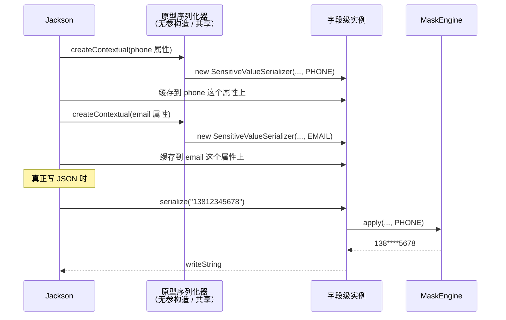

# 第 9 章 通道一 · Jackson 3 序列化脱敏

> **本章目标**：把前五章造好的引擎接到 Spring MVC 的主出口上。业务代码只留一个 `@Sensitive`，JSON 里的敏感字段自动打码，**内存对象始终是明文**。
> **前置知识**：第 2 章「出口通道 vs 突变通道」、第 6 章 `MaskEngine.apply()`。知道 Controller 返回对象会被序列化成 JSON。
> **预计时长**：70 分钟。
> **本章代码**：`mask-tutorial/src/main/java/com/learn/mask/tutorial/ch09/`

---

## 9.1 问题场景：引擎还没接到任何出口上

第二部分结束时，引擎已经能独立工作：角色、规则、缓存、指标全有了。但所有测试都是直接调 `engine.apply()`。真实请求的路径是：

```
Controller 返回 UserDto
        ↓
Jackson 把对象写成 JSON 字节
        ↓
HTTP 响应
```

如果引擎不插进 Jackson，前端拿到的永远是明文。本章要做的事情只有一件：**在「写每个 String 字段」的那一瞬间，把明文换成打码值。**

业务侧最终长这样：

```java
public class UserDto {
    private String name;                          // 不打码
    @Sensitive(type = SensitiveType.PHONE)
    private String phone;                         // JSON 里变成 138****5678
}
```

验证出口通道的那条铁律：

```java
@Test
@DisplayName("内存对象不被改写 —— 这是出口通道的定义")
void inMemoryObjectStaysPlain() {
    UserView view = new UserView();
    mapper.writeValueAsString(view);
    assertThat(view.getPhone()).isEqualTo("13812345678");
}
```

序列化之后 `view.phone` 还是明文。后续 Service 拿同一个对象去发短信、写审计、做校验，都不受影响。这是 Jackson 通道相对 AOP / MyBatis 最大的优点，也是它成为**默认主路径**的原因。

---

## 9.2 Jackson 3 的三个断裂变化

本项目跑在 Spring Boot 4.0 上，Jackson 是 **3.x**。如果网上搜到的教程还在写 `com.fasterxml.jackson.databind.JsonSerializer`，那些代码在这里**编译不过**。

三个必须记住的变化：

| Jackson 2（Boot 2/3）                 | Jackson 3（Boot 4）                           | 影响        |
| ----------------------------------- | ------------------------------------------- | --------- |
| 包名 `com.fasterxml.jackson.databind` | 实现类包名变成 `tools.jackson.databind`            | import 全换 |
| `JsonSerializer<T>`                 | `ValueSerializer<T>`                        | 基类改名      |
| 另实现 `ContextualSerializer`          | `createContextual` 直接长在 `ValueSerializer` 上 | 少一个接口     |

注解包仍然是 `com.fasterxml.jackson.annotation`。所以一份能跑的代码会同时出现两套包名：

```java
import com.fasterxml.jackson.annotation.JacksonAnnotationsInside;   // 注解，没改
import tools.jackson.databind.annotation.JsonSerialize;            // 序列化声明，改了
import tools.jackson.databind.ValueSerializer;                     // 实现类，改了
```

写测试时 ObjectMapper 也换了：

```java
import tools.jackson.databind.json.JsonMapper;

JsonMapper mapper = JsonMapper.builder().build();
String json = mapper.writeValueAsString(dto);
```

其余习惯几乎不变：`readTree`、`JsonNode.get("phone").asText()` 都还在。

---

## 9.3 动手写：组合注解

业务不该看见 `ValueSerializer`。把「用哪个序列化器」藏进一个业务注解：

```java
@Documented
@Target({ElementType.FIELD, ElementType.METHOD, ElementType.RECORD_COMPONENT})
@Retention(RetentionPolicy.RUNTIME)
@JacksonAnnotationsInside
@JsonSerialize(using = SensitiveValueSerializer.class)
public @interface Sensitive {
    SensitiveType type() default SensitiveType.CUSTOM;
    String code() default "";
}
```

两层注解的分工：

| 注解                            | 给谁看              | 干什么                               |
| ----------------------------- | ---------------- | --------------------------------- |
| `@Sensitive`                  | 业务代码、AOP（第 12 章） | 「这个字段要脱敏，类型是 PHONE」               |
| `@JsonSerialize(using = ...)` | Jackson          | 「写这个字段时用我指定的序列化器」                 |
| `@JacksonAnnotationsInside`   | Jackson 的注解内省    | 「请穿透这一层，把里面的 Jackson 注解当成直接标在字段上」 |

第三行是最容易漏的。没有它，Jackson 只认识直接标在字段上的 `@JsonSerialize`，**不会穿透自定义注解**。结果是 `@Sensitive` 变成一个只有人类能读懂的注释，JSON 照样输出明文。

反例就在测试里：

```java
@Retention(RetentionPolicy.RUNTIME)
@JsonSerialize(using = SensitiveValueSerializer.class)   // 没有 JacksonAnnotationsInside
public @interface BareSensitive {
    SensitiveType type() default SensitiveType.PHONE;
}
```

```java
@Test
@DisplayName("漏掉 JacksonAnnotationsInside 时 @JsonSerialize 不生效")
void withoutJacksonAnnotationsInsideNothingHappens() {
    JsonNode json = mapper.readTree(mapper.writeValueAsString(new BareView()));
    assertThat(json.get("phone").asText()).isEqualTo("13812345678");
}
```

这个测试绿了表示 **bug 确实存在**。和 `NaiveMaskerTest` 同一类写法。

`type` 和 `code` 的关系在第 4 章已经定过：内置类型用 `type`，业务自定义类型用 `code`，引擎里 `code` 优先。本章注解只是把这两个参数送到序列化器。`reversible` 留给第 14 章。

---

## 9.4 核心难点：`createContextual` 必须返回新实例

Jackson 序列化一个 Bean 时，大致是这样：



两个关键事实：

1. **序列化器对象默认是共享的。** `@JsonSerialize(using = X.class)` 告诉 Jackson「用这个类」，不是「每个字段 new 一个带自己状态的对象」。Jackson 3 对「按注解挂上的序列化器」会为每个属性各 new 一次；但对**全局注册**的序列化器，整个应用共用一个实例。
2. **每个属性的规则不一样。** phone 要走 `PHONE`，email 要走 `EMAIL`。规则必须存在「这个属性专用的序列化器」上，不能存在共享实例的字段里。

所以 `createContextual` 的合同是：**看这个属性，返回一个专门服务它的序列化器。**

```java
@Override
public ValueSerializer<?> createContextual(SerializationContext ctxt, BeanProperty property) {
    Sensitive annotation = findSensitive(property);
    if (annotation != null) {
        return new SensitiveValueSerializer(
                resolveEngine(), resolveProperties(), resolveContext(), resolveChannels(),
                annotation.type(),
                MaskStrategyRegistry.normalize(
                        annotation.code().isBlank() ? annotation.type().name() : annotation.code()));
    }
    // map-keys 回落见 9.5
    return this;
}
```

### 反例：改 `this` 再返回自己

如果写成：

```java
this.type = annotation.type();
return this;
```

在「每个属性独立 new」的注解路径上，你可能看不出问题——测试里 `@Sensitive` 标在两个字段上，Jackson 本来就会 new 两次，返回 `this` 碰巧还是两个对象。

**这个 bug 只在全局共享一个实例时爆发。** 用 `SimpleModule.addSerializer(String.class, shared)` 模拟：

```java
@Override
public ValueSerializer<?> createContextual(...) {
    this.type = resolveType(property);   // phone → PHONE，email → EMAIL
    return this;                         // 同一个对象
}
```

Jackson 会先对所有属性调用 `createContextual`，把返回值记在每个属性上；这些属性记下的**是同一个引用**。全部 introspect 完之后，`type` 只剩最后那个属性的值。真正 `serialize` 时，phone 和 email 用的是同一套规则。

```java
@Test
@DisplayName("错误实现：全局共享一个可变实例时，后处理的字段覆盖先处理的")
void mutatingThisMixesRulesWhenSharedGlobally() {
    SimpleModule module = new SimpleModule();
    module.addSerializer(String.class, new MutatingSensitiveValueSerializer());
    JsonMapper leakyMapper = JsonMapper.builder().addModule(module).build();

    JsonNode json = leakyMapper.readTree(leakyMapper.writeValueAsString(new NamedFieldsView()));
    boolean phoneOk = "138****5678".equals(json.get("phone").asText());
    boolean emailOk = "a****@example.com".equals(json.get("email").asText());
    assertThat(phoneOk && emailOk).isFalse();
}
```

**正确实现下两个断言同时成立；错误实现下它们不可能同时成立。** 这就是「必须 `new`」的可观测证据。

一条实用判断：`createContextual` 里只要用到了「这个属性特有的信息」（注解、字段名、Java 类型），返回值就必须是新对象，或者至少不能是那个会被别的属性再次 `createContextual` 的共享实例。

---

## 9.5 两级规则：注解优先，字段名兜底

`createContextual` 里还有第二条路：

```java
String resolvedCode = props.typeCodeOf(property.getName());
if (resolvedCode != null) {
    return new SensitiveValueSerializer(..., SensitiveType.CUSTOM, resolvedCode);
}
```

| 优先级 | 来源                        | 适用                                       |
| --- | ------------------------- | ---------------------------------------- |
| 1   | `@Sensitive(type / code)` | 有 DTO、能改源码                               |
| 2   | `masking.map-keys` 的字段名   | 没注解，但属性名对得上（`phone`、`idCard`、`bankCard`） |

第二条路径对 **DTO 字段几乎走不到**。原因：没有 `@Sensitive` 时，Jackson 根本不会把 `SensitiveValueSerializer` 挂到这个属性上，`createContextual` 不会被调用。`map-keys` 真正发挥作用的地方是 9.6 节的 `Map`。

starter 仍然在 `SensitiveValueSerializer` 里写了这级回落，相当于给「将来如果全局注册了这个序列化器」留口。现在这个口是半开的：全局注册后，**没注解也没命中 map-keys 的字段会 `return this`，而 `this` 的默认类型是 `CUSTOM`**——于是 `name`、`title` 这类普通字符串也会被打成 `张*`。这是一个真实的设计缺口，练习 9.3 会让你补上。

注解路径要找三次，因为 Jackson 把注解可能放在不同位置：

```java
property.getAnnotation(Sensitive.class);          // 属性本身
property.getContextAnnotation(Sensitive.class);   // 上下文（比如类上）
property.getMember().getAnnotation(Sensitive.class); // 字段或 getter 的 Java 成员
```

Demo 的 `UserDto.getIdentityCard()` 在 getter 上既有 `@JsonProperty("idCard")` 又有 `@Sensitive`。第三条就是为这种情况准备的。字段和 getter 同时标同一注解会让 Jackson 看到两份，行为取决于内省顺序——**只标一处**。

---

## 9.6 嵌套、List、Map：三条完全不同的路

### Bean 和 `List<Bean>`：什么都不用做

```java
static class NestedView {
    @Sensitive(type = SensitiveType.PHONE)
    private String phone;
    private ContactView contact;              // 嵌套对象
    private List<ContactView> contacts;       // 对象列表
}
```

Jackson 序列化嵌套 Bean 时，会**再次**走属性内省。`ContactView.phone` 上的 `@Sensitive` 会再次触发 `createContextual`。`List` 里的每个元素同理。

```java
assertThat(json.get("contact").get("phone").asText()).isEqualTo("139****1111");
assertThat(json.get("contacts").get(0).get("phone").asText()).isEqualTo("139****1111");
```

这是 Jackson 通道相对 AOP 的第二个巨大优势：AOP 必须自己写递归、防循环引用、跳过 JDK 类型（第 12 章）；Jackson 的递归是框架送的。

### 裸 `Map`：注解走不通

`Map<String, Object>` 的值没有字段，也就没有 `@Sensitive`。接口如果返回

```json
{ "phone": "13812345678", "name": "张三" }
```

Jackson 只会按 String 默认序列化，脱敏完全不发生。

所以需要一个**按键名**工作的序列化器，以及一个把它挂上去的包装类型：

```java
@JsonSerialize(using = SensitiveMapView.Serializer.class)
public record SensitiveMapView(Map<String, Object> data) { }
```

```java
public class SensitiveMapSerializer extends ValueSerializer<Map<String, ?>> {
    private String maskIfMapped(String key, String text) {
        String typeCode = properties.typeCodeOf(key);
        if (typeCode == null) {
            return text;      // 认不出的键保持明文
        }
        return engine.apply(text, null, typeCode, maskContext);
    }
}
```

控制器这样返回：

```java
@GetMapping("/{id}/as-map")
public SensitiveMapView asMap(@PathVariable Long id) {
    return new SensitiveMapView(userService.loadAsMap(id));
}
```

对照测试钉死了「为什么必须包装」：

```java
@Test
@DisplayName("裸 Map 不会走脱敏 —— 这就是为什么需要 SensitiveMapView")
void rawMapIsNotMasked() {
    Map<String, Object> data = Map.of("phone", "13812345678");
    JsonNode json = mapper.readTree(mapper.writeValueAsString(data));
    assertThat(json.get("phone").asText()).isEqualTo("13812345678");
}
```

嵌套 Map 递归调用 `serialize`；嵌套 List 里如果元素还是 Map，同样递归。**字符串列表用的是父键名**去查 `map-keys`：

```java
data.put("phones", List.of("13600000001", "13600000002"));
```

键是 `phones`，默认 `map-keys` 只有 `phone`，所以**不打码**。这不是 bug，是查找规则的直接推论。要打码，要么把键改成 `phone`，要么加一条映射：

```yaml
masking:
  map-keys:
    phones: PHONE
```

测试把「令人惊讶的默认行为」和「加映射之后的正确行为」写成了两条，避免读者以为实现坏了。

---

## 9.7 静态桥：Jackson 绕过了 Spring

`@JsonSerialize(using = SensitiveValueSerializer.class)` 的语义是：Jackson **自己** `new` 这个类。默认走无参构造，不经过 Spring，所以 `@Autowired MaskEngine` 是 null。

Logback 的 `ClassicConverter`、MyBatis 的 `TypeHandler` 也是框架反射创建的。三个通道共用一个问题：**框架创建的对象拿不到 Spring 容器里的引擎。**

折中方案是进程级的静态位：

```java
public final class MaskingSpringBridge {
    private static volatile MaskEngine engine;
    private static volatile MaskingProperties properties;
    private static volatile MaskContext context;
    private static volatile ChannelProperties channels;

    public static void bind(...) { ... }
    public static void unbind() { ... }   // 测试用，starter 没有
}
```

序列化器两边都接：

```java
public SensitiveValueSerializer() {
    this(MaskingSpringBridge.engine(), ...);   // Jackson 反射走这里
}

private MaskEngine resolveEngine() {
    return engine != null ? engine : MaskingSpringBridge.engine();
}
```

构造时拷一份，运行时再兜底一次。拷一份是为了 `createContextual` new 出来的实例带上已经解析好的依赖；兜底是为了「无参构造时桥还没 bind、后来 bind 了」的启动时序。

自动配置在创建 `MaskEngine` 时 bind 一次（starter 的 `MaskingAutoConfiguration`）。教程测试里手动 bind / unbind：

```java
@BeforeEach
void setUp() {
    MaskingSpringBridge.bind(engine, properties, maskContext, channels);
}

@AfterEach
void tearDown() {
    MaskingSpringBridge.unbind();
}
```

**starter 没有 `unbind`。** 这是它的序列化器几乎没法脱离 Spring 写单测的原因之一：静态位会在测试之间串状态。教程版补上，是为了让本章 17 个测试不启动容器也能跑。

### fail-open：桥没绑上就写明文

```java
if (value == null || maskEngine == null || props == null || !props.isEnabled()
        || (channelProps != null && !channelProps.isJackson())) {
    gen.writeString(value);
    return;
}
```

`engine == null` 时写明文。测试明确断言了这一点：

```java
@Test
@DisplayName("没 bind 时引擎是 null，序列化器 fail-open 写出明文")
void unboundBridgeLeaksPlaintext() {
    MaskingSpringBridge.unbind();
    JsonNode json = mapper.readTree(mapper.writeValueAsString(new UserView()));
    assertThat(json.get("phone").asText()).isEqualTo("13812345678");
}
```

第 6 章要求安全组件 fail-loud。这里却是 fail-open。窗口是真实的：Spring 还没跑到 `MaskingAutoConfiguration`、第一个请求已经进来时，Jackson 会把明文写出去。

练习 9.2 会让你改成 fail-closed。本章先保持和 starter 一致，对照时再批评。

### 通道开关

`ChannelProperties.jackson` 关掉后，序列化器原样写字段，**根本不调引擎**。这和第 13 章「第一层防线：关闭的通道直接透传」是同一件事。ADMIN 旁路仍然走引擎（引擎第 2 步），和关通道不是一条路：关通道是「这个出口不参与脱敏」，旁路是「这个人允许看明文」。

---

## 9.8 优缺点

|     |                                                                                             |
| --- | ------------------------------------------------------------------------------------------- |
| 优点  | 业务只标注解；嵌套 / List 免费递归；**不改内存**，短信、审计、校验不受影响；和 HTTP 响应的边界对齐，是 Web API 的默认选择                  |
| 缺点  | 管不到日志（第 10 章）、管不到内部方法返回值（第 12 章）、管不到「查询结果在进 Service 之前」（第 11 章）；依赖 Jackson 3 API；静态桥是全局可变状态 |
| 适用  | REST / MVC 接口是敏感数据的主要出口。绝大多数项目开这一个通道就够                                                      |
| 不适用 | 非 HTTP 的出口（RPC、消息、定时任务写文件）；需要「应用层就拿不到明文」的场景                                                 |

---

## 9.9 验证

```bash
mvn -f mask-tutorial/pom.xml test "-Dtest=SensitiveValueSerializerTest,SensitiveMapSerializerTest"
```

17 个测试：

| 测试类                            | 数量  | 覆盖什么                                                                                                                                                                   |
| ------------------------------ | --- | ---------------------------------------------------------------------------------------------------------------------------------------------------------------------- |
| `SensitiveValueSerializerTest` | 11  | 注解字段按类型独立打码、**内存不变**、`code` 优先；嵌套 Bean 和 List 免费递归；通道关 / 总开关 / ADMIN 旁路；**桥没 bind 则 fail-open**；漏掉 `JacksonAnnotationsInside` 不生效；`createContextual` 返回新实例 vs 全局共享可变实例 |
| `SensitiveMapSerializerTest`   | 6   | map-keys 按名打码、嵌套 Map、**字符串列表用父键名**、裸 Map 不打码、通道关闭、入参 Map 不被修改                                                                                                          |

跑 Demo 的对照实验（第 3 章实验一、二）现在可以回到「原理」列：JSON 里的星号，就是 `SensitiveValueSerializer.serialize` 调了一次 `engine.apply`。

---

## 9.10 对照真实实现

| 方面                       | 你的 `ch09`                                                   | `mask-starter`                                  | 评价               |
| ------------------------ | ----------------------------------------------------------- | ----------------------------------------------- | ---------------- |
| 注解                       | `@Sensitive` + `JacksonAnnotationsInside` + `JsonSerialize` | 相同，多一个 `reversible`                             | 第 14 章再加         |
| 序列化器基类                   | `ValueSerializer<String>`                                   | 相同                                              | —                |
| `createContextual` 返回新实例 | 是                                                           | 是                                               | 正确               |
| 无参构造 + 静态桥               | 有，且有 `unbind`                                               | 有 bind，**无 unbind**                             | 教程版可单测           |
| fail-open                | `engine == null` 写明文                                        | 相同                                              | 两边都该改，见练习 9.2    |
| `ChannelProperties`      | 独立类                                                         | `MaskingProperties.Channels` 内部类                | 教程尚未把通道开关并进 YAML |
| Map                      | `SensitiveMapView` 包装                                       | 相同                                              | —                |
| 自动配置                     | 本章未写                                                        | `JacksonMaskingAutoConfiguration` 声明了两个 `@Bean` | 见下               |
| 两套 Jackson 包             | 故意保持和 starter 一致                                            | `com.fasterxml` 注解 + `tools.jackson` 实现         | 第 17 章改进项        |

真实序列化器的上下文化：

```54:73:mask-starter/src/main/java/com/learn/mask/jackson/SensitiveValueSerializer.java
    @Override
    public ValueSerializer<?> createContextual(SerializationContext ctxt, BeanProperty property) {
        if (property == null) {
            return this;
        }
        Sensitive annotation = findSensitive(property);
        if (annotation != null) {
            return new SensitiveValueSerializer(
                    resolveEngine(), resolveProperties(), resolveContext(),
                    annotation.type(), MaskingProperties.normalizeCode(annotation.code(), annotation.type()));
        }
        // ...
        return this;
    }
```

### 差异一：`JacksonMaskingAutoConfiguration` 的两个 `@Bean` 基本没用

```22:28:mask-starter/src/main/java/com/learn/mask/config/JacksonMaskingAutoConfiguration.java
    @Bean
    @ConditionalOnMissingBean
    public SensitiveValueSerializer sensitiveValueSerializer(...) {
        return new SensitiveValueSerializer(engine, properties, maskContext);
    }
```

`@JsonSerialize(using = SensitiveValueSerializer.class)` 让 Jackson 反射 new，**不会**向 Spring 要这个 Bean。除非配置了 `HandlerInstantiator` 并且它按类型查找 Bean，这个 `@Bean` 只是容器里多了一个没人调用 `serialize` 的对象。

真正让引擎被序列化器看到的，是 `MaskingAutoConfiguration` 里创建 `MaskEngine` 时的 `MaskingSpringBridge.bind(...)`。自动配置类的名字容易让人以为「注册 Bean = 接入 Jackson」，其实接入点是注解，接入依赖是静态桥。

### 差异二：注解同时服务两条通道

starter 的 `@Sensitive` javadoc 写得很清楚：Jackson 用它选序列化器，AOP 用同一注解改内存。教程本章只有 Jackson 认识它。第 12 章会复用这个注解，所以现在不要改成 `jackson.Sensitive` 这种通道专属名字。

### 差异三：`@Sensitive` 混用两套 Jackson 包

这是第 17 章列出的改进项之一。能跑，是因为 `jackson-annotations` 仍然用 `com.fasterxml.jackson.annotation`，而 databind 3 认 `@JacksonAnnotationsInside`。风险是：某一天 Jackson 把这个元注解也迁到 `tools.jackson.annotation`，组合注解会静默失效——失效形态和第 9.3 节的 `BareSensitive` 一模一样，JSON 突然变明文，编译还是绿的。

---

## 本章小结

- Jackson 通道是**出口通道**：改的是写出的 JSON，不是内存对象
- Boot 4 / Jackson 3：实现类在 `tools.jackson.*`，`ValueSerializer` 取代 `JsonSerializer`，`createContextual` 长在基类上
- `@Sensitive` 是组合注解。**漏掉 `@JacksonAnnotationsInside`，Jackson 当它不存在**
- `createContextual` 必须返回带该字段规则的**新实例**。返回 `this` 的危害在全局共享实例时才会爆，注解路径会把它藏起来
- 嵌套 Bean 和 `List<Bean>` 免费递归；裸 `Map` 必须走 `SensitiveMapView`；字符串列表用**父键名**查 `map-keys`
- Jackson 反射创建序列化器，拿不到 Spring Bean。静态桥是折中，`unbind` 是为了能测
- 桥没绑上时 starter 和教程都 fail-open，会泄漏明文。这和第 6 章的 fail-loud 原则冲突

下一章处理另一条出口：日志。接口打码挡不住 `log.info("phone={}", user.getPhone())`。

---

## 课后练习

**练习 9.1** `@Sensitive` 标在字段上和标在 getter 上，Jackson 3 各走哪条 `findSensitive` 分支？给 Demo 的 `identityCard` 画一下：字段上有一份、getter 上又有一份，实际生效的是哪份？如果两份的 `type` 不一致会怎样？

**练习 9.2** 把 `engine == null` 改成 fail-closed：不写明文。你有几种写出策略（空字符串 / 全掩码 / 抛异常）？选一个实现，并说明为什么另外两个不合适。改完之后 `unboundBridgeLeaksPlaintext` 必须红，再改断言让它绿。

**练习 9.3** 假设产品要求「没标 `@Sensitive` 的字段，只要名字在 `map-keys` 里也打码」。你决定全局注册 `SensitiveValueSerializer`。

1. `createContextual` 在「没注解、也没命中 map-keys」时该返回什么？返回 `this` 为什么是错的？
2. 怎么拿到「普通 String 序列化器」而不递归死循环？
3. 全局注册之后，第 9.4 节那个共享实例问题会不会重新出现？你的 `createContextual` 还够不够？

**练习 9.4** `SensitiveMapView` 让每个返回 Map 的接口都要改返回类型。给出一种**不改控制器方法签名**的方案（提示：Jackson 的 `Module` 或 Spring 的 `Jackson2ObjectMapperBuilderCustomizer` / Boot 4 对应物）。它的误伤面是什么？

---

## 练习答案

### 练习 9.1

Jackson 内省 Java Bean 时，一个逻辑属性通常对应「字段 + getter + setter」。`BeanProperty.getAnnotation` 拿的是**逻辑属性上合并后的注解**；`getMember().getAnnotation` 拿的是当前正在处理的那个成员。

Demo 的 `identityCard`：

```java
@Sensitive(type = SensitiveType.ID_CARD, reversible = true)
private String identityCard;

@JsonProperty("idCard")
@Sensitive(type = SensitiveType.ID_CARD, reversible = true)
public String getIdentityCard() { ... }
```

两份注解内容相同，所以看不出冲突。JSON 字段名由 getter 上的 `@JsonProperty("idCard")` 决定，脱敏由 `@Sensitive` 决定。因为两份 `type` 都是 `ID_CARD`，无论命中哪次 `findSensitive`，结果一样。

**如果字段标 `PHONE`、getter 标 `ID_CARD`：** 生效的是 Jackson 最终选用的那个成员上的注解，通常是 getter（序列化读的是 getter）。字段上那份会被忽略，形成「我改了字段注解怎么没生效」的排查陷阱。

规则：**一个属性只标一处 `@Sensitive`。** 有 `@JsonProperty` 需要标在 getter 上时，把 `@Sensitive` 也放 getter，字段上不要再标。

### 练习 9.2

三种写出策略：

| 策略    | 做法                                                         | 问题                                                      |
| ----- | ---------------------------------------------------------- | ------------------------------------------------------- |
| 写空字符串 | `gen.writeString("")`                                      | 前端看到空，可能当成「用户没填手机号」，业务语义被污染                             |
| 写固定掩码 | `gen.writeString("***")`                                   | 所有类型长得一样，丢失「这是打码后的手机号」的形状，但**不泄漏**                      |
| 抛异常   | `throw new IllegalStateException("mask engine not bound")` | 整个接口 500。fail-loud，符合第 6 章；代价是启动早期的健康检查、Actuator 也可能被打挂 |

**选抛异常。** 脱敏引擎没就绪却已经在对外写 JSON，说明启动顺序错了，这是配置/装配错误，不是业务数据错误。空字符串和 `***` 会让故障以「偶发数据异常」的形态活很久。

```java
if (maskEngine == null || props == null) {
    throw new IllegalStateException("MaskingSpringBridge is not bound");
}
```

`value == null` 仍然写 JSON null——那是数据，不是装配失败。通道关闭、总开关关闭仍然原样写，那是明确的配置意图。

`unboundBridgeLeaksPlaintext` 会变成「期望抛异常」。把它改成：

```java
assertThatThrownBy(() -> mapper.writeValueAsString(new UserView()))
        .isInstanceOf(IllegalStateException.class)
        .hasMessageContaining("not bound");
```

（Jackson 可能把业务异常包进自己的 `JacksonException`，断言时用 `hasRootCauseInstanceOf`。）

### 练习 9.3

**1. 必须返回「不做脱敏的 String 序列化器」，不能返回 `this`。**

`this` 的 `type`/`code` 是原型上的默认值 `CUSTOM`。`serialize` 不会再判断「我是不是因为没匹配才落到这里」，它会按 CUSTOM 打码。`name`、`createdAt` 的字符串形式、枚举的 `name()` 全部中招。

**2. 避免递归的做法：**

```java
@Override
public ValueSerializer<?> createContextual(SerializationContext ctxt, BeanProperty property) {
    Sensitive annotation = findSensitive(property);
    if (annotation != null) { /* new 带规则的实例 */ }
    String mapped = props.typeCodeOf(property.getName());
    if (mapped != null) { /* new 带 map-keys 的实例 */ }

    ValueSerializer<?> delegate = ctxt.getDefaultValueSerializer(String.class, property);
    return delegate == this ? ctxt.getNullValueSerializer() /* 不行 */ : delegate;
}
```

Jackson 3 里更稳妥的是：**命中才返回自己这种序列化器，未命中返回 `ValueSerializer.none()` 或 `ctxt.findContentValueSerializer` 之前先把「当前这个 contextualizer」排除掉。** 一种不会递归的实现是拆成两个类：

- `SensitiveValueSerializer`：只处理已确定要脱敏的属性，不再做「要不要脱」的判断
- `SensitiveStringContextualizer`：全局注册，只负责 `createContextual` 分流，未命中时返回 `null` 让 Jackson 用默认 String 序列化器

`createContextual` 返回 `null` 的语义是「我不管这个属性」。这是分流器该做的事，不是脱敏器该做的事。

**3. 会重新出现。** 全局注册就是第 9.4 节反例的前提。所以分流器必须 `new` 出**不可变**的字段级实例（`type`/`code` 都是 `final`），绝不能改 `this`。教程的 `SensitiveValueSerializer` 已经把字段做成 `final` 了——这比 starter 又多了一层保护：就算有人在 `createContextual` 里想改 `this.type`，编译器会拦住。

### 练习 9.4

注册一个 Jackson `Module`，为 `Map.class`（或 `Map<String, ?>`）挂上 `SensitiveMapSerializer`：

```java
SimpleModule module = new SimpleModule();
module.addSerializer(new SensitiveMapSerializer(...) {
    @Override
    public Class<?> handledType() {
        return Map.class;
    }
});
```

Boot 4 里用 `JacksonModule` / `JsonMapper` 的 builder customizer 把这个 module 加进去。控制器继续 `return Map<String, Object>`，不用改签名。

**误伤面：应用里所有被 Jackson 序列化的 Map 都会走脱敏。** 包括：

- Actuator 的 `/actuator/health` 细节、`/actuator/metrics` 的 tag
- 错误响应里 Spring 自己组装的 Map
- 本不是敏感数据、只是碰巧有个键叫 `phone` 的结构（比如 `{ "phone": "客服热线说明" }`）

`map-keys` 按**精确键名**匹配，误伤是真实风险。包装类型 `SensitiveMapView` 的价值就是**把这个风险收成显式选择**：只有你主动包装的才脱，Actuator 不受影响。

如果一定要全局处理 Map，至少加白名单（只处理特定 package 的控制器返回值），或者要求键名带前缀。对 starter 这种「给别人用的组件」来说，默认用包装类型、全局 Map 序列化器作为可选开关，更合适。
