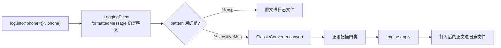

# 第 10 章 通道二 · Logback 日志脱敏

> **本章目标**：堵住第 2 章画过的那条日志支线。接口打码挡不住 `log.info("phone={}", user.getPhone())`。
> **前置知识**：第 2、6、9 章。知道日志框架把 `log.info` 的参数拼成一行文本。
> **预计时长**：40 分钟。
> **本章代码**：`mask-tutorial/src/main/java/com/learn/mask/tutorial/ch10/`

---

## 10.1 问题场景：接口干净了，日志还是明文

第 9 章之后，这个接口的 JSON 已经是打码的：

```json
{ "phone": "138****5678" }
```

但 Service 里通常还有一句：

```java
log.info("loaded user phone={}", user.getPhone());
```

`user.getPhone()` 读的是内存对象。Jackson 是出口通道，**不改内存**，所以这里拿到的仍是 `13812345678`。日志文件、ELK、运维终端，全是明文。

第 3 章实验五已经看过这个现象：接口脱敏和日志脱敏是两条独立的出口。关了 Jackson、日志照样打码；反过来，Jackson 再干净也救不了日志。

日志这条通道有一个 Jackson 没有的困难：**没有注解、没有字段名、没有类型。** 到手的是一整句已经拼好的字符串。只能靠「长得像什么」来猜。

---

## 10.2 原理：`%msg` 换成 `%sensitiveMsg`

Logback 把一行日志写成字符串时，会按 pattern 里的转换词调用转换器：

```
%d [%thread] %-5level %logger{36} - %msg%n
                                      ↑
                              MessageConverter
                              输出 event.getFormattedMessage()
```

我们注册一个自己的转换词，做同样的事，但输出前先扫一遍：

```
- %sensitiveMsg%n
       ↑
SensitiveMessageConverter
输出 脱敏后的 formattedMessage
```



`ListAppender` 测「日志里有没有明文」时有一个坑：它保存的是 `ILoggingEvent` 本身，**还没走 pattern**。直接 `appender.list.get(0).getFormattedMessage()` 看到的永远是明文。要断言脱敏结果，必须调 `converter.convert(event)`，或者给 appender 配上带 `%sensitiveMsg` 的 encoder。

---

## 10.3 动手写：按正则扫描，按固定顺序替换

```java
public class SensitiveMessageConverter extends ClassicConverter {

    private static final Pattern PHONE = Pattern.compile("(?<![0-9])(1[3-9][0-9]{9})(?![0-9])");
    private static final Pattern ID_CARD = Pattern.compile("(?<![0-9])([0-9]{17}[0-9Xx])(?![0-9])");
    private static final Pattern EMAIL = Pattern.compile("([a-zA-Z0-9._%+-]+@[a-zA-Z0-9.-]+\\.[a-zA-Z]{2,})");
    private static final Pattern BANK_CARD = Pattern.compile("(?<![0-9])([0-9]{16,19})(?![0-9])");

    @Override
    public String convert(ILoggingEvent event) {
        String message = event.getFormattedMessage();
        if (message == null || engine == null || !properties.isEnabled()
                || !channels.isLogback()) {
            return message;
        }
        String masked = replace(message, PHONE, SensitiveType.PHONE, engine);
        masked = replace(masked, ID_CARD, SensitiveType.ID_CARD, engine);
        masked = replace(masked, EMAIL, SensitiveType.EMAIL, engine);
        return replace(masked, BANK_CARD, SensitiveType.BANK_CARD, engine);
    }
}
```

`(?<![0-9])` / `(?![0-9])` 是左右环视：匹配的左右不能再是数字。没有它们，`13812345678001` 这种订单号会被切出一段 `13812345678` 当成手机号。测试覆盖了这个边界。

`Matcher.quoteReplacement` 是必须的。引擎返回的打码值里有 `$` 或 `\` 时（自定义 `maskChar` 万一是 `$`），`appendReplacement` 会把它们当引用语法。第 4 章的掩码字符默认是 `*`，现在看起来没事，换字符就会炸。

引擎仍然是唯一入口：旁路、幂等、缓存、指标，日志通道一份都不自己实现。ADMIN 请求打出来的日志是明文——第 3 章实验五的那个现象，根源就在这里：`engine.apply` 第 2 步旁路了对所有通道生效，包括日志。

---

## 10.4 为什么 BANK_CARD 必须放最后

银行卡正则是「16~19 位数字」。这个范围盖住了另外两类东西：

| 先跑银行卡会误伤什么 | 例子                             | 误伤结果                                                 |
| ---------- | ------------------------------ | ---------------------------------------------------- |
| 18 位身份证    | `110101199001011234`           | 按卡号保留前 4 后 4：`1101**********1234`，而不是身份证的前 6 后 4     |
| 邮箱本地段里的长数字 | `1234567890123456@example.com` | 本地段被切走：`1234********3456@example.com`，EMAIL 正则再也匹配不上 |

所以顺序是硬约束：

```
PHONE → ID_CARD → EMAIL → BANK_CARD
```

PHONE（11 位）和 BANK_CARD（16~19 位）不重叠，前后无所谓。但把 ID_CARD、EMAIL 放在 BANK_CARD 前面是正确性要求，不是风格问题。

```java
@Test
@DisplayName("EMAIL 先于 BANK_CARD：本地段 16 位数字不会被当成卡号")
void emailBeforeBankCard() {
    String converted = convert("login=1234567890123456@example.com");
    assertThat(converted).isEqualTo("login=1***************@example.com");
    assertThat(converted).doesNotContain("1234********3456@example.com");
}

@Test
@DisplayName("ID_CARD 先于 BANK_CARD：18 位身份证不会被当成卡号")
void idCardBeforeBankCard() {
    String converted = convert("id=110101199001011234");
    assertThat(converted).isEqualTo("id=110101********1234");
    assertThat(converted).doesNotContain("1101**********1234");
}
```

README 大纲只写了「EMAIL 必须排在 BANK_CARD 之前」。**身份证同样必须排在银行卡之前**，漏写这一条会让 18 位身份证按卡号规则打码，合规形态是错的，但肉眼仍能看出「打过码」，更容易漏过 code review。

---

## 10.5 注册：starter 提供 conversionRule，业务改 pattern

转换器写好了还不会自动生效。Logback 需要一条 conversionRule，再在 pattern 里用这个词。

starter 把规则放在自己 jar 里：

```xml
<!-- mask-starter/.../masking-converter.xml -->
<included>
    <conversionRule conversionWord="sensitiveMsg"
                    class="com.learn.mask.logback.SensitiveMessageConverter"/>
</included>
```

业务的 `logback-spring.xml` include 进来，并把 `%msg` 换成 `%sensitiveMsg`：

```xml
<configuration>
    <include resource="com/learn/mask/logback/masking-converter.xml"/>
    <appender name="CONSOLE" class="ch.qos.logback.core.ConsoleAppender">
        <encoder>
            <pattern>%d{HH:mm:ss.SSS} [%thread] %-5level %logger{36} - %sensitiveMsg%n</pattern>
        </encoder>
    </appender>
    <root level="INFO">
        <appender-ref ref="CONSOLE"/>
    </root>
</configuration>
```

两步缺一不可：

| 只做了                         | 结果                                             |
| --------------------------- | ---------------------------------------------- |
| 只改 pattern，没 conversionRule | Logback 不认识 `%sensitiveMsg`，启动报错或当字面量          |
| 只 include，pattern 仍是 `%msg` | 转换器注册了但没人调用，日志仍是明文。这是接入 starter 后「日志没打码」最常见的原因 |

教程模块不挂 `logback-spring.xml`——单测直接调 `convert()`，不依赖文件配置。接入真实应用时按上面两步做。

---

## 10.6 正则通道固有的三个弱点

**误伤。** 16 位数字的订单号、流水号会被当成银行卡。11 位数字的设备 ID 会被当成手机号。没有字段名，无法区分。

**漏判。** 国外手机号、15 位老身份证、公司内部邮箱域名、带空格的卡号，正则都认不出。Jackson 通道靠注解，标了就脱；日志通道靠长相，长得不像就漏。

**性能。** 每一行日志跑四次正则。第 8 章测过内置 `keepMask` 只要几百纳秒；一次正则是微秒级。高 QPS 下日志量往往比 JSON 字段数多（一条请求打十几行日志），这条通道可能比 Jackson 更贵。

所以日志通道是**兜底**，不是主路径。主路径仍然是第 9 章：能标 `@Sensitive` 的走注解，日志只负责拦住「随手 log 了一下」的泄漏。

另一个产品决策：ADMIN 旁路要不要对日志生效？第 3 章实验五的实际行为是生效——管理员请求的日志里是明文。安全团队通常不接受这一点：日志会进集中存储，读者远不止当前这个 ADMIN。练习 10.3 讨论怎么把「日志永远脱敏」做成例外。

---

## 10.7 验证

```bash
mvn -f mask-tutorial/pom.xml test "-Dtest=SensitiveMessageConverterTest"
```

8 个测试：

| 分组    | 覆盖                                      |
| ----- | --------------------------------------- |
| 按类型扫描 | 一行里同时打手机号和邮箱；身份证和银行卡；环视避免从更长数字里切手机号     |
| 替换顺序  | EMAIL 先于 BANK_CARD；ID_CARD 先于 BANK_CARD |
| 开关    | 通道关闭 / 桥未绑定 → 原文；ADMIN 旁路对日志同样生效        |

---

## 10.8 优缺点

|     |                                                                              |
| --- | ---------------------------------------------------------------------------- |
| 优点  | 业务零改动（只改 logback pattern）；覆盖所有 `log.info` / `log.error`；和 Jackson 互补，堵住另一条出口 |
| 缺点  | 正则误伤和漏判；每行四次正则；ADMIN 旁路会让明文进日志仓库；自定义类型（快递单号）默认扫不到                            |
| 适用  | 生产环境与 Jackson 同时开，作为泄漏兜底                                                     |
| 不适用 | 作为唯一脱敏手段；日志里有大量「长得像敏感数据」的业务编号                                                |

---

## 10.9 对照真实实现

| 方面                 | 你的 `ch10`                           | `mask-starter`                       | 评价                                |
| ------------------ | ----------------------------------- | ------------------------------------ | --------------------------------- |
| 四个正则               | 相同                                  | 相同                                   | —                                 |
| 替换顺序               | PHONE → ID_CARD → EMAIL → BANK_CARD | 相同                                   | 正确，但 starter 没有测试钉死顺序             |
| 环视                 | 有                                   | 有                                    | —                                 |
| `quoteReplacement` | 有                                   | 有                                    | —                                 |
| 通道开关               | `ChannelProperties.logback`         | `MaskingProperties.Channels.logback` | —                                 |
| fail-open          | 桥未绑定返回原文                            | 相同                                   | 日志比 JSON 更常在启动早期打出来               |
| 单测                 | 8 个，含顺序和环视                          | 1 个，只断言手机号和邮箱被打码                     | 教程把顺序这个正确性约束测出来了                  |
| 自定义类型              | 扫不到                                 | 同样扫不到                                | EXPRESS 只在 Jackson/AOP/MyBatis 生效 |

starter 唯一的测试：

```51:58:mask-starter/src/test/java/com/learn/mask/logback/SensitiveMessageConverterTest.java
        LoggingEvent event = new LoggingEvent();
        event.setMessage("loaded user phone=13812345678 email=zhangsan@example.com");
        String converted = new SensitiveMessageConverter().convert(event);

        assertThat(converted).doesNotContain("13812345678");
        assertThat(converted).doesNotContain("zhangsan@example.com");
```

它证明「能打码」，不证明「顺序对」「环视有效」「ADMIN 旁路会进日志」。后三件对生产更危险。把它们补成测试的成本是几分钟，不补的成本是一次合规事故。

---

## 本章小结

- 日志是独立出口。Jackson 不改内存，`log.info("{}", user.getPhone())` 拿到的永远是明文
- 接入方式：`conversionRule` + pattern 把 `%msg` 换成 `%sensitiveMsg`
- 没有类型信息，只能正则猜。**BANK_CARD 必须最后跑**，否则身份证和邮箱本地段会被当成卡号
- `ListAppender` 拿到的是事件不是转后文本，断言明文不出现要走 `convert()` 或 encoder
- ADMIN 旁路对日志同样生效——这是第 3 章实验五，也是一个值得产品上重新决定的点
- 日志通道是兜底，不是主路径

下一章把刀切到更早：MyBatis 从 ResultSet 读出字符串的那一刻。那是突变通道，语义和这两章完全相反。

---

## 课后练习

**练习 10.1** 把 BANK_CARD 挪到 EMAIL 前面，用 `emailBeforeBankCard` 那条用例证明它红了。再写一个「18 位身份证按卡号规则打码」的失败断言。不要改生产代码去迁就错误顺序。

**练习 10.2** 给转换器加一个「忽略 logger 名」名单，比如 `org.hibernate.SQL`、`org.springframework.jdbc`。为什么这些 logger 可能不该走脱敏？实现时忽略名单应该放在转换器里还是配置里？

**练习 10.3** 让日志通道**忽略角色旁路**：即使当前是 ADMIN，日志也打码。Jackson 通道保持原样。这个判断应该写在 `SensitiveMessageConverter` 还是 `MaskEngine`？写出你选的方案，并说明另一种方案会破坏什么。

**练习 10.4** 快递单号 `SF1234567890123` 会出现在日志里。现有四个正则都认不出它。给出两种扩展方案，并比较对误伤率的影响。

---

## 练习答案

### 练习 10.1

调换顺序后 `1234567890123456@example.com` 会变成 `1234********3456@example.com`（银行卡 keep 4+4），EMAIL 再跑也匹配不到（`@` 前面已经不是「字符合法的 local」那种连续明文了——其实 EMAIL 仍可能匹配 `3456@example.com` 这种残段，结果更乱）。

身份证用例：期望 `110101********1234`，错误顺序下得到 `1101**********1234`。让测试红着，直到把顺序改回来。**用测试锁定顺序，而不是用注释。** starter 缺的就是这两条测试。

### 练习 10.2

Hibernate 的 `org.hibernate.SQL` 会把绑定参数打进日志，里面经常有 16 位订单号、主键、时间戳。脱敏这些「长得像卡号」的数字，会让 SQL 日志变得难以排障，而且误伤率极高。

Spring JDBC 的 statement 日志同理。

忽略名单应该放在**配置**里（`masking.logback.ignore-loggers`），不要写死在转换器里。不同项目的噪音 logger 不一样；热更新也用得上（第 7 章的容器 + 快照模式）。转换器只读这份名单：

```java
if (ignoreLoggers.contains(event.getLoggerName())) {
    return message;
}
```

用前缀匹配还是精确匹配：前缀更方便（`org.hibernate` 一把抓住），也更容易误伤业务里碰巧叫这个前缀的 logger。精确匹配 + 文档列出建议名单更稳。

### 练习 10.3

**写在转换器里，不要改引擎。**

引擎的 `shouldBypass()` 是全局语义：「这个人可以看明文」。Jackson 响应要给 ADMIN 看完整手机号，这个语义是对的。日志的读者不是这个 ADMIN，是所有能打开日志仓库的人。

如果在引擎里加 `apply(..., EnumSet<Channel> )` 或 `neverBypassForLog`，通道知识就会漏进内核，第 6 章「通道只调 apply、自己不做判断」会被打破。以后每多一个「这个通道特殊」的需求，引擎就会长出一堆 flags。

转换器的做法：调引擎之前把旁路关掉。最干净的是给引擎一个**不看角色**的入口，或者临时清掉上下文：

```java
// 不推荐清 ThreadLocal：会干扰同一请求里稍后的 Jackson 序列化
```

更好：

```java
engine.apply(raw, type, code, null);   // context == null → 引擎当 USER，不旁路
```

第 6 章的 `apply` 在 `context == null` 时角色是 USER、不走旁路。日志通道传 `null` 而不是 `MaskingSpringBridge.context()`，Jackson 通道继续传真实 context。**两行差别，语义分层保持干净。**

注意：指标上这些日志调用会记成 `role=USER`，而不是真实的 ADMIN。如果审计要看「ADMIN 的请求产生了多少日志打码」，需要另打一个 tag，不要为此把旁路重新打开。

### 练习 10.4

| 方案                           | 做法                                      | 误伤                                               |
| ---------------------------- | --------------------------------------- | ------------------------------------------------ |
| A. 再加一条快递单号正则                | `([A-Z]{2}\\d{10,})` 之类                 | 高。`OK` + 一串数字的业务编号很多。日志通道没有「这是 expressNo 字段」的上下文 |
| B. 只扫已配置的 extras 编码，正则由接入方提供 | `masking.logback.patterns.EXPRESS: ...` | 可控。谁加谁负责误伤；默认不扫自定义类型                             |

选 B。日志通道对未知类型保持沉默，和 Jackson「没注解就不脱」是同一保守策略。快递单号出现在日志里，优先改业务代码不要把单号拼进 log，而不是把正则越加越宽。

如果业务确实需要，配置里加 pattern，转换器按 extras 再跑几轮 `replace`。顺序仍然是：先跑「更特殊的」（带字母前缀的快递单），最后跑「更宽的」（纯数字银行卡）。
