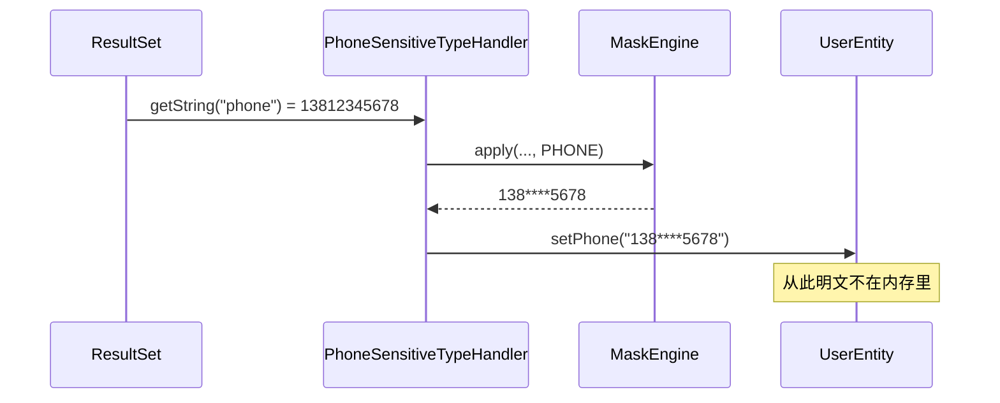

# 第 11 章 通道三 · MyBatis TypeHandler 查询即脱敏

> **本章目标**：在结果映射那一刻打码。这是突变通道——Entity 进 Service 时已经没有明文。
> **前置知识**：第 2 章「出口 vs 突变」、第 6、9 章。知道 Mapper 把 `ResultSet` 列映射到 Java 字段。
> **预计时长**：45 分钟。
> **本章代码**：`mask-tutorial/src/main/java/com/learn/mask/tutorial/ch11/`

---

## 11.1 问题场景：有些字段全系统都不该出现明文

前两章都是出口：Jackson 改 JSON，Logback 改日志，内存里仍是 `13812345678`。这是 Web API 的正确默认。

但有一类需求完全相反：一张历史归档表、一套只给前端展示的只读查询，**应用层任何地方拿到明文都是事故**。出口通道拦不住「Service 里拿 phone 去拼 SQL / 发到另一个 MQ」。

MyBatis 的 TypeHandler 卡在「JDBC 字符串 → Java 字段」这一刀：



第 3 章实验七已经演示过它的固有弱点：MyBatis 必须逐列点名 TypeHandler。Demo 为地址补了 `AddressSensitiveTypeHandler`，所以 `/api/db` 现在会打码 `addressDetail`；**把那一行 `typeHandler` 删掉再请求，就会漏脱。** 没被点名的列，默认是明文。

---

## 11.2 只脱敏读出数据，不改写入数据

TypeHandler 是双向的。四个方法里三个是读，一个是写：

```java
@Override
public void setNonNullParameter(PreparedStatement ps, int i, String parameter, JdbcType jdbcType)
        throws SQLException {
    ps.setString(i, parameter);   // 原样透传
}

@Override
public String getNullableResult(ResultSet rs, String columnName) throws SQLException {
    return mask(rs.getString(columnName));
}
```

**写路径必须原样透传。** 如果这里也调引擎，一次 `INSERT` 就会把星号写进数据库。备份、对账、监管报送拿到的将是打码值，而且不可逆。

```java
@Test
@DisplayName("写入 PreparedStatement 时原样透传 —— 绝不能把星号写进库")
void setNonNullParameterWritesPlaintext() throws Exception {
    phoneHandler.setNonNullParameter(ps, 1, "13812345678", JdbcType.VARCHAR);
    verify(ps).setString(1, "13812345678");
}
```

读路径默认关：`ChannelProperties.mybatis` 默认 `false`。测试里必须显式打开，和生产默认一致——误开突变通道的代价比误关出口通道大。

---

## 11.3 最大的坑：不要注册成全局 String 处理器

MyBatis 允许：

```java
configuration.getTypeHandlerRegistry().register(String.class, PhoneSensitiveTypeHandler.class);
```

之后**所有** `String` 列都走手机号规则。`name`、`city`、`id` 的字符串形式，全部按 `keepPrefix=3, keepSuffix=4` 打码。测试钉死了这件事：

```java
assertThat(defaultString).isInstanceOf(PhoneSensitiveTypeHandler.class);
assertThat(new PhoneSensitiveTypeHandler().getNullableResult(nameColumn, "name"))
        .isEqualTo("***");   // 「张三丰」长度不够，整段打星
```

同样危险的还有：把 TypeHandler 声明成 Spring `@Bean` / `@Component`。部分 MyBatis-Spring 集成会把容器里的 `TypeHandler` 自动注册进 `TypeHandlerRegistry`。starter 的 `MybatisMaskingAutoConfiguration` **是一个空类**，只用来表达「这个通道存在、但一个 Bean 都不建」：

```13:16:mask-starter/src/main/java/com/learn/mask/config/MybatisMaskingAutoConfiguration.java
@AutoConfiguration(after = MaskingAutoConfiguration.class)
@ConditionalOnClass(TypeHandler.class)
@ConditionalOnBean(MaskEngine.class)
public class MybatisMaskingAutoConfiguration {
}
```

正确用法只有一个：Mapper 里按列点名。

---

## 11.4 正确用法：`@Result(typeHandler = ...)` 和四个子类

```java
@Results({
    @Result(column = "phone", property = "phone", typeHandler = PhoneSensitiveTypeHandler.class),
    @Result(column = "id_card", property = "idCard", typeHandler = IdCardSensitiveTypeHandler.class),
    @Result(column = "email", property = "email", typeHandler = EmailSensitiveTypeHandler.class),
    @Result(column = "bank_card", property = "bankCard", typeHandler = BankCardSensitiveTypeHandler.class),
    @Result(column = "address_detail", property = "addressDetail"),  // 没点名 = 明文
})
UserEntity findByIdMasked(Long id);
```

MyBatis 的 `typeHandler` 属性只能写类名，**不能传构造参数**。所以基类虽然有 `SensitiveTypeHandler(SensitiveType)`，Mapper 用不上它。每种类型必须有一个无参子类：

```java
public class PhoneSensitiveTypeHandler extends SensitiveTypeHandler {
    public PhoneSensitiveTypeHandler() {
        super(SensitiveType.PHONE);
    }
}
```

自定义类型同理：Demo 的 `ExpressSensitiveTypeHandler` 就是 `super("EXPRESS")`。

漏一列就是第 3 章实验七。没有「扫描 Entity 上的 `@Sensitive` 自动挂钩」——那是 AOP 的事。MyBatis 通道认的是 Mapper，不是 Java 注解。

MyBatis 也用无参构造反射创建 Handler，引擎从第 9 章的 `MaskingSpringBridge` 取。三个非 Spring 管理的扩展点（Jackson 序列化器、Logback Converter、TypeHandler）共用一座桥。

---

## 11.5 代价：明文不在了

Entity 进 Service 之后：

| 你还想做的事                        | 结果                            |
| ----------------------------- | ----------------------------- |
| 给用户发短信，用 `entity.getPhone()`  | 发出去的是 `138****5678`           |
| 第 14 章的还原接口，用内存里的值当原文         | 失败。明文只在数据库里，必须再查一次未打码的 Mapper |
| 把 Entity 放进缓存 / 再 `UPDATE` 回去 | 星号写进 Redis 或写回库               |

所以这个通道要求：**同一张表要有两套 Mapper**。一套不挂 TypeHandler，给内部写路径和还原用；一套挂 TypeHandler，给纯展示查询用。Demo 就是 `UserMapper` + `UserMaskedMapper`。

漏用写路径 Mapper，是「打码值写回数据库」事故的标准配方。第 17 章会再列一次。

---

## 11.6 优缺点

|     |                                               |
| --- | --------------------------------------------- |
| 优点  | 应用层零注解；展示查询性能最好（只在映射时打一次）；明文不进 Service        |
| 缺点  | 逐列点名，漏列即漏脱；写路径必须另接 Mapper；可逆还原、缓存、回写都要小心；默认关闭 |
| 适用  | 归档表、只读展示查询、确定全系统不需要明文的列                       |
| 不适用 | CRUD 同一套 Entity 又读又写；需要在 Service 里用明文做业务      |

---

## 11.7 验证

```bash
mvn -f mask-tutorial/pom.xml test "-Dtest=SensitiveTypeHandlerTest"
```

8 个测试：读出打码、写入透传、null；邮箱子类与自定义编码；通道关闭 / 桥未绑定透传；**按 `String.class` 全局注册后 handler 类型被换成手机号**。

---

## 11.8 对照真实实现

| 方面        | 你的 `ch11`                           | `mask-starter`                        | 评价           |
| --------- | ----------------------------------- | ------------------------------------- | ------------ |
| 基类 + 四个子类 | 有                                   | 有                                     | —            |
| 写路径透传     | 有测试                                 | 实现有，测试无                               | 教程把「不写回库」钉死了 |
| 空自动配置     | 本章未写                                | `MybatisMaskingAutoConfiguration` 是空类 | 第 18 章讲条件装配  |
| 默认关闭      | `ChannelProperties.mybatis = false` | 相同                                    | —            |

---

## 本章小结

- 突变通道：Entity 进 Service 时已经是打码值
- **只脱读、不脱写**。写路径打码等于污染数据库
- TypeHandler 只能按列点名。全局注册 `String.class` 会误伤所有字符串列
- 每种类型一个无参子类，因为 `@Result` 不能传构造参数
- 漏列就是漏脱。需要明文的路径必须用另一套 Mapper

下一章是另一个突变通道：AOP 在方法返回后改对象。和 MyBatis 一样改内存，但识别依据换成了 `@Sensitive`。

---

## 课后练习

**练习 11.1** 如果 `setNonNullParameter` 也调了 `mask()`，设计一个测试证明「INSERT 会把星号写进库」。不一定要起 H2，Mock `PreparedStatement` 就够。

**练习 11.2** 为什么不能让 TypeHandler 去读 Entity 字段上的 `@Sensitive`，从而免掉逐列 `@Result`？给出至少两条理由。

**练习 11.3** Demo 的 `AddressSensitiveTypeHandler` 为什么传 `AddressMaskStrategy.ADDRESS` 字符串，而不是 `SensitiveType` 枚举？如果漏掉 `address_detail` 这一列的 TypeHandler，Jackson 通道开着能否兜住？

---

## 练习答案

### 练习 11.1

```java
phoneHandler.setNonNullParameter(ps, 1, "13812345678", JdbcType.VARCHAR);
verify(ps).setString(1, "138****5678");   // 错误实现下绿，正确实现下红
```

正确实现这条必须红（实际是 `13812345678`）。把「错误行为」写成测试再改实现，和第 4 章 `NaiveMaskerTest` 同类。

### 练习 11.2

1. **TypeHandler 拿不到 Entity。** 它的输入是 `ResultSet` 的一列，不知道这列将 set 到哪个字段。`@Sensitive` 在 Java 成员上，结果映射还没发生。
2. **一个 TypeHandler 实例对应一种类型，不是一个字段。** `PhoneSensitiveTypeHandler` 处理所有挂了它的列。如果去「猜字段注解」，同一实例在不同列上会读到不同注解，又回到第 9 章共享可变状态的坑。
3. **XML Mapper / 动态 SQL 可以没有 Java 字段。** 有些查询映射到 `Map`。注解不存在。

免掉逐列声明的正路是第 12 章：先映射成带 `@Sensitive` 的对象，再在应用层走 AOP。那是另一条通道，不要把 AOP 的活塞进 TypeHandler。

### 练习 11.3

starter 枚举里没有 `ADDRESS`，自定义类型走 `SensitiveTypeHandler(String code)`，编码和策略类上的 `public static final String ADDRESS` 是同一个常量。还要在 `UserMaskedMapper` 的 `@Result` 里点名这个 Handler。

Jackson **兜不住 MyBatis 通道的「查询接口」**，如果这个接口返回的是已经映射好的 Entity、且字段上没有 `@Sensitive`。Demo 的 `/api/db` 走的是 MyBatis 通道，`UserEntity.addressDetail` 没有 Jackson 注解，所以漏了 TypeHandler 就是明文。出口通道救不了「你根本没走到出口、直接把 Entity 当 JSON 用了但字段没标」——如果 Entity 就是响应体且字段有 `@Sensitive`，Jackson 能兜；实验七暴露的是「点名制漏点」。
