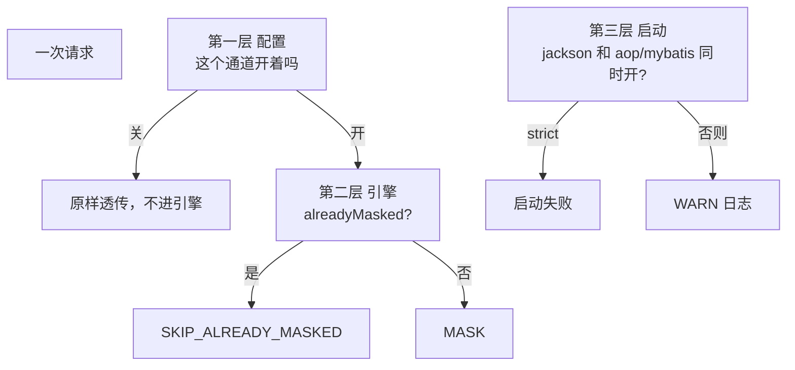

# 第 13 章 四通道协同：三层防线

> **本章目标**：四个通道可以同时存在，但不能随便组合。用配置、引擎幂等、启动校验三层把「打成两层星号 / 明文被改掉还以为没出事」拦住。
> **前置知识**：第 2 章出口 vs 突变，第 6 章判定链，第 9~12 章四个通道。
> **预计时长**：40 分钟。
> **本章代码**：`mask-tutorial/src/main/java/com/learn/mask/tutorial/ch13/`

---

## 13.1 先看事故：同一个字段走了两次

默认 Web 组合是 Jackson + Logback。有人觉得「再开 AOP 更保险」，于是：

```yaml
masking:
  channels:
    jackson: true
    aop: true
```

请求路径变成：

```
Service.loadForAop()
    → AOP 把 dto.phone 改成 138****5678     （内存变了）
    → Controller 返回同一个 dto
    → Jackson 再对 phone 调一次 engine.apply
```

`keepMask` 对已打码的手机号再套一次，字符串看起来还是 `138****5678`。**接口测试会绿。** 真正坏掉的是：

1. 内存没明文了，还原 / 短信 / 回写都会用星号
2. 引擎被叫了两次。没有幂等的话，非 `keepMask` 的策略（正则快递单、加密）第二次会坏
3. 缓存可能把打码值当成明文存进去（第 6 章：幂等在缓存之前，SKIP 不写缓存；若判定失败就会污染）

所以「看起来没出事」不是安全。第 12.4 节那个测试已经展示了内存被改。本章把组合问题系统化。



---

## 13.2 第一层 · 配置：关掉的通道不进引擎

每个通道入口都有同一句：

```java
if (!channels.isJackson()) { gen.writeString(value); return; }   // 第 9 章
if (!channels.isLogback()) { return message; }                   // 第 10 章
if (!channels.isMybatis()) { return raw; }                       // 第 11 章
if (!channels.isAop()) { return result; }                        // 第 12 章
```

关掉 = 这个扩展点当自己不存在。引擎零调用，零指标，零缓存。

```java
@Test
@DisplayName("关掉 Jackson 后，AOP 改过的对象序列化不再进引擎")
void disablingJacksonStopsSecondPass() {
    channels.setJackson(false);
    channels.setAop(true);
    walker.mask(view);
    recorder.actions.clear();
    mapper.writeValueAsString(view);
    assertThat(recorder.actions).isEmpty();
}
```

JSON 仍是 `138****5678`，因为内存已经被 AOP 改了，Jackson 只是把字段写出去。**第一层不能挽回「内存已被突变」。** 它只能阻止第二次进引擎。要保住明文，必须从一开始就不要开 AOP。

这就是默认值的含义：出口默认开，突变默认关。

---

## 13.3 第二层 · 引擎：幂等跳过

第一层会被人关掉又打开。第二层是兜底：值已经是当前规则的打码形态，就不要再 `mask()`。

第 4 章的 `alreadyMasked`、第 6 章判定链第 5 步，就是为这一层准备的。

```java
@Test
@DisplayName("AOP 改过内存后，Jackson 再序列化走 SKIP，不会打成两层星号")
void jacksonAfterAopIsSkippedNotRemasked() {
    walker.mask(view);                    // 第一次：MASK
    recorder.actions.clear();
    mapper.writeValueAsString(view);      // 第二次：SKIP_ALREADY_MASKED
    assertThat(json.get("phone").asText()).isEqualTo("138****5678");
    assertThat(recorder.actions)
            .contains(MaskAction.SKIP_ALREADY_MASKED)
            .doesNotContain(MaskAction.MASK);
}
```

只看 JSON 断言会绿，看 `MaskAction` 才能证明「第二次没当真脱敏」。这是第 6 章引入 `MaskAction` 的理由。

`masking.skipped` 指标（第 8 章）在生产上的读法：持续有 `skipped` 且 `jackson+aop` 都开着，说明第一层没配好，第二层在替你擦。

幂等不是万能的。掩码字符改了、规则 keep 位数改了、策略是正则且已打码形态匹配不上，SKIP 就不会发生。所以不能靠第二层当主控。

---

## 13.4 第三层 · 启动护栏

```java
public void afterPropertiesSet() {
    boolean conflict = channels.isJackson() && (channels.isAop() || channels.isMybatis());
    if (!conflict) {
        return;
    }
    if (channels.isStrict()) {
        throw new IllegalStateException(CONFLICT_MESSAGE);
    }
    log.warn(CONFLICT_MESSAGE);
}
```

冲突定义：**出口 Jackson 和任一突变通道同时开。** Logback 是出口，和 Jackson 同时开不冲突——一个改 HTTP，一个改日志，互不改内存。

| `strict`    | 冲突时                                |
| ----------- | ---------------------------------- |
| `false`（默认） | WARN，应用能起。给还在试的环境                  |
| `true`      | 抛 `IllegalStateException`，启动失败。给生产 |

```java
@Test
void strictModeFailsWhenJacksonConflictsWithAop() {
    channels.setJackson(true);
    channels.setAop(true);
    channels.setStrict(true);
    assertThatThrownBy(() -> validator.afterPropertiesSet())
            .isInstanceOf(IllegalStateException.class);
}
```

WARN 默认能起，是因为教学 Demo 要展示「冲突时第二层仍能工作」。你自己的生产配置建议 `strict: true`。忘了关 AOP 时，宁愿起不来，也不要带着静默突变跑。

校验放在 `InitializingBean`，Spring 容器起来、配置绑好后立刻跑。放 Controller 里就晚了：第一个请求已经突变过了。

---

## 13.5 三种推荐组合

| 场景                 | jackson | logback | aop | mybatis | 理由                        |
| ------------------ | ------- | ------- | --- | ------- | ------------------------- |
| **典型 Web API**（默认） | 开       | 开       | 关   | 关       | 出口互补；内存保留明文               |
| **无 HTTP 的服务**     | 关       | 开       | 开   | 关       | 没有 JSON 出口，AOP 改返回值；日志仍要兜 |
| **只读展示查询**         | 关或开*    | 开       | 关   | 开       | 查询即打码；若 Jackson 也开，第三层会冲突 |

\* MyBatis 已经改了 Entity，再开 Jackson 会走 SKIP。能跑，但 Entity 不能再用于写回。更干净的是展示接口只走 MyBatis，Jackson 关掉，或展示 DTO 另建且不经过 TypeHandler。

Demo 的五个 profile 对应这些组合：

| profile    | 文件                         | 组合                            |
| ---------- | -------------------------- | ----------------------------- |
| 默认         | `application.yml`          | Jackson + Logback             |
| `jackson`  | `application-jackson.yml`  | 只强调 Jackson                   |
| `aop`      | `application-aop.yml`      | jackson 关，aop 开               |
| `mybatis`  | `application-mybatis.yml`  | jackson 关，mybatis 开           |
| `conflict` | `application-conflict.yml` | jackson + aop，用来看 WARN / SKIP |

教程测试覆盖了「默认不冲突」「只开 AOP 且 strict 也能起」「jackson+aop 在 strict 下起不来」。

---

## 13.6 验证

```bash
mvn -f mask-tutorial/pom.xml test "-Dtest=ChannelCooperationTest"
```

7 个测试：strict 下 jackson+aop / jackson+mybatis 失败；非 strict 只 WARN；默认 Web 组合通过；只开 AOP 通过；运行时 SKIP；关掉 Jackson 后引擎不再被叫。

第三部分全部章节：

```bash
mvn -f mask-tutorial/pom.xml test
```

---

## 13.7 对照真实实现

| 方面           | 你的 `ch13`                  | `mask-starter`                      | 评价             |
| ------------ | -------------------------- | ----------------------------------- | -------------- |
| 冲突定义         | jackson ∧ (aop ∨ mybatis)  | 相同                                  | —              |
| strict       | `ChannelProperties.strict` | `MaskingProperties.Channels.strict` | —              |
| 测试           | 7 个，含运行时 SKIP 与关通道         | 2 个，只测启动校验                          | 教程把三层都测到了      |
| Logback 不算冲突 | 是                          | 是                                   | 正确：两条出口不改同一块内存 |

```22:34:mask-starter/src/main/java/com/learn/mask/config/MaskingChannelValidator.java
        boolean conflict = channels.isJackson() && (channels.isAop() || channels.isMybatis());
        if (!conflict) {
            return;
        }
        String message = "masking.channels: jackson is enabled together with aop and/or mybatis; "
                + "mutating channels change in-memory values. Idempotent skip will prevent double masking.";
        if (channels.isStrict()) {
            throw new IllegalStateException(message);
        }
        log.warn(message);
```

---

## 本章小结

- 出口可以叠加（Jackson + Logback）；出口和突变叠加是冲突
- 三层：配置关掉（主控）→ 引擎 SKIP（兜底）→ 启动校验（护栏）
- 接口测试绿不代表组合正确，要看内存还在不在、指标是 MASK 还是 SKIP
- 生产建议 `strict: true`
- 三种推荐组合覆盖 Web / 无 HTTP / 查询即打码，不要四个全开

第三部分结束。引擎接到了四条通道上，并且知道它们怎么和平共处。第四部分转向可逆还原、测试策略、性能和 starter 设计复盘。

---

## 课后练习

**练习 13.1** `conflict` 只把 jackson+aop 和 jackson+mybatis 当冲突。jackson+aop+mybatis 三个一起开会怎样？要不要把 aop+mybatis（Jackson 已关）也当冲突？

**练习 13.2** 第二层依赖 `alreadyMasked`。把手机号规则从保留 3+4 热更新成 3+0 后，内存里的 `138****5678` 还会被认成「已打码」吗？这对冲突组合意味着什么？

**练习 13.3** 给校验器加一条：生产环境（`debug.header-role-enabled=true`）直接失败。它该放在 `MaskingChannelValidator` 还是第 5 章的 Filter？

---

## 练习答案

### 练习 13.1

三个一起开：`jackson && (aop || mybatis)` 为 true，仍然冲突。不需要第三条分支。

**aop + mybatis，Jackson 关掉：** 当前不报冲突。但两个突变通道会打两次内存：MyBatis 读出已是星号，AOP 再走一遍，第二次命中 SKIP。功能上靠第二层，语义上是浪费，而且 MyBatis 漏列的字段会被 AOP 补上——有人会把这当成特性。

要不要当冲突：教学上可以 WARN「两个突变通道同时开」。生产上这种组合很少见（查询已经打码，AOP 没必要）。我倾向于 **WARN 但不 fail**，避免误伤「MyBatis 只打部分列、AOP 补 DTO 上其余字段」这种刻意设计。如果要 fail，用独立开关，不要塞进现在的 `strict`。

### 练习 13.2

`alreadyKeepMasked("138****5678", keep 3+0)`：按新规则，合法打码形态是 `138` + 8 个星，没有「5678」后缀。旧值中间是 4 个星、后面是数字，判定为 **未打码**。Jackson 会再 `keepMask(..., 3, 0)` → `138********`。

冲突组合下热更新规则，等于第二层暂时失效，直到对象重新从数据源加载。第一层（不要同时开）和第三层（strict）仍然是主控。幂等跳过只能兜「规则没变时的二次进入」。

### 练习 13.3

放在 `MaskingChannelValidator`（或一个总的 `MaskingSafetyValidator`）。Filter 只能拦请求，拦不住启动后、第一个请求前的状态；而且 Header 开关是配置问题，不是请求问题。启动期把「生产开了调试头」和「通道冲突」放在一起 fail-fast，运维只看启动日志就能收干净。

Filter 里可以再留一道运行时防御（第 5 章已经：开关 false 时不读 ThreadLocal），那是纵深，不是主控。
