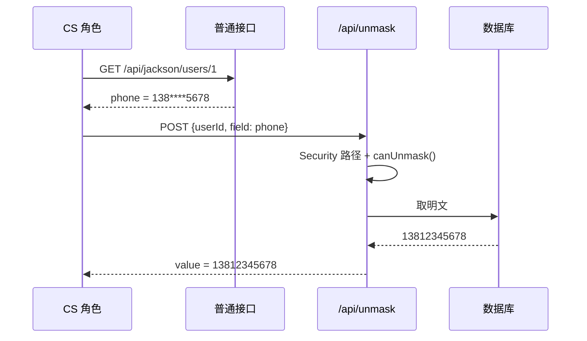
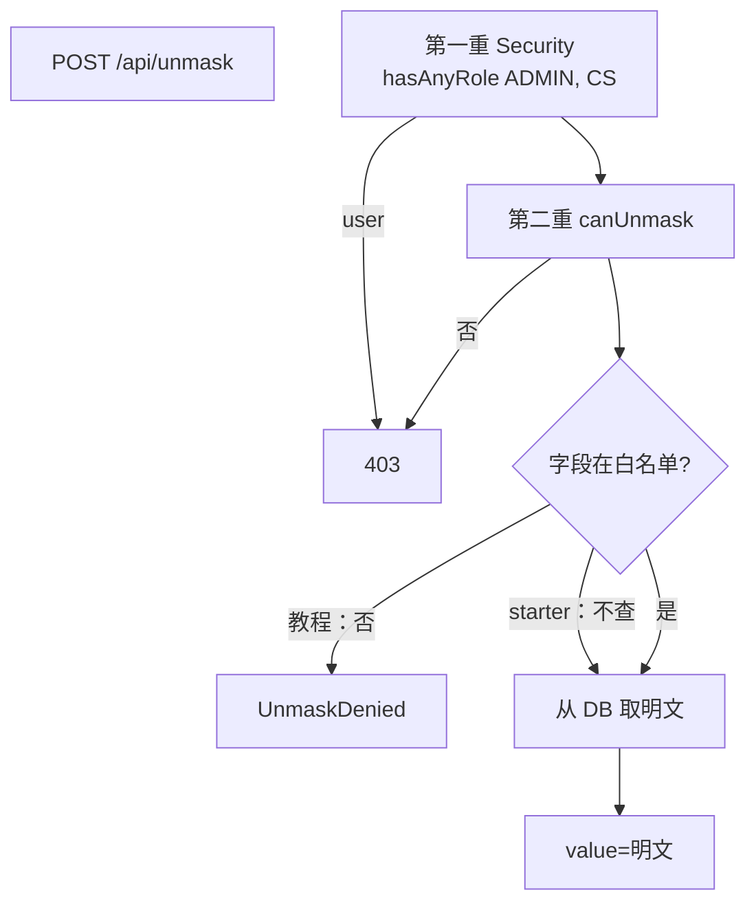
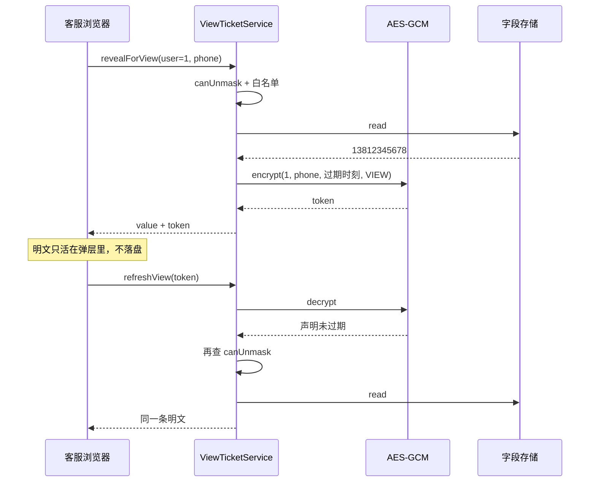
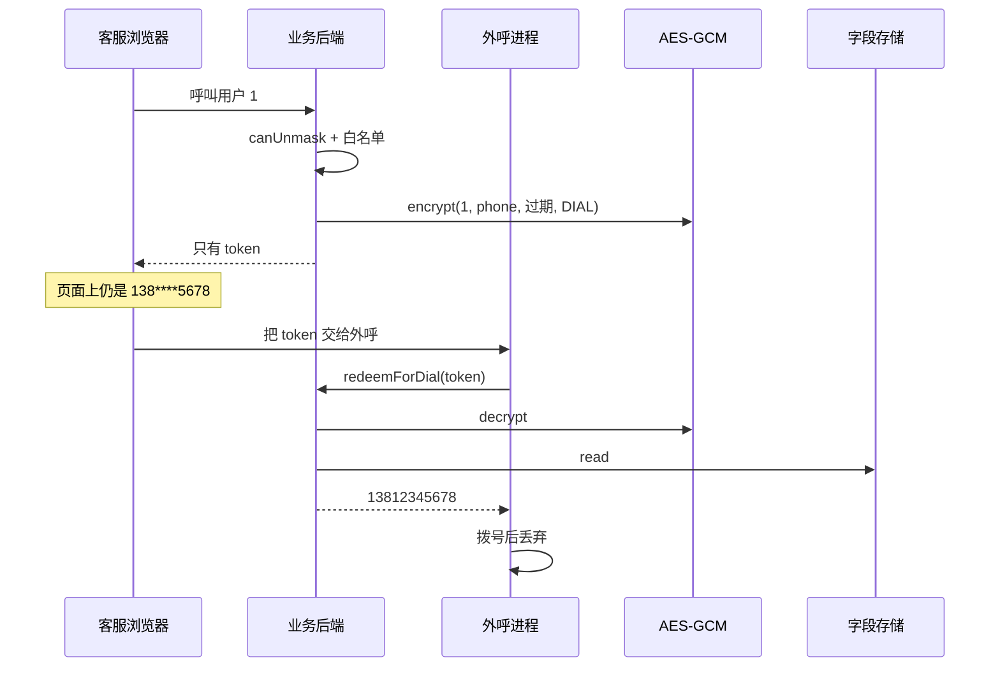

# 第 14 章 可逆脱敏：客服要看完整手机号怎么办

> **本章目标**：把「接口永远打码」和「授权角色能再拿一次明文」拆开。先走**不加 AES** 的还原闭环；只有出现票据 / 限时再查这类需求，再走**加 AES** 的第二条线。
> **前置知识**：第 5 章 `canUnmask()`，第 6 章 fail-loud，第 9 章 `@Sensitive`，第 11 章突变通道会毁掉库中原文。
> **预计时长**：50 分钟。
> **本章代码**：`mask-tutorial/src/main/java/com/learn/mask/tutorial/ch14/`（按场景分包，见下表）

| 场景 | 包（每包自包含，便于通读） | 入口类 |
| --- | --- | --- |
| 不加 AES，直接查库 | `ch14.immediatewithoutcrypto` | `UnmaskService` |
| 加 AES，弹层 60 秒刷新 | `ch14.viewwithcrypto` | `ViewTicketService` |
| 加 AES，点拨外呼 | `ch14.dialwithcrypto` | `DialTicketService` |

每个带 AES 的包内都有：`InMemoryUserStore`（用户表）、`InMemoryTokenStore`（Map 模拟 Redis 存 token）、`AesGcmReversibleMasker`。

---

## 14.1 问题场景：两种语义，不要混用

客服说：「用户报障时我要核对完整手机号。」产品的第一反应经常是：

> 那接口别打码了，或者 JSON 里再塞一份密文，前端拿密钥解开。

这两条都会把脱敏做废：

| 做法 | 实际效果 |
| --- | --- |
| 接口对 CS 不打码 | 任何能冒充 CS 的请求都直接拿到全库明文。浏览器缓存、CDN、访问日志全是明文 |
| JSON 里带 AES 密文 | 密文一旦出站，离线暴力、密钥泄露、前端反编译都能还原。脱敏变成「稍微难点的加密」 |
| 把密文当脱敏结果写进字段 | 下游当手机号用会炸；同一明文每次密文不同，缓存和幂等全失效 |

正确拆法是**两条通道**，和加不加 AES 无关：

```
展示通道（第 9~12 章）          还原通道（本章）
  任何角色的普通接口              单独的 /api/unmask
  永远输出星号                    先过权限，再从库取明文
  不碰密钥                        明文来自数据库，不是把星号解回去
```

「可逆」不是「把打码反着做回去」。星号已经丢了信息，`138****5678` 解不出 `13812345678`。能还原，是因为**库里还有原文**。

Demo 里 `UserDto.phone` / `identityCard` 标了 `reversible = true`，`email` / `bankCard` 没有。客服该能核对手机号，不该顺手把邮箱、卡号一起拖走。这个标记只约束还原通道，不改变展示形态。

---

## 14.2 先把请求路径钉死

下面三条就是这条需求在系统里实际发生的事。读完对照自己的理解：

1. **CS 第一次查询仍走正常展示路径。**  
   `GET /api/jackson/users/1` 的 `phone` 是 `138****5678`。和 USER 一样。`reversible = true`、角色是 CS，都不会让这个接口变明文。
2. **要看完整号码，再发一次请求**，带上用户和字段，例如 `{ "userId": 1, "field": "phone" }`，打到单独的 `/api/unmask`。
3. **服务器先判角色，再查库。**  
   不是「先取出明文，再决定给不给」。`user` 在 Spring Security 这一层就是 403，进不了 Controller。通过之后，`value` 是库里的原文。



到这里，还原已经闭环。图里**没有 AES**。密钥既不决定给不给明文，也不把星号还原成数字。

---

## 14.3 先选线：要不要 AES

| | 线程 A · 不加 AES | 线程 B · 加 AES |
| --- | --- | --- |
| 产品需求 | 客服点一下，看完整手机号 | 弹层 60 秒内刷新；点拨外呼且浏览器不能拿号 |
| 明文从哪来 | 数据库 | 仍然是数据库（核销后再读） |
| 给不给看 | 角色 + 字段白名单 | 签发前相同。AES 保护的是**票面声明** |
| 响应 | `{ field, value }` | 查看：`value + VIEW 票`；外呼：只有 `DIAL 票` |
| 密钥 | 不需要 | 签发 / 核销 token |
| 本章代码 | `immediatewithoutcrypto.UnmaskService` | `viewwithcrypto.ViewTicketService` + `dialwithcrypto.DialTicketService` |

没有限时刷新、也没有「明文不能出浏览器」时，**线程 A 就够了**。  
线程 B 不是把 A 换掉：签发前仍走 A 的鉴权；AES 让一张短时声明可以过网关、进外呼进程，而里面没有号码。

当前 Demo / starter 是「A 的闭环 + 把明文加密后挂上、但没有核销」。那解释不了 AES 的用处。14.5 用两个完整场景把核销补上。

库里也不想存明文（落盘加密）是**第三件事**：KMS / 列加密，不是 `/api/unmask` 里现算的展示 token。本章不展开。

下面 14.4 先把 A 写完，14.5 再上 B。

---

## 14.4 线程 A：不加 AES，授权后再查库

### 14.4.1 双重校验

Demo 的路径规则：

```java
.requestMatchers("/api/unmask").hasAnyRole("ADMIN", "CS")
```

`user/user123` 在 Spring Security 这一层就是 403。这是第一重。

第二重在业务里：`MaskContext.canUnmask()`。Header 覆盖、角色解析、`unmask-roles` 配置都在第 5 章。即使有人把路径规则改松了，运行时还能挡。

顺序必须是 **先鉴权，再碰明文**：

```
POST /api/unmask
  → Security hasAnyRole(ADMIN, CS)     否则 403
  → canUnmask()                        否则 403
  → 字段在白名单？                     否则拒绝
  → 从 DB 取该字段原文
  → 返回 value
```

ADMIN 也能还原：`unmask-roles` 默认含 ADMIN。ADMIN 走普通接口是旁路（明文），走还原接口同样能拿明文。两套语义一致，不要在还原里把 ADMIN 挡掉。

### 14.4.2 `reversible = true` 只是许可标记

starter 的注解：

```java
@Sensitive(type = SensitiveType.PHONE, reversible = true)
private String phone;
```

Jackson / AOP / MyBatis **都不读这个属性**。普通接口里仍然是 `138****5678`。它的唯一合法含义是：

> 这个字段**允许**走还原接口；没标的字段，即使调用方是 CS，也不该还。

教程版 `@Sensitive` 没有这个属性（第 9 章为了少讲一个维度）。还原服务用**字段白名单**：

```java
public static UnmaskService create() {
    return new UnmaskService(Set.of("phone", "idCard"), InMemoryUserStore.demo());
}
```

`email` 不在名单里。CS 请求 email 会失败。这比 starter 的 `UnmaskController` 严——真实实现只查角色，**不查 `reversible`**。

展示通道继续走 `MaskEngine.apply`。还原通道不走引擎，也不把打码值「解密」。两条路径不要汇合。

MyBatis 若在查询时就把列打成星号，还原从同一条查询拿不到原文。线程 A 和突变通道互斥——第 11、13 章说过，这里是业务上的再确认。

### 14.4.3 动手写：只返回明文

```java
public UnmaskResult unmask(MaskContext context, UnmaskRequest request) {
    if (context == null || !context.canUnmask()) {
        throw new UnmaskDeniedException("Current role cannot unmask");
    }
    if (request.field() == null || !reversibleFields.contains(request.field())) {
        throw new UnmaskDeniedException("Field is not reversible: " + request.field());
    }
    String value = userStore.readField(request.userId(), request.field());
    return new UnmaskResult(request.userId(), request.field(), value);
}
```

线程 A：`masker == null`，`token` 为 null。`value` 是调用方传入的**库中原文**。

真实 `UnmaskController` 的权限 + 查库部分就是 A（它后面多写了一行 `encrypt`，属于 B，见 14.5.5）：

```java
if (!maskContext.canUnmask()) {
    throw new ResponseStatusException(HttpStatus.FORBIDDEN, "Current role cannot unmask");
}
String plain = userService.fieldValue(request.userId(), request.field());
body.put("value", plain);
```

`fieldValue` 支持 phone / idCard / email / bankCard / expressNo。所以在 Demo 里 CS 对 **email** 也能拿到明文。注解上的 `reversible = true` 是摆设。



### 14.4.4 验证线程 A

```bash
mvn -f mask-tutorial/pom.xml test "-Dtest=com.learn.mask.tutorial.ch14.immediatewithoutcrypto.UnmaskServiceTest"
```

CS 还原得到库中明文、USER 拒绝、email 不在白名单、ADMIN 可还原。`withoutCrypto` 那条 `token` 为 null。

对照 Demo：

```bash
curl -u cs:cs123 -H "Content-Type: application/json" \
  -d "{\"userId\":1,\"field\":\"phone\"}" http://localhost:8080/api/unmask
```

看 `value` 是否为 `13812345678`。换 `user:user123` 应 403。换 `"field":"email"` 在 Demo 里**会成功**——starter 没校验 `reversible`。响应里多出来的 `token` 先当不存在，下一节再讲。

线程 A 到这里可以收工。没有限时票据需求，就不要往下加密钥。

---

## 14.5 线程 B：加 AES —— 签发**能核销**的限时票据

`aes.legacy.StarterStyleUnmaskService`（与 Demo 对齐）只是把明文加密后挂在响应上，**没有人拿 token 再办事**。那解释不了「AES 有什么用」。

有用的前提是：token 里装的不是手机号，而是一张**声明**（谁、哪一列、何时过期、作什么用），服务端能 `decrypt` 核销它。完整代码在 `aes.view.ViewTicketService` 与 `aes.dial.DialTicketService`。

先否定三件它**不做**的事：

| 不是 | 原因 |
| --- | --- |
| 把 `138****5678` 解回手机号 | 星号已经丢信息；明文始终从 `SensitiveFieldStore` 再读 |
| 代替 14.4 的第一次鉴权 | 签发前仍要 `canUnmask()` + 白名单 |
| 普通接口里的 `phone` 字段 | 密文不能当脱敏值，见 14.5.7 |

下面两个需求，少了 AES 就得把明文传给不该看见的人，或者让下游系统直连用户库。

### 14.5.1 场景一：客服弹层 60 秒内刷新

真实约束：完整号码不能进 `localStorage` / 前端长期缓存（审计和 XSS 面都太大）。客服点「查看」弹出蒙层，关掉再打开是常见动作。若每次都走「再点一次字段」，要么重复弹确认，要么审计日志被刷爆。

协议：

1. CS 点查看 → `revealForView`：鉴权、读库、返回 `value` + 一张 **60 秒 VIEW 票**
2. 30 秒后弹层重开 → `refreshView(token)`：解密票、看是否过期、**再跑一遍 `canUnmask()`**、再读库
3. 满 60 秒 → 刷新失败，必须重新 `reveal`，审计上是一条新的 `REVEAL`



AES 在这里做的事：把「1 号用户的 phone、VIEW、12:01 过期」封进浏览器带得走、但**拆不开**的字符串。没有服务端密钥，客服改不了 userId、改不了过期时间。GCM tag 被改一位就核销失败。

刷新仍要鉴权：票没过期，人已经被撤成 USER，照样拒绝。票不是终身通行证。

### 14.5.2 场景二：点拨外呼，浏览器永远不拿号码

比场景一更需要 AES。客服要点「呼叫」，但完整号码进浏览器就有剪贴板、XSS、屏幕水印都挡不住的泄漏。外呼系统（独立进程）却必须拿到真号去拨。

协议：

1. CS 点呼叫 → `issueDialToken`：鉴权后**只返回 token**，响应里没有 `value`
2. 前端把 token 交给外呼服务（或业务后端再转）
3. 外呼进程 `redeemForDial(token)`：解密、确认用途是 `DIAL`、未过期、读库、拨号、丢掉明文



没有这张票，你只能二选一：把明文给浏览器，或让外呼系统直接查用户表（权限面从「一个脱敏服务」扩成「整库」）。

VIEW 票不能拿去 `redeemForDial`，DIAL 票不能拿去 `refreshView`。用途写进票面，核销时对一下，防止「查看弹层的票被拿去打给所有人」。

外呼核销不再要 CS 的 `MaskContext`：外呼是服务账号（真实环境用 mTLS）。票证明的是「这一条、这一分钟、这一用途刚被授权过」。

### 14.5.3 动手写：票面 + AES-GCM

为什么是 GCM，不是「AES/CBC + 自己拼 IV」：

1. **认证加密**。改密文的任意一位，解密失败，不会解出乱码当明文用
2. **IV 不需要保密**，但**每次必须不同**。GCM 重用 IV + 同一密钥会直接裂开
3. JDK 自带，不引入新依赖

封装格式：

```
Base64( 12 字节随机 IV  ||  ciphertext || 16 字节 GCM tag )
```

`Cipher.doFinal` 在 GCM 下已经把 tag 附在密文后面，所以缓冲区只拼 IV + `doFinal` 的结果。

```java
public interface ReversibleMasker {
    String encrypt(String plainText);
    String decrypt(String cipherText);
}
```

完整实现见 `AesGcmReversibleMasker`。要点：

```java
byte[] iv = new byte[12];
random.nextBytes(iv);                          // 每次新 IV
cipher.init(ENCRYPT_MODE, secretKey(), new GCMParameterSpec(128, iv));
byte[] cipherBytes = cipher.doFinal(plain.getBytes(UTF_8));
return Base64.getEncoder().encodeToString(/* IV + cipherBytes */);
```

解密时先 Base64，切出前 12 字节当 IV，剩余当密文+tag。长度不够或 tag 对不上，都抛 `IllegalStateException`——和第 6 章一样，安全组件 fail-loud。

密钥处理**故意和 starter 一样**：UTF-8 字节拷进 32 字节数组，短的后面补 0、长的截断。14.5.5 节会批评它。

加密的是票面，不是手机号：

```
subjectId \u001f field \u001f expiresAtEpochMilli \u001f VIEW|DIAL
```

```java
String token = masker.encrypt(ticket.serialize());
UnmaskTicket parsed = UnmaskTicket.parse(masker.decrypt(token));
```

核销后再 `store.read(ticket.subjectId(), ticket.field())`。库才是真相；票里不放号码，换号、销号立刻生效。

`StarterStyleUnmaskService` 那种 `encrypt(明文)` 是 Demo 的半成品，对照 14.6。场景一用 `ViewTicketService`，场景二用 `DialTicketService`。

### 14.5.4 随机 IV 的两个后果

同一明文两次 `encrypt` 结果不同：

```java
assertThat(first).isNotEqualTo(second);
assertThat(masker.decrypt(first)).isEqualTo("13812345678");
```

所以：

1. **可逆加密绝不能进第 8 章的脱敏缓存。** 缓存 value 是稳定打码串。token 每次不同，命中会返回「另一张票」。
2. Token 不能当「这个用户的手机号指纹」做去重。要比对，比库里的明文或哈希。

篡改测试把 token 最后一字节异或掉：GCM tag 对不上，必须抛异常，不能返回乱码。

### 14.5.5 密钥管理的现实差距

Demo 默认：

```yaml
masking:
  reversible:
    enabled: true
    secret-key: ${MASKING_AES_KEY:demo-key-not-for-prod-32b!!}
```

实现：

```java
byte[] keyBytes = secretKey.getBytes(UTF_8);
byte[] aesKey = new byte[32];
System.arraycopy(keyBytes, 0, aesKey, 0, Math.min(keyBytes.length, 32));
```

| 密钥字符串 | 实际 AES-256 密钥 |
| --- | --- |
| `short` | `short` + 27 个 `0x00`。有效熵约 5 个字符 |
| `demo-key-not-for-prod-32b!!`（27 字符） | 27 字节 + 5 个 `0x00` |
| 超过 32 字节的口令 | **静默丢掉**后面的字节 |

两个不同的短口令如果前缀相同，截断/补零后可能变成同一把钥匙。测试 `shortKeysArePaddedWithZeros` 把这件事钉死。

生产最低要求（只在你选了线程 B 时才有意义）：

1. **正好 32 字节**的随机密钥，环境变量或 KMS / Vault 下发，不要写进仓库
2. 长度不对就**启动失败**，不要补零、不要截断
3. 轮换：旧 token 用旧钥解，新签发用新钥。当前实现没有 key id，轮换等于全作废
4. `enabled: false` 时还原接口应 404/403，不要继续用默认 Demo 钥加密

教程和 starter 都没做 2~4。写进第 17 章改进项。

### 14.5.6 对照：Demo 只签发，不核销

`mask-demo` 的 `/api/unmask` 仍是 `encrypt(明文)` 后塞进 `token`，没有 `refresh` / `redeem`。starter 注释写「用 AES 令牌换回明文」，实现以 `UnmaskController` 为准。教程用 `ViewTicketService` / `DialTicketService` 把核销补齐，用来回答「AES 干什么」。

### 14.5.7 为什么不能把密文直接吐给前端当「脱敏值」

假设把展示 JSON 改成：

```json
{ "phone": "base64(IV||ciphertext||tag)" }
```

问题：

1. **密文是可逆的。** 密钥从配置、堆转储、日志里漏出去，历史响应全部可还原
2. **形态不像手机号。** 下游校验、短信网关、对账都会坏
3. **每次请求密文不同**（随机 IV），CDN、ETag、脱敏缓存全部失效
4. **权限被绕开。** 展示接口通常只要登录。把密文放进展示接口，等于把还原能力发给所有 USER

令牌只出现在**已经过双重校验的还原接口**里。展示接口继续打码。密文的受众是「这次被授权查看的人」，不是「所有能 GET 用户详情的人」。

### 14.5.8 验证线程 B

```bash
mvn -f mask-tutorial/pom.xml test "-Dtest=com.learn.mask.tutorial.ch14.immediatewithoutcrypto.UnmaskServiceTest,com.learn.mask.tutorial.ch14.viewwithcrypto.ViewTicketServiceTest,com.learn.mask.tutorial.ch14.dialwithcrypto.DialTicketServiceTest"
```

除开算法往返 / IV / 篡改，还应看到：

- 查看后 30 秒刷新成功，审计是 `REVEAL` 再 `REFRESH`
- 拨到 60 秒刷新失败
- 刷新时改成 USER 被拒
- `issueDialToken` 的返回值不含 `13812345678`，`redeemForDial` 才等于明文
- VIEW 票不能外呼，DIAL 票不能刷新

Demo 的 `token` 每次不同只证明「签发了」。要看 AES 真正办事，跑上面这组。

---

## 14.6 对照真实实现

| 点 | 教程 `ch14` | `mask-starter` / `mask-demo` |
| --- | --- | --- |
| 线程 A：鉴权 + 查库 | `canUnmask()` + 字段白名单；`withoutCrypto()` 不签发 | Security `hasAnyRole` + `canUnmask()`，**无字段名单** |
| 线程 B：AES | `ViewTicketService` / `DialTicketService` 加密**票面**并核销 | `encrypt(明文)` 写入 `token`，**无核销** |
| 核销 | `refreshView` / `redeemForDial`；过期、撤权、用途错都拒绝 | 无 |
| 密钥 | 补 0 / 截断到 32 字节 | 相同，默认 `demo-key-not-for-prod-32b!!` |
| `reversible` 注解 | 教程 `@Sensitive` 无此属性，用白名单 | 注解有，**UnmaskController 不读** |
| 明文来源 | `SensitiveFieldStore`（核销时再读） | `UserService.fieldValue` 从 H2 再查 |
| 单测 | A：鉴权 / 白名单；B：算法 + 两个场景 | starter 只测往返；Demo 只测 CS 200 / USER 403 |

对应文件：

- `mask-starter/.../crypto/ReversibleMasker.java`
- `mask-starter/.../crypto/AesGcmReversibleMasker.java`（约 77 行）
- `mask-starter/.../annotation/Sensitive.java` 的 `reversible()`
- `mask-demo/.../web/UnmaskController.java`
- `mask-demo/.../config/SecurityConfig.java` 第 25 行
- `mask-demo/.../domain/UserDto.java`：phone / identityCard 标了 `reversible = true`

---

## 本章小结

- 展示打码和授权还原是两条通道。星号不可逆，明文来自数据库
- **线程 A（默认）**：双重校验 → 字段白名单 → 查库返回 `value`。没有限时票据需求，到此为止
- **线程 B（可选）**：AES 封的是限时声明（谁 / 哪列 / 何时过期 / VIEW 还是 DIAL），核销后再读库。场景：弹层 60 秒刷新、点拨外呼（浏览器不拿号）
- Demo 的 `/api/unmask` 只签发、不核销，所以看不出 AES 的用处。教程用 `ViewTicketService` / `DialTicketService` 把核销补上
- `reversible = true` 应限制「哪些字段能还」，不要指望它改变接口形态
- 选了 B 才谈密钥：Demo 的补零 / 截断只适合教学；生产用 KMS/Vault，长度不对就启动失败
- 密文不准当展示字段

---

## 课后练习

**练习 14.1（线程 A）** 真实 `UnmaskController` 不读 `reversible`。设计一种不扫描整个 classpath 注解的做法，让 `"field":"email"` 对 CS 也失败。提示：白名单可以来自配置 `masking.reversible.fields`。

**练习 14.2（线程 B）** 给 `AesGcmReversibleMasker` 加启动校验：密钥 UTF-8 字节数必须正好是 16 或 32。写一个用 `"short"` 构造就会抛的测试。不要改 `ReversibleOptions.demo()` 的默认值（Demo 钥是 27 字符，校验加上后会不合法——这正是你要在注释里写明的）。

**练习 14.3（线程 B）** `refreshView` 在 TTL 内可以反复刷新。给 DIAL 票加上「只能核销一次」：票面加 `jti`（随机 id），核销后记入已用集合，第二次 `redeemForDial` 必须失败。VIEW 刷新仍可多次。为什么外呼要一次性、弹层刷新不要？

---

## 练习答案

### 练习 14.1

配置：

```yaml
masking:
  reversible:
    fields: [phone, idCard, identityCard]
```

Controller 在 `canUnmask()` 之后：

```java
if (!properties.getReversible().getFields().contains(request.field())) {
    throw new ResponseStatusException(HttpStatus.FORBIDDEN, "Field is not reversible");
}
```

不要运行时反射去找 `UserDto` 上的 `@Sensitive`：字段名和 JSON 名、DB 列名经常不一致（`identityCard` vs `idCard`）。注解给人看；**强制执行走配置白名单**。两者不一致时以白名单为准，启动时可以打 WARN。

这是线程 A 的缺口，和 AES 无关。

### 练习 14.2

在构造器或 `secretKey()` 里：

```java
byte[] keyBytes = options.secretKey().getBytes(StandardCharsets.UTF_8);
if (keyBytes.length != 16 && keyBytes.length != 32) {
    throw new IllegalStateException(
            "AES key must be 16 or 32 UTF-8 bytes, got " + keyBytes.length);
}
```

`"short"` 是 5 字节，构造即失败。`demo-key-not-for-prod-32b!!` 是 27 字节，同样失败——Demo 默认钥从来就不是合法 AES 钥匙，只是靠补零混过去。

不要在校验里继续 `arraycopy` 补零。校验的意义是关掉那条路。没选线程 B 的项目，这个练习可以不做。

### 练习 14.3

票面增加第四段之外的 `jti`（UUID）。服务内用 `Set<String> usedJti`。`redeemForDial` 在 `open` 成功后：

```java
if (!usedJti.add(ticket.jti())) {
    throw new UnmaskDeniedException("Dial ticket already redeemed");
}
```

`refreshView` 不写这个 Set。

外呼一次性：同一张票被转发两次就打出两通，或被中间人重放。核销一次即作废，重放失败。弹层刷新是同一会话里反复读同一号，一次性会逼客服每关一次窗就重新点「查看」，把审计打爆。TTL 已经限制刷新窗口；外呼多一道 jti。

生产上这个 Set 要带过期（和票 TTL 对齐），否则会无限涨。跨实例用 Redis `SETNX` + TTL，不要本机 HashSet。
