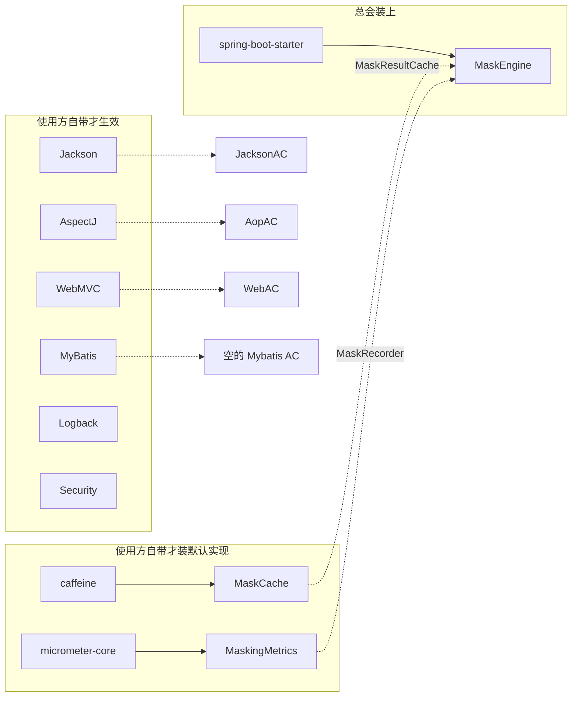
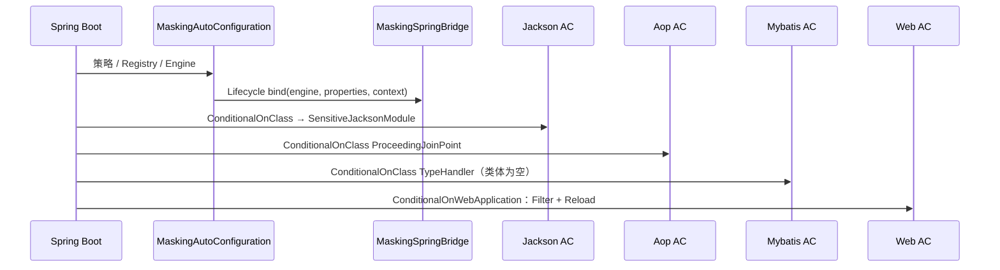

# 第 18 章 复盘：为什么这个 starter 长这样

> **本章目标**：看清依赖怎么切、自动配置怎么装、静态桥为什么存在；能把同一套引擎搬到自己的项目，并说得出「如果重做会改哪三处」。
> **前置知识**：第 6~14 章。
> **预计时长**：40 分钟。
> **对照代码**：`mask-starter/pom.xml`、`config/*`、`META-INF/spring/org.springframework.boot.autoconfigure.AutoConfiguration.imports`
>
> 本章以**当前** `mask-starter` 为准。18.6 原先列的三处（注解解耦、Caffeine/Micrometer optional、桥生命周期 + Logback fail-closed）已经落地。

---

## 18.1 依赖边界：通道 optional，内核并不是「零框架」

README 大纲写过「annotation / strategy / engine 零框架依赖」。对照 `pom.xml` 和 import，更准确的说法是：

**通道框架全部 `optional`。Caffeine / Micrometer 也是 `optional`：有则装默认实现，没有则引擎落到 `NO_OP`。内核只强制 `spring-boot-starter`。**

| 依赖 | `optional` | 谁用 |
| --- | --- | --- |
| `spring-boot-starter` | 否 | 自动配置、`@ConfigurationProperties` |
| `caffeine` | 是 | `MaskingCacheAutoConfiguration` → `MaskCache`；缺类则 `MaskResultCache.NO_OP` |
| `micrometer-core` | 是 | `MaskingMetricsAutoConfiguration` → `MaskingMetrics`；缺类则 `MaskRecorder.NO_OP` |
| `spring-boot-starter-jackson` | 是 | Jackson 通道：`SensitiveJacksonModule` |
| `spring-boot-starter-aspectj` | 是 | AOP 通道 |
| `spring-boot-starter-webmvc` | 是 | Filter、Reload Controller |
| `spring-boot-starter-security` | 是 | `MaskContext` 里 `catch (NoClassDefFoundError)` |
| `spring-boot-starter-actuator` | 是 | 业务侧暴露指标，starter 不强制 |
| `mybatis-spring-boot-starter` | 是 | 仅 `ConditionalOnClass`；自动配置类是空的 |
| `logback-classic` | 是 | Converter + XML 片段 |

`optional=true` 的含义：starter 编译期看得到这些类，**使用方 pom 不写它们就不会传递下去**。于是：

- 只有 Web 的项目：加上 jackson / webmvc，Jackson 通道自动亮
- 没有 MyBatis：`MybatisMaskingAutoConfiguration` 因 `@ConditionalOnClass(TypeHandler)` 不加载，也不报错
- 没有 Security：角色解析走无 Security 的分支（第 5 章）

策略实现（`PhoneMaskStrategy` 等）确实不 import Jackson / MyBatis / AspectJ。`MaskEngine` 只依赖 `MaskSettings` / `MaskStrategyRegistry` / `MaskResultCache` / `AlreadyMaskedDetector` / `MaskRecorder`，不 import 通道 API，也不 import Caffeine、Micrometer。这是「通道可拔、缓存/指标可换」的真正边界。

自动配置把 Caffeine / Micrometer 拆成独立类，并且 **`@ConditionalOnClass` 标在配置类上**，避免「没有 Caffeine 却加载了引用 `MaskCache` 的配置类」。使用方要本地缓存，自己在 pom 里加 `caffeine`（Demo 已加）。只要 Actuator，Micrometer 通常已经在。

`@Sensitive` **不再带任何 Jackson 注解**。Jackson 通道靠 `SensitiveJacksonModule` 插入 `SensitiveAnnotationIntrospector`。没有 Jackson 的项目可以只开 AOP，编译和加载 `@Sensitive` 都不会缺类。

`MaskingSpringBridge` 和通道实现仍然拿具体的 `MaskingProperties`（通道开关、`map-keys`、规则快照都在上面）。引擎单测可以塞替身；真正跑起来时，桥上挂的还是那份配置对象。



---

## 18.2 三个条件注解各管一刀

| 注解 | 问的问题 | 本 starter 的用法 |
| --- | --- | --- |
| `@ConditionalOnClass` | classpath 上有没有这个类 | Jackson / AOP / MyBatis / Web 自动配置的大门 |
| `@ConditionalOnBean` | 容器里有没有这个 Bean | 通道配置都要求已有 `MaskEngine`；`UnmaskTicketService` 还要求业务提供了 `SensitiveFieldLookup` |
| `@ConditionalOnMissingBean` | 使用方是不是已经给过了 | 策略、引擎、Walker、Filter：按具体类型；缓存 / 指标：按 **接口** `MaskResultCache` / `MaskRecorder` |

`@ConditionalOnMissingBean` 是扩展点：Demo 的 `AddressMaskStrategy`、`ExpressNoMaskStrategy` 以 `@Component` 出现，Registry 的 `List<MaskStrategy>` 会收进去。使用方也可以自己 `@Bean` 一个 `MaskResultCache`，starter 的 `MaskCache` 不创建。

`@ConditionalOnWebApplication` 挡 Reload Controller 和 Filter，避免把 starter 丢进非 Web 进程时去注册 Servlet。

没有 `@ConditionalOnProperty(masking.enabled)` 包整份自动配置。总开关在引擎热路径里判断：关了仍创建 Bean，`apply` 记 `MaskAction.DISABLED` 后立刻返回。好处是 reload 可以把 `enabled` 再打开；代价是关了也占一套缓存和桥。启动时若已经是 `false`，`MaskingChannelValidator` 打 error；热更新从开打到关也会打 error。

---

## 18.3 `AutoConfiguration.imports` 与顺序

文件：`mask-starter/src/main/resources/META-INF/spring/org.springframework.boot.autoconfigure.AutoConfiguration.imports`

```
com.learn.mask.config.MaskingCacheAutoConfiguration
com.learn.mask.config.MaskingMetricsAutoConfiguration
com.learn.mask.config.MaskingCacheMetricsAutoConfiguration
com.learn.mask.config.MaskingAutoConfiguration
com.learn.mask.config.JacksonMaskingAutoConfiguration
com.learn.mask.config.AopMaskingAutoConfiguration
com.learn.mask.config.MybatisMaskingAutoConfiguration
com.learn.mask.config.WebMaskingAutoConfiguration
```

Boot 4 不再用 `spring.factories` 的 `EnableAutoConfiguration` 列表。imports 文件一行一个类。

各通道类上还有 `@AutoConfiguration(after = MaskingAutoConfiguration.class)`。顺序保证：先引擎 + `MaskingSpringBridge.bind`，再序列化器 / 切面 / Filter。



MyBatis 那份是**故意空的**（第 11 章）：只用来占位和文档，防止以后有人「顺手加一个 TypeHandler `@Bean`」。

Jackson 自动配置注册 **`SensitiveJacksonModule` Bean**。Boot 4 把容器里所有 `JacksonModule` 交给 `JsonMapper.Builder`。模块插入 `SensitiveAnnotationIntrospector`：看见 `@Sensitive` 就返回**已经注入引擎**的 `SensitiveValueSerializer`，不再靠字段上的 `@JsonSerialize` 去无参 `new`。

`SensitiveMapView` 仍用自己的 `@JsonSerialize` + 静态桥，因为裸 `Map` 没有字段注解可发现。Logback / MyBatis 也还走桥。

---

## 18.4 静态桥：必要的折中，也是坏味道

Jackson 反射 `new SensitiveValueSerializer()` 这条路径只剩 `SensitiveMapView`。`@Sensitive` 字段由 Module 创建已注入的序列化器。Logback `Converter`、MyBatis `TypeHandler` **仍不是 Spring 创建的**。

桥把三个对象挂到 `static volatile` 上。Logback / MyBatis / Map 视图还需要它。

当前成品和早期版本的差别：

| 问题 | 现在的表现 |
| --- | --- |
| 全局可变单例 | 测试之间仍可能串状态；`MaskingSpringBridgeLifecycle` 创建时 bind，**容器关闭时 unbind** |
| Jackson `@Sensitive` 字段 | 走 Module，序列化器构造时已有引擎；未 bind 仍抛 `IllegalStateException` |
| MyBatis | `engine == null` 时抛同样的错 |
| Logback | 未 bind 时用星号盖住正则匹配段，**不写原文**；通道关掉才原样返回 |
| 隐藏依赖 | Map 视图 / Logback / TypeHandler 仍依赖「必须先跑 AutoConfiguration」 |
| 多容器 | 后启动的 Context 会覆盖静态位；先关的那个 destroy 会把后一个的桥也 unbind 掉 |

**什么时候还能忍**：进程里只有一个 Boot 应用。`@Sensitive` JSON 已经不依赖无参构造。Logback / MyBatis / `SensitiveMapView` 仍然需要桥。

**什么时候该换**：自己注册 Map 的 Module 序列化器、自己 new TypeHandler 并传入引擎。那时这三条也可以离开静态位。

---

## 18.5 移植到自己项目的检查清单

按顺序做，不要先抄 Demo 的 `application.yml`。

1. **依赖**：业务 pom 引入 `mask-starter`，并按需加 jackson / security / mybatis / aspectj。要本地缓存再加 `caffeine`；指标通常随 Actuator 来。不要为了「齐全」四个通道都加。
2. **Boot 4 / Jackson 3**：包名 `tools.jackson.*`。Boot 3 项目不能直接用这份 starter。
3. **通道默认值**：starter 默认 jackson+logback 开，aop+mybatis 关，`strict=false`。Demo 为了上课改成四开。生产跟 **starter 默认**，不要跟 Demo。
4. **`strict`**：生产建议 `true`，冲突组合直接起不来。
5. **`header-role-enabled`**：starter 默认 `false`。Demo 是 `true`。生产必须 `false`。
6. **缓存**：starter 默认 `cache.enabled=false`，且 `MaskCache` 已 `recordStats()`。Demo 为了第 8 章对比改成了 `true`。生产若要开，先看 `masking.cache.hit_rate`。
7. **AES 钥**：环境变量 `MASKING_AES_KEY`，不要提交默认那串演示密钥。长度必须是 16 或 32 个 UTF-8 字节，否则启动失败（不再补零 / 截断）。
8. **角色**：`bypass-roles` / `unmask-roles` 与 Security 角色名对齐（不要带 `ROLE_` 前缀）。
9. **自定义类型**：实现 `MaskStrategy` + `@Component`，编码用策略类上的 `public static final String`，`@Sensitive(code = XxxStrategy.XXX)`，`masking.rules.extras` + `extra-map-keys`。不要改 starter 枚举。地址、快递单号都是这个路子。
10. **不要往枚举加业务类型**：`SensitiveType` 只有 `PHONE` / `ID_CARD` / `BANK_CARD` / `EMAIL` / `CUSTOM`。
11. **回写**：更新接口不要把 GET 到的打码值写回库。能只用 Jackson 就不要开 AOP/MyBatis。
12. **可逆**：`UnmaskTicketService` 读 `masking.reversible.enabled` 和 `reversible.fields`（默认 `phone` / `idCard` / `identityCard`），不读字段上的 `@Sensitive(reversible=true)`。两套标记必须自己对齐。业务还要提供 `SensitiveFieldLookup` Bean，否则还原服务根本不会创建。
13. **观测**：`masking.invoke` 的 `result` 是小写。总开关关掉是 `disabled`，不要和 `bypass` 混在一起看。缓存命中率看 `masking.cache.hit_rate`。
14. **测试**：精确字符串 + 三角色 + 日志 ListAppender。清单见第 15 章。
15. **热更新**：只信 reload 能改的那几项（附录 A）：`enabled`、通道开关、规则补丁。`RulePatch` 里 `null` 表示这一项不改。`bypass-roles` / 缓存 / 密钥不能靠 reload。
16. **总开关**：`masking.enabled=false` 是应急按钮。启动时若已关闭、或 reload 把它关掉，日志会打 error。配一条「出现 `result=disabled` 即告警」。

---

## 18.6 这三处已经改入 starter

原先「如果重做」的三条都有生产价值，已经落地：

### 一、注解与 Jackson 解耦（已做）

`@Sensitive` 只是标记。`SensitiveJacksonModule` 插入内省器，Boot 收集 `JacksonModule` Bean。没有 Jackson 也能编译 AOP 专用项目。

教程第 9 章仍用 `@JacksonAnnotationsInside` + `@JsonSerialize` 讲组合注解——那是教学路径，对照 starter 时不要抄回去。

### 二、Caffeine / Micrometer 改为 optional（已做）

`MaskingCacheAutoConfiguration` / `MaskingMetricsAutoConfiguration` 用类级别的 `@ConditionalOnClass`。缺依赖时核心配置提供 `NO_OP`。Demo 显式声明了 `caffeine`。

### 三、桥有生命周期，Logback fail-closed（已做）

`MaskingSpringBridgeLifecycle`：创建 bind，销毁 unbind。Jackson `@Sensitive` 字段走 Module。Logback 未 bind 时用星号盖匹配段，不写原文。

### 若再往下改

挤不进「结构级三处」、但还值得做的：`SensitiveMapView` 仍走桥；`@Sensitive(reversible)` 与 `masking.reversible.fields` 两套名单；未注册的自定义 code 静默回落 `CUSTOM`；Demo 的四通道 / Header 覆盖不要当生产默认值。

---

## 本章小结

- 通道依赖 optional；Caffeine / Micrometer 也是 optional，缺了就 `NO_OP`。内核只强制 Boot。`@Sensitive` 不再沾 Jackson
- 引擎只认三个窄接口。缓存和指标按接口 `MissingBean`，并且拆在独立的 `ConditionalOnClass` 配置类里
- `ConditionalOnClass` / `OnBean` / `OnMissingBean` 分别管「有没有框架」「引擎在不在」「能不能换」
- imports 顺序：先缓存/指标，再核心 bind，再通道。Jackson 靠 `JacksonModule` Bean 接入
- 静态桥留给 Logback / MyBatis / Map 视图。Lifecycle 成对 bind/unbind；Logback 未就绪盖星号
- 移植跟 starter 默认值，不要跟 Demo 默认值；要用缓存就自己加 `caffeine`
- 18.6 的三条已经落地。还值得做的是 Map 视图离桥、可逆名单合一、自定义 code 打 WARN

---

## 课后练习

**练习 18.1** 使用方只有 `spring-boot-starter` + `mask-starter`，没有 jackson。启动会失败吗？`@Sensitive` 标在一个普通 Bean 上会怎样？

**练习 18.2** 为什么 MyBatis 自动配置要留一个空类，而不是从 imports 里删掉这一行？

**练习 18.3** 给「重做第一处」（注解不含 `@JsonSerialize`）画一下：业务字段、Jackson Module、AOP Walker 各自读什么。

---

## 练习答案

### 练习 18.1

启动**不会**因 Jackson 自动配置失败：`@ConditionalOnClass(ValueSerializer)` 不满足，那份 AC 跳过。内核 AC 仍会创建引擎和桥。`@Sensitive` 已不含 Jackson 类型，**业务只标注解、只开 AOP 时可以编译和加载**。JSON 不会打码，因为根本没有 Module。这正是解耦的目的。

### 练习 18.2

空类 + `ConditionalOnClass` 是文档和扩展锚点：后来的人看到「有 MyBatis 配置」会去读类注释（禁止 TypeHandler Bean）。删掉 imports 行，这个警告只存在于教程里，代码里看不见。空类几乎零成本。

### 练习 18.3

```
@Sensitive(type, code, reversible)     ← 纯标记，无 Jackson
        │
        ├─ Jackson Module / Introspector  → 发现注解 → 挂 SensitiveValueSerializer
        ├─ AOP Walker                     → 同样读注解，改内存
        └─ Unmask 白名单（配置或启动扫描） → 读 reversible
```

三个读者，一份注解，没有任何读者要求另外两个框架在场。starter 的 Jackson 通道已经是这个结构。第三项实际读的是 `masking.reversible.fields`，不是注解上的 `reversible()`。
