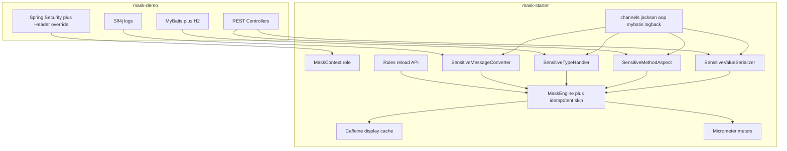

# 数据脱敏方案 MVP 开发计划

基于 [requirement.txt](requirement.txt) 完善后的实现规格与分阶段计划。原文是教学大纲，本文将其落实为可开发、可验收的工程约定。

## 1. 已确认决策

| 项 | 结论 |
| --- | --- |
| 技术栈 | Java 21、Spring Boot **4.0.7**、WebMVC（`spring-boot-starter-webmvc`） |
| JSON | Jackson **3.x**：`tools.jackson.databind.ValueSerializer`（不是 Jackson 2 的 `JsonSerializer`） |
| 范围 | 按 requirement.txt **全量落地**：四切入点 + 角色控制 + 配置化/热更新 + 可逆还原 + 监控 + 压测 |
| 工程形态 | Maven 多模块：`mask-starter`（可复用自动配置）+ `mask-demo`（演示应用） |
| 角色来源 | Spring Security 为正式方案；本地可开 `X-User-Role` 调试覆盖 |
| 演示库 | H2 内存库 + schema/data 脚本 |
| 多通道叠加 | 全局 `masking.channels.*` 开关 + 引擎幂等；推荐 Jackson+Logback，AOP/MyBatis 默认关 |

## 2. 需求完善

### 2.1 目标

做 **动态脱敏**：库中仍存明文，在出口（接口 / 日志 / 可选的查询映射）按角色与规则打码。

静态脱敏（落库即打码）不作为主路径。

### 2.2 设计原则

低侵入、高内聚、可扩展。业务代码只声明「这是敏感数据」，不手写打码逻辑。

### 2.3 四个切入点与通道开关

四个切入点全部实现，由全局配置决定当前启用哪些。Demo 仍用不同 API 分别展示各通道，便于对照。

1. **传输层（主路径）**：Jackson 3 自定义 `ValueSerializer`，序列化接口响应时打码。**不改内存对象**。
2. **日志层**：Logback `MessageConverter`，对非结构化日志按规则/正则打码。**独立出口**，与接口脱敏互补。
3. **持久层**：MyBatis `BaseTypeHandler`，结果映射时打码。**会改内存对象**（应用层拿到的已是脱敏值）。
4. **应用层**：`@Sensitive` + AOP，拦截方法返回值。**会改内存对象**。

详见 [2.3.1 多通道叠加如何处理](#231-实际业务中同一字段走多次脱敏如何处理)。

### 2.3.1 实际业务中同一字段走多次脱敏如何处理

可以，而且**应当**用全局配置显式开启/关闭各方案，而不是靠「开发约定不要叠加」。

**通道分类**

- **出口通道（不改业务对象）**：Jackson、Logback。两者作用在不同出口（HTTP JSON vs 日志），生产上通常同时开。
- **突变通道（改 Java 对象里的值）**：AOP、MyBatis TypeHandler。会把明文替换成打码值，后续再走 Jackson 就会二次打码，也可能把打码值写回缓存/DB。

**处理策略（三层）**

1. **配置层（主控）**：`masking.channels.*` 控制四通道启停；关闭的通道直接透传，不调用引擎。
2. **引擎层（兜底幂等）**：`MaskEngine` 若发现值已经是当前规则的打码形态（含连续 `maskChar`，且前后缀符合 keepPrefix/keepSuffix），则跳过，指标记 `result=skipped_already_masked`。
3. **启动校验**：`jackson+aop` 或 `jackson+mybatis` 同时为 true 时打 WARN；`masking.channels.strict=true` 时直接启动失败，避免误配上线。

**推荐组合**

- 典型 Web API：**jackson=true, logback=true, aop=false, mybatis=false**
- 无 HTTP、只对服务返回值打码：**aop=true, jackson=false, logback=true, mybatis=false**
- 查询即打码（应用层不再持有明文，不可逆）：**mybatis=true, jackson=false, aop=false, logback=true**

Logback 默认开启：`log.info("phone={}", user.getPhone())` 里仍是明文时，接口 Jackson 打码挡不住日志泄漏。

热更新 reload 时通道开关一并生效（不注册的 Bean 除外；Jackson/AOP/TypeHandler 在请求路径上读最新 `MaskingProperties`）。

### 2.4 角色模型

| 角色 | 行为 |
| --- | --- |
| `ADMIN` | 旁路脱敏，接口返回明文 |
| `USER` | 始终脱敏 |
| `CS` | 默认脱敏；对标记为可逆的字段可调用还原接口 |

调试：`masking.debug.header-role-enabled=true` 时读取 `X-User-Role`，优先级高于 Security，**仅本地**，生产关闭。

### 2.5 两种处理语义（不要混用）

- **展示脱敏（不可逆）**：如 `138****8000`，可走 Caffeine 缓存。
- **可逆脱敏**：AES-GCM。展示层仍返回打码文案；`CS` / `ADMIN` 通过独立还原 API 取回明文，不把密文直接吐给前端。

### 2.6 内置策略（可扩展）

手机号、身份证、银行卡、邮箱、自定义 `keepPrefix` / `keepSuffix`、AES 可逆。

新增规则：实现策略接口并注册即可，不改业务代码。

### 2.7 监控

- 指标：脱敏调用次数、平均耗时、按角色脱敏/旁路比例、失败次数。
- 集成：Micrometer + Actuator（`/actuator/metrics`、`/actuator/prometheus`）。
- 不接外部 Prometheus / Grafana。

### 2.8 压测

对比开启/关闭脱敏、开启/关闭缓存时的 QPS / RT / CPU / GC。目标 **15000+ QPS** 作为环境相关记录项；本机达不到时以开关对比和瓶颈分析为准，不把绝对 QPS 当功能验收。

### 2.9 明确弱化

- 可逆密钥：配置项 + 环境变量，不做 KMS。
- 日期 / 数字默认不打码，避免破坏 JSON 类型。

## 3. 架构



**数据流**：默认（Jackson+Logback）下业务方法始终持有明文，脱敏只发生在 HTTP/日志出口。若打开 TypeHandler 或 AOP，内存中的字段会被改成打码值，可逆还原将无法从该对象取回明文。引擎对已打码值幂等跳过，避免二次打码。

## 4. 工程结构

```
learn-spring-boot-mask/
  pom.xml                 # 父工程：Java 21，spring-boot-starter-parent 4.0.7
  mask-starter/           # 可复用自动配置（引擎 + 四个切入点），目录见 4.1
  mask-demo/              # WebMVC 演示：Security、H2、MyBatis、示例 API
  requirement.txt
  plan.md
```

### 4.1 mask-starter

根包 `com.learn.mask`。按「无 Spring 的引擎 / 各通道适配 / 自动配置」分层，避免业务 Demo 代码漏进 starter。

```
mask-starter/
  pom.xml
  src/main/java/com/learn/mask/
    annotation/                          # 对外注解，业务只依赖这一层
      Sensitive.java                     # 字段：type、reversible；带 @JsonSerialize
      SensitiveMethod.java               # 方法切点（AOP）
      SensitiveType.java                 # PHONE / ID_CARD / BANK_CARD / EMAIL / CUSTOM
    strategy/                            # 策略模式，无 Spring
      MaskStrategy.java                  # mask(raw, rule) / supports(type) / alreadyMasked
      MaskStrategyRegistry.java          # 按 SensitiveType 注册、查找
      PhoneMaskStrategy.java
      IdCardMaskStrategy.java
      BankCardMaskStrategy.java
      EmailMaskStrategy.java
      CustomPatternMaskStrategy.java     # keepPrefix / keepSuffix / maskChar
    engine/                              # 编排：角色 + 通道 + 幂等 + 缓存
      MaskEngine.java                    # 唯一入口 apply(raw, type, ctx)
      MaskAction.java                    # BYPASS / MASK / SKIP_ALREADY_MASKED / FAIL
      AlreadyMaskedDetector.java         # 识别已打码形态，防二次打码
    context/                             # 当前请求角色
      MaskContext.java                   # 从 Security / Header 解析
      MaskRole.java                      # ADMIN / USER / CS
    cache/
      MaskCache.java                     # Caffeine；key = type + ruleVersion + raw
    crypto/
      ReversibleMasker.java              # encrypt / decrypt
      AesGcmReversibleMasker.java
    metrics/
      MaskingMetrics.java                # invoke / duration / fail / bypass / skipped
    support/
      MaskUtils.java                     # 空值、非 String、嵌套遍历辅助
    config/                              # Spring Boot 绑定与装配
      MaskingProperties.java             # masking.*（enabled、channels、rules、cache…）
      MaskingAutoConfiguration.java      # 引擎/缓存/指标/上下文
      JacksonMaskingAutoConfiguration.java
      AopMaskingAutoConfiguration.java   # @ConditionalOnClass + channels.aop
      MybatisMaskingAutoConfiguration.java
      MaskingChannelValidator.java       # jackson 与 aop/mybatis 冲突 WARN / strict 失败
    jackson/
      SensitiveValueSerializer.java      # ValueSerializer<String> + createContextual
    aop/
      SensitiveMethodAspect.java         # @Around @SensitiveMethod
      SensitiveObjectWalker.java         # 递归 Bean / List / Map 上的 @Sensitive
    mybatis/
      SensitiveTypeHandler.java          # BaseTypeHandler<String>；通道关则透传
    logback/
      SensitiveMessageConverter.java     # %sensitiveMsg；通道关则原样输出
    web/
      MaskingReloadController.java       # POST 热更新规则；@ConditionalOnWebApplication
  src/main/resources/
    META-INF/spring/
      org.springframework.boot.autoconfigure.AutoConfiguration.imports
    META-INF/additional-spring-configuration-metadata.json
    com/learn/mask/logback/masking-converter.xml   # 可选 include，Demo 引入 %sensitiveMsg
  src/test/java/com/learn/mask/
    strategy/                            # 各策略 + alreadyMasked
    engine/                              # 幂等、角色旁路、缓存
    crypto/                              # AES 往返
    jackson/                             # 序列化切片（无完整 Web）
    aop/
    config/                              # channels / strict 校验
```

依赖边界：`annotation` / `strategy` / `engine` 不依赖 Web、MyBatis、Logback。Jackson / AOP / MyBatis / Logback 包各自可选；对应依赖在 starter POM 里标 `optional`，由 `mask-demo` 引入后自动配置才生效。

职责对照：

- **注解**：`@Sensitive(type, reversible)` 标字段；`@SensitiveMethod` 标方法。
- **引擎**：`MaskEngine` 统一走策略注册表；已打码则 `SKIP_ALREADY_MASKED`。
- **上下文**：`MaskContext` → `BYPASS` / `MASK` / `ALLOW_UNMASK`。
- **配置**：`MaskingProperties` 含 `channels` 与 `strict`；reload 改内存规则版本（缓存 key 带 `ruleVersion`）。
- **Jackson 3**：通道关闭时原样写出；嵌套对象、`List<T>` 递归字段注解；`Map` 按敏感 key。
- **AOP**：通道关闭则 `proceed()`；开启则就地修改返回对象。
- **MyBatis**：通道关闭则 `getResult` 透传。
- **Logback**：Demo `logback-spring.xml` include starter 的 converter 片段。
- **缓存**：仅展示脱敏；可逆加密不缓存（随机 IV）。
- **监控**：`masking.invoke`（tag: type/role/result）、`duration`、`fail`、`bypass`。

### 4.2 mask-demo

演示账号：

- `admin` / `admin123` → `ADMIN`
- `user` / `user123` → `USER`
- `cs` / `cs123` → `CS`

演示接口：

| 方法 | 路径 | 说明 |
| --- | --- | --- |
| GET | `/api/jackson/users/{id}` | 嵌套对象 + List（Jackson 主路径） |
| GET | `/api/jackson/users/{id}/as-map` | Map 脱敏 |
| GET | `/api/aop/users/{id}` | AOP 通道 |
| GET | `/api/db/users/{id}` | MyBatis TypeHandler 通道 |
| POST | `/api/unmask` | CS / ADMIN 还原可逆字段 |
| POST | `/api/admin/masking/reload` | 热更新规则 |

另：业务日志打印手机号/身份证，验证 Logback 通道；H2 + `schema.sql` / `data.sql`。

### 4.3 配置示例

```yaml
masking:
  enabled: true
  channels:
    jackson: true      # JSON 序列化（推荐开）
    logback: true      # 日志（推荐开，防日志泄漏）
    aop: false         # 切面，会改内存对象，默认关
    mybatis: false     # TypeHandler，查询即打码，默认关
    strict: false      # true 时 jackson 与 aop/mybatis 同时开则启动失败
  bypass-roles: [ADMIN]
  unmask-roles: [ADMIN, CS]
  cache:
    enabled: true
    max-size: 10000
  debug:
    header-role-enabled: true
    header-name: X-User-Role
  reversible:
    enabled: true
    secret-key: ${MASKING_AES_KEY}
  rules:
    PHONE: { keep-prefix: 3, keep-suffix: 4 }
    ID_CARD: { keep-prefix: 6, keep-suffix: 4 }
    BANK_CARD: { keep-prefix: 4, keep-suffix: 4 }
    EMAIL: { keep-prefix: 1 }
```

Demo 可用 Spring Profile 演示组合：`jackson`（默认）、`aop`、`mybatis`、`conflict`（多通道全开，验证幂等跳过）。

## 5. 技术要点（Spring Boot 4 / Jackson 3）

- Web 依赖：`spring-boot-starter-webmvc`、`spring-boot-starter-webmvc-test`，**不要**用 Boot 3 的 `starter-web`。
- Jackson 3 包名：`tools.jackson.*`；注解 `@JsonSerialize` 仍在 `com.fasterxml.jackson.annotation`。
- `ContextualSerializer` 已移除，上下文配置改为 `ValueSerializer#createContextual`。
- MyBatis：`mybatis-spring-boot-starter` **4.0.x**（Boot 4 线）。
- 测试：`spring-boot-starter-webmvc-test` + MockMvc。

## 6. 测试方案

- **单元**：各策略、工厂、角色判定、缓存命中、AES 往返、非字符串跳过。
- **集成**：三角色、Header 覆盖、嵌套 / List / Map、单通道分别生效、`channels` 关闭后透传、多通道全开时幂等不二次打码、`strict=true` 启动失败、热更新立即生效。
- **日志**：ListAppender 断言原文不出现在日志。
- **压测**：Gatling 对比 `masking.enabled` / `cache.enabled`，记录 QPS、RT、CPU、GC。

## 7. 实现顺序

按可演示闭环推进，先引擎后通道。

1. 父 POM + 两模块骨架 + starter 自动配置空壳。
2. 策略引擎、配置（含 `channels`）、角色上下文、Caffeine、Micrometer、已打码幂等跳过。
3. Jackson 3 序列化 + Demo 用户 API + Security（主路径先跑通）。
4. AOP、Logback、MyBatis TypeHandler 三条通道 + H2。
5. AES-GCM 可逆还原 + 规则热更新 API。
6. 单测 / 集成测 + Gatling + Actuator 指标验收。

## 8. 任务清单

- [x] 创建 Maven 父工程 + `mask-starter` / `mask-demo`，Java 21 + Boot 4.0.7 WebMVC 依赖与自动配置空壳
- [x] 实现策略接口、内置规则、工厂/注册表、MaskEngine（含已打码幂等）、MaskContext、`channels` 开关、Caffeine 缓存与 Micrometer 指标
- [x] Jackson 3 `SensitiveValueSerializer` + `@Sensitive`，演示嵌套对象 / List / Map 与 Spring Security
- [x] 补齐 AOP、Logback MessageConverter、MyBatis TypeHandler 三条通道及 H2 Demo
- [x] AES-GCM 可逆还原接口与规则热更新 API
- [x] 单元/集成测试 + Gatling 开关对比压测 + Actuator 指标验收

## 9. 实现避坑

1. 业务上用 `masking.channels.*` 选择通道；Jackson+Logback 可同时开；AOP/MyBatis 与 Jackson 不要同时开（除非接受幂等跳过 + 内存已被打码）。
2. TypeHandler / AOP 打码后应用层没有明文，不可再走可逆还原。
3. 日期 / 数字默认不打码；确需处理时先 `String.valueOf`。
4. 可逆加密不要走展示缓存（随机 IV）。
5. 生产环境必须关闭 Header 角色覆盖。
6. 注解不生效时优先查：是否走了对应通道、组件扫描/自动配置是否加载、Jackson 是否用了 3.x 而不是 2.x。
